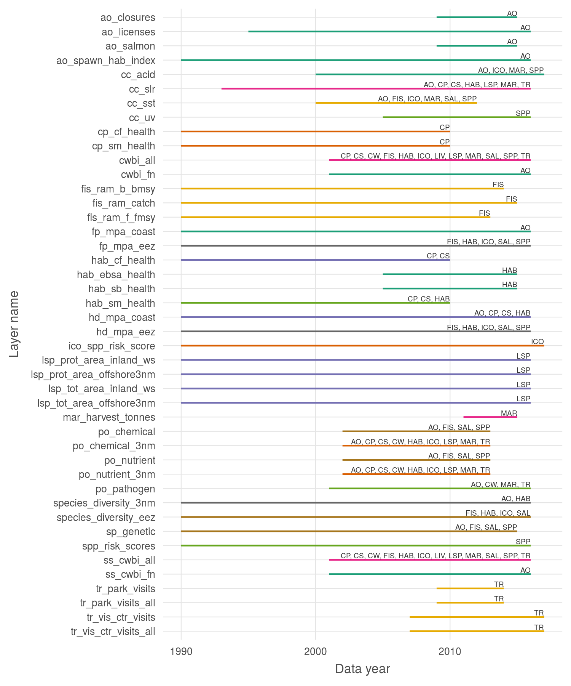

``` {r setup, echo = TRUE, message = FALSE, warning = FALSE}

knitr::opts_chunk$set(fig.width = 6, fig.height = 4, fig.path = 'Figs/',
                      echo = TRUE, message = FALSE, warning = FALSE)

library(ohicore) ### devtools::install_github('ohi-science/ohicore')

source('~/github/ohibc/src/R/common.R')

dir_ohibc  <- '~/github/ohibc'
dir_calc   <- file.path(dir_ohibc, 'calc_ohibc')
dir_master <- file.path(dir_calc, 'master')

source(file.path(dir_calc, 'calc_scores_fxns.R'))

### provenance tracking
# library(provRmd); prov_setup()

```


# Status plots

``` {r plot_all_scores}

scores <- read_csv(file.path(dir_calc, 'scores_all.csv')) %>%
  filter(dimension %in% c('status')) %>%
  spread(dimension, score) %>%
  filter(!is.na(status)) %>%
  left_join(get_rgn_names(), by = c('region_id' = 'rgn_id'))

for(goalname in scores$goal %>% unique() %>% sort) {
  # goalname <- scores$goal[1]
  scores_tmp <- scores %>%
    filter(goal == goalname)
  status_plot <- ggplot(scores_tmp %>% 
                          filter(region_id != 0), 
                      aes(x = year, y = status, color = rgn_name)) +
    ggtheme_plot() +
    geom_line(data = scores_tmp %>% 
                filter(region_id == 0), 
              aes(x = year, y = status), size = 1.5, color = 'grey20', alpha = .8) +
    geom_line(aes(group = region_id), alpha = .7, size = 1) +
    scale_x_continuous(breaks = scores_tmp$year %>% unique() %>% sort) +
    scale_y_continuous(limits = c(0, 100)) +
    theme(axis.text.x = element_text(angle = 30)) +
    labs(color = goalname) +
    guides(colour = guide_legend(override.aes = list(size = 3)))

  print(status_plot)
}


```

# Trend plots

``` {r plot_all_trends}

scores <- read_csv(file.path(dir_calc, 'scores_all.csv')) %>%
  filter(dimension %in% c('trend')) %>%
  left_join(get_rgn_names(), by = c('region_id' = 'rgn_id'))

for(goalname in scores$goal %>% unique() %>% sort) {
  # goalname <- scores$goal[1]
  scores_tmp <- scores %>%
    filter(goal == goalname)
  trend_plot <- ggplot(scores_tmp %>% 
                          filter(region_id != 0), 
                      aes(x = year, y = score, color = rgn_name)) +
    ggtheme_plot() +
    geom_line(aes(group = region_id), alpha = .7) +
    scale_x_continuous(breaks = scores_tmp$year %>% unique() %>% sort) +
    scale_y_continuous(limits = c(-1, 1)) +
    theme(axis.text.x = element_text(angle = 30)) +
    labs(color = goalname) +
    guides(colour = guide_legend(override.aes = list(size = 3)))

  print(trend_plot)
}

```


# Data layer year spans

Clipped to 1990 and later; some data layers go back farther but these will not typically inform scores except as reference points.

``` {r}

layer_targets <- read_csv(file.path(dir_calc, 'master/layers_targets_master.csv')) %>%
  select(-target_element, -dimension) %>%
  distinct()

data_years <- read_csv(file.path(dir_calc, 'master/all_data_years.csv'))

# no_year_spans <- layer_targets %>% 
#   filter(!layer %in% data_years$layer_name) %>%
#   group_by(layer) %>%
#   summarize(targets = paste(target, collapse = ', '))
# 
# knitr::kable(no_year_spans) %>% paste(collapse = '')

year_spans <- data_years %>%
  full_join(layer_targets, by = c('layer_name' = 'layer')) %>%
  filter(target != 'spatial') %>%
  group_by(layer_name) %>%
  filter(year >= 1990) %>%
  summarize(year_min = min(year),
            year_max = max(year),
            targets = paste(unique(target) %>% sort(), collapse = ', ')) %>%
  ungroup() %>%
  arrange(layer_name) %>%
  mutate(layer_name = factor(layer_name, levels = rev(.$layer_name %>% unique), ordered = TRUE))

span_plot <- ggplot(year_spans, aes(x = layer_name, color = targets)) +
  ggtheme_plot(base_size = 8) +
  geom_linerange(aes(ymin = year_min, ymax = year_max), show.legend = FALSE) +
  labs(x = 'Layer name',
       y = 'Data year') +
  scale_color_manual(values = rep(brewer.pal(n = 8, name = 'Dark2'), 4)) +
  geom_text(aes(y = year_max, label = targets), color = 'grey20', size = 1.6, 
            vjust = 0, nudge_x = 0.1, hjust = 1, show.legend = FALSE) +
  coord_flip()

ggsave(file.path(dir_calc, 'layers_data_years.png'), height = 6, width = 5)

```



