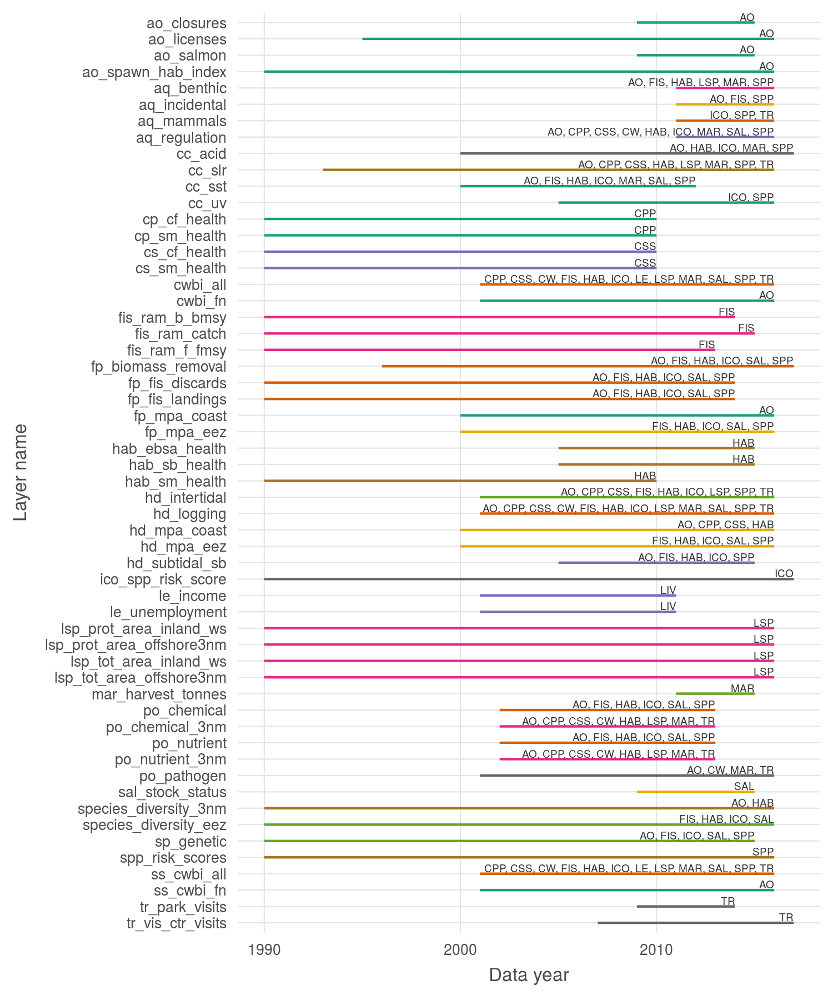

``` {r setup, echo = TRUE, message = FALSE, warning = FALSE}

knitr::opts_chunk$set(fig.width = 6, fig.height = 4, fig.path = 'Figs/',
                      echo = TRUE, message = FALSE, warning = FALSE)

library(ohicore) ### devtools::install_github('ohi-science/ohicore')

source('~/github/ohibc/src/R/common.R')

dir_ohibc  <- '~/github/ohibc'
dir_calc   <- file.path(dir_ohibc, 'calc_ohibc')
dir_master <- file.path(dir_calc, 'master')

source(file.path(dir_calc, 'calc_scores_fxns.R'))

### provenance tracking
# library(provRmd); prov_setup()

```


## Status vs dimensions plots (overall only)

Dark grey is status; grey dotted is score; red is pressures; green is resilience.

``` {r plot_all_dimensions}

scores_overall <- read_csv(file.path(dir_calc, 'scores_all.csv')) %>%
  filter(dimension != 'future') %>%
  filter(region_id != 0) %>%
  filter(!goal %in% c('Index', 'SP', 'FP', 'BD')) %>%
  group_by(goal, dimension, year) %>%
  summarize(mean_score = mean(score, na.rm = TRUE)) %>%
  ungroup() %>%
  spread(dimension, mean_score)

dim_plot <- ggplot(scores_overall, 
                    aes(x = year, y = status)) +
  ggtheme_plot() +
  geom_line(color = 'grey20', alpha = .7, size = 1.5) +
  geom_line(aes(y = score), 
            color = 'grey30', linetype = '1111',alpha = .7, size = 1) +
  geom_line(aes(y = pressures),  color = 'darkred', alpha = .7, size = .5) +
  geom_line(aes(y = resilience), color = 'darkgreen', alpha = .7, size = .5) +
  scale_x_continuous(breaks = scores_tmp$year %>% unique() %>% sort) +
  scale_y_continuous(limits = c(0, 100)) +
  theme(axis.text.x = element_text(angle = 90),
        axis.title.y = element_blank()) +
  facet_wrap( ~ goal)

print(dim_plot)


```

## Trend plots

``` {r plot_all_trends}

scores <- read_csv(file.path(dir_calc, 'scores_all.csv')) %>%
  filter(dimension %in% c('trend')) %>%
  left_join(get_rgn_names(), by = c('region_id' = 'rgn_id'))

for(goalname in scores$goal %>% unique() %>% sort) {
  # goalname <- scores$goal[1]
  scores_tmp <- scores %>%
    filter(goal == goalname)
  trend_plot <- ggplot(scores_tmp %>% 
                          filter(region_id != 0), 
                      aes(x = year, y = score, color = rgn_name)) +
    ggtheme_plot() +
    geom_line(aes(group = region_id), alpha = .7) +
    scale_x_continuous(breaks = scores_tmp$year %>% unique() %>% sort) +
    scale_y_continuous(limits = c(-1, 1)) +
    theme(axis.text.x = element_text(angle = 30)) +
    labs(color = goalname) +
    guides(colour = guide_legend(override.aes = list(size = 3)))

  print(trend_plot)
}

```

## Pressure plots

``` {r plot_all_pressures}

prs_scores <- read_csv(file.path(dir_calc, 'scores_all.csv')) %>%
  filter(dimension %in% c('pressures')) %>%
  left_join(get_rgn_names(), by = c('region_id' = 'rgn_id'))

for(goalname in prs_scores$goal %>% unique() %>% sort) {
  # goalname <- scores$goal[1]
  scores_tmp <- prs_scores %>%
    filter(goal == goalname)
  prs_plot <- ggplot(scores_tmp %>% 
                          filter(region_id != 0), 
                      aes(x = year, y = score, color = rgn_name)) +
    ggtheme_plot() +
    geom_line(aes(group = region_id), alpha = .7) +
    scale_x_continuous(breaks = scores_tmp$year %>% unique() %>% sort) +
    # scale_y_continuous(limits = c(-1, 1)) +
    theme(axis.text.x = element_text(angle = 30)) +
    labs(color = goalname) +
    guides(colour = guide_legend(override.aes = list(size = 3)))

  print(prs_plot)
}

```

## Resilience plots

``` {r plot_all_resilience}

res_scores <- read_csv(file.path(dir_calc, 'scores_all.csv')) %>%
  filter(dimension %in% c('resilience')) %>%
  left_join(get_rgn_names(), by = c('region_id' = 'rgn_id'))

for(goalname in res_scores$goal %>% unique() %>% sort) {
  # goalname <- scores$goal[1]
  scores_tmp <- res_scores %>%
    filter(goal == goalname)
  res_plot <- ggplot(scores_tmp %>% 
                          filter(region_id != 0), 
                      aes(x = year, y = score, color = rgn_name)) +
    ggtheme_plot() +
    geom_line(aes(group = region_id), alpha = .7) +
    scale_x_continuous(breaks = scores_tmp$year %>% unique() %>% sort) +
    # scale_y_continuous(limits = c(-1, 1)) +
    theme(axis.text.x = element_text(angle = 30)) +
    labs(color = goalname) +
    guides(colour = guide_legend(override.aes = list(size = 3)))

  print(res_plot)
}

```

## Flower plots, overall, by year

``` {r plot_flowers_overall}

source('~/github/ohibc/src/R/plot_flower.R')
index_scores <- read_csv(file.path(dir_calc, 'scores_all.csv')) %>%
  filter(region_id == 0) %>%
  filter(dimension %in% c('score')) %>%
  filter(goal != 'Index')

plot_wts <- read_csv(file.path(dir_calc, 'conf/goals.csv')) %>%
  select(order = order_hierarchy,
         goal, parent, goal_label = name_flower, 
         weight)

index_scores <- index_scores %>%
  left_join(plot_wts, by = 'goal') %>%
  arrange(order) %>%
  filter(!goal %in% plot_wts$parent)

for(yr in index_scores$year %>% unique() %>% sort()) {
  # yr <- 2016
  
  scores_tmp <- index_scores %>%
    filter(year == yr)
  
  index_flower <- plot_flower(scores_tmp, show_plot = FALSE) +
    labs(title = paste0('OHIBC ', yr))

  print(index_flower)
  
}

```

## Figure: Past "likely future status" compared to current "status"

``` {r}

scores_all <- read_csv(file.path(dir_calc, 'scores_all.csv')) %>%
  filter(region_id == 0) %>%
  spread(dimension, score) %>%
  group_by(goal, region_id) %>%
  mutate(pred_future_status = lag(future, 5))


score_compare_plot <- ggplot(scores_all, aes(x = pred_future_status, y = status, color = goal)) +
  ggtheme_plot() +
  geom_abline(slope = 1, intercept = 0, color = 'darkred') +
  geom_point(size = 2)

plotly::ggplotly(score_compare_plot)
```

``` {r}

scores_all <- read_csv(file.path(dir_calc, 'scores_all.csv')) %>%
  filter(region_id == 0) %>%
  filter(goal != 'Index') %>%
  filter(dimension %in% c('status', 'future')) %>%
  mutate(dimension = str_replace(dimension, 'status', 'obs_status'),
         dimension = str_replace(dimension, 'future', 'pred_status'),
         year = ifelse(dimension == 'pred_status', year + 5, year))

for(gl in (scores_all$goal %>% unique())) { ### gl = 'AO'
  
  scores_goal <- scores_all %>% 
    filter(goal == gl)
  
  score_compare_plot <- ggplot(scores_goal, aes(x = dimension, y = score, label = year)) +
    ggtheme_plot() +
    geom_point(size = 2) +
    geom_line(size = 1, alpha = .5, aes(group = year), alpha = .7) +
    labs(y = gl)
  
  print(score_compare_plot)
}
```

## Data layer year spans

Clipped to 1990 and later; some data layers go back farther but these will not typically inform scores except as reference points.



