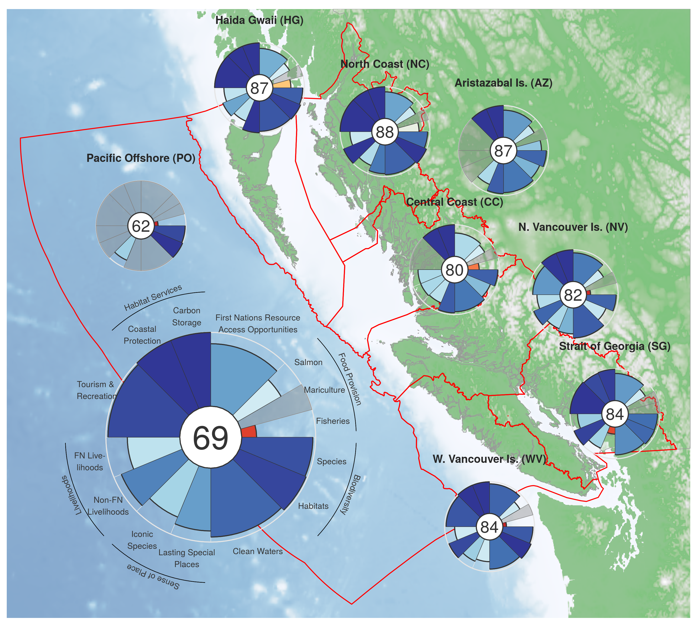

``` {r setup, echo = TRUE, message = FALSE, warning = FALSE}

knitr::opts_chunk$set(fig.width = 6, fig.height = 4, fig.path = 'Figs/',
                      echo = TRUE, message = FALSE, warning = FALSE)

library(sf)
library(raster)

dir_ohibc  <- '~/github/ohibc'
dir_calc   <- file.path(dir_ohibc, 'calc_ohibc')
dir_master <- file.path(dir_calc, 'master')
dir_figs   <- file.path(dir_ohibc, 'ms_figures')

### provenance tracking
# library(provRmd); prov_setup()

source('https://raw.githubusercontent.com/oharac/src/master/R/common.R')

scores_all <- read_csv(file.path(dir_calc, 'scores_all.csv'))
goals_all <- scores_all$goal %>% unique()

```


``` {r plot basemap}

ohibc_sf  <- read_sf(file.path(dir_ohibc, 'prep/_spatial/ohibc_rgns_unclipped.shp'))

if(!file.exists(file.path(dir_figs, 'etopo_rast.tif'))) {
  ### Use ETOPO raster for bathy and topo shading
  etopo_file <- file.path(dir_M, 'git-annex/bcprep/_raw_data',
                          'etopo-bathymetry/d2015/ETOPO2v2_bathymetry/ETOPO2v2c.tif')

  etopo_raw <- raster(etopo_file)
  crs(etopo_raw) <- '+init=epsg:4326'
  extent(etopo_raw) <- c(-180, 180, -90, 90)
  
  bbox <- st_bbox(ohibc_sf)[c(1, 3, 2, 4)] + c(-25000, +25000, -25000, +25000)
  
  etopo <- etopo_raw %>%
    crop(extent(-140, -110, 45, 65)) %>%
    projectRaster(crs = st_crs(ohibc_sf)$proj4string, res = 1000) %>%
    crop(extent(bbox))
  
  writeRaster(etopo, file.path(dir_figs, 'etopo_rast.tif'), overwrite = TRUE)
  
} else {
  
  etopo <- raster(file.path(dir_figs, 'etopo_rast.tif'))
  crs(etopo) <- st_crs(ohibc_sf)
}

etopo_df <- etopo %>%
  rasterToPoints() %>%
  as.data.frame() %>%
  setNames(c('x', 'y', 'elev'))

elev_r <- range(etopo_df$elev, na.rm = TRUE)

bcland_sf <- read_sf(file.path(dir_ohibc, 'prep/_spatial/ohibc_land.shp')) %>%
  st_crop(etopo)

# basemap_cols <- c(rev(brewer.pal(5, 'Blues')), terrain.colors(5))
basemap_cols <- c(rev(brewer.pal(5, 'Blues')), 'forestgreen', 'green4', '#CCCCCC', '#EEEEEE', '#FFFFFF')
### set up values for where colors land, so zero matches up
val_0 <- -elev_r[1] / (elev_r[2] - elev_r[1])
basemap_vals <- c(seq(0, val_0, length.out = 5), seq(val_0 + .001, 1, length.out = 5))

basemap <- ggplot() +
  ggtheme_map() +
  geom_raster(data = etopo_df, aes(x, y, fill = elev), alpha = .5, show.legend = FALSE) +
  scale_fill_gradientn(colors = basemap_cols,
                       values = basemap_vals) +
  geom_sf(data = bcland_sf, alpha = .5, color = 'grey60', fill = NA, size = .25) +
  geom_sf(data = ohibc_sf,  alpha = .5, color = 'red', fill = NA, size = .5) +
  coord_sf(datum = NA) +
  scale_x_continuous(expand = c(0, 0)) + scale_y_continuous(expand = c(0, 0))

```

``` {r plot flowers 2016}
scores <- scores_all %>%
  filter(year == 2016) %>%
  filter(dimension == 'score') %>%
  complete(goal = goals_all, nesting(region_id))
    ### make sure every region has every goal, NA or otherwise

source('fig_fxns.R')

overall_flower <- plot_flower(scores %>% filter(region_id == 0))
# print(overall_flower)

rgn_flowers <- vector('list', length = 8)
rgn_names <- get_rgn_names()

for(rgn in 1:8) { ### rgn <- 1
  rgn_name <- sprintf('%s (%s)',
                      rgn_names$rgn_name[rgn_names$rgn_id == rgn],
                      rgn_names$rgn_code[rgn_names$rgn_id == rgn])
  rgn_name <- rgn_name %>% str_replace('est V|orth V', '. V')
    ### abbreviate West and North Vancouver Island (not North Coast)
  rgn_name <- rgn_name %>% str_replace('Island', 'Is.')
    ### abbreviate Island for those regions
  rgn_flowers[[rgn]] <- plot_flower(scores %>% filter(region_id == rgn),
                                    score_size = 6,
                                    plot_clean = TRUE, 
                                    rgn_name = rgn_name)
  # print(rgn_flowers[[rgn]])
}
```

``` {r arrange plots}
library(cowplot)

sm_fl_size <- 0.21
lg_fl_size <- 0.60

draw_plot_ctr <- function(grob, x_ctr, y_ctr, size) {
  x <- x_ctr - .5 * size; y <- y_ctr - .5 * size
  draw_plot(grob, x, y, size, size)
}

x <- ggdraw() +
  draw_plot(basemap, 0, 0, 1, 1) +
  draw_plot_ctr(overall_flower, .30, .30, lg_fl_size) +
  draw_plot_ctr(rgn_flowers[[1]], 0.55, 0.80, sm_fl_size) +
  draw_plot_ctr(rgn_flowers[[2]], 0.37, 0.87, sm_fl_size) +
  draw_plot_ctr(rgn_flowers[[3]], 0.65, 0.58, sm_fl_size) +
  draw_plot_ctr(rgn_flowers[[4]], 0.82, 0.54, sm_fl_size) +
  draw_plot_ctr(rgn_flowers[[5]], 0.70, 0.17, sm_fl_size) +
  draw_plot_ctr(rgn_flowers[[6]], 0.88, 0.35, sm_fl_size) +
  draw_plot_ctr(rgn_flowers[[7]], 0.20, 0.65, sm_fl_size) +
  draw_plot_ctr(rgn_flowers[[8]], 0.72, 0.77, sm_fl_size)

ggsave('flower_plot_map.png', height = 9, width = 10, dpi = 300)

```


