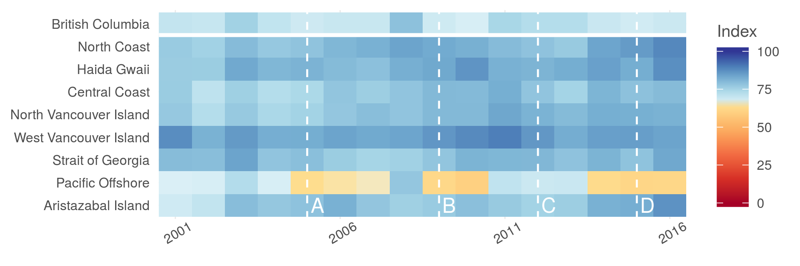
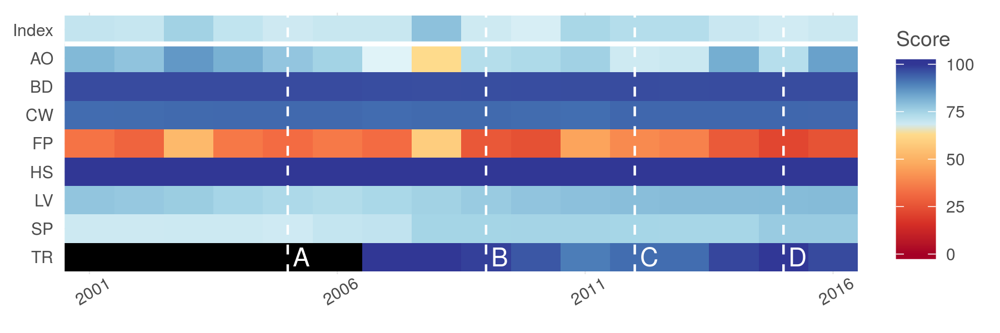

``` {r setup, echo = TRUE, message = FALSE, warning = FALSE}

knitr::opts_chunk$set(fig.width = 6, fig.height = 4, fig.path = 'Figs/',
                      echo = TRUE, message = FALSE, warning = FALSE)

source('~/github/ohibc/src/R/common.R')

dir_ohibc <- '~/github/ohibc'
dir_calc <- file.path(dir_ohibc, 'calc_ohibc')
dir_figs <- file.path(dir_ohibc, 'ms_figures')

source(file.path(dir_figs, 'fig_fxns.R'))

### provenance tracking
# library(provRmd); prov_setup()

```


# Figure 1B: Carpet plot

``` {r plot_index_by_rgn}

timeline <- data.frame(year = c(2005, 2009, 2012, 2015),
                       desc = c('a thing happened in 2005',
                                'another thing happened in 2009',
                                'thing 3', 'thing 4'),
                       label = c('A', 'B', 'C', 'D'))

scores <- read_csv(file.path(dir_calc, 'scores_all.csv')) %>%
  filter(dimension %in% c('score')) %>%
  spread(dimension, score) %>%
  filter(!is.na(score)) %>%
  left_join(get_rgn_names(), by = c('region_id' = 'rgn_id'))

rgn_scores <- scores %>%
  filter(goal == 'Index') %>%
  arrange(desc(region_id)) %>%
  mutate(rgn_name = fct_inorder(rgn_name),
         rgn_code = fct_inorder(rgn_code))

rgn_carpet <- ggplot(rgn_scores, aes(x = year, y = rgn_code)) +
  ggtheme_plot() +
  geom_tile(aes(fill = score)) +
  geom_vline(data = timeline, aes(xintercept = year), 
             color = 'white', linetype = 'dashed') +
  geom_hline(yintercept = 8.5, color = 'white', size = 1) +
  geom_text(data = timeline, aes(x = year, y = 1, label = label), 
            nudge_x = .1, hjust = 0, color = 'white') +
  scale_x_continuous(breaks = c(2001, 2006, 2011, 2016),
                     expand = c(0, 0)) +
  theme(axis.text.x = element_text(angle = 30),
        axis.title  = element_blank(),
        strip.background = element_blank(),
        strip.text = element_text(hjust = 0)) +
  labs(fill = 'Index') +
  scale_fill_gradientn(colours=ohi_palette, na.value="black",
                       limits = c(0, 100)) +
  guides(colour = guide_legend(override.aes = list(size = 3)))

ggsave(file.path(dir_figs, 'fig_1b_carpet_by_rgn.png'),
       width = 6, height = 2, dpi = 300)

```



# Figure 3: Carpet plot

``` {r plot_score_by_goal}

scores <- read_csv(file.path(dir_calc, 'scores_all.csv')) %>%
  filter(dimension %in% c('score')) %>%
  spread(dimension, score) %>%
  filter(!is.na(score)) %>%
  left_join(get_rgn_names(), by = c('region_id' = 'rgn_id')) %>%
  mutate(goal_name = goal_labels[goal])

goal_scores <- scores %>%
  filter(region_id == 0) %>%
  filter(nchar(goal) == 2 | goal == 'Index') %>%
  mutate(goal = fct_inorder(goal),
         goal = fct_relevel(goal, 'Index'),
         goal = fct_rev(goal)) %>%
  group_by(goal) %>%
  complete(year = 2001:2016) %>%
  ungroup()

scores_plot <- ggplot(goal_scores, 
                      aes(x = year, y = goal)) +
  ggtheme_plot() +
  geom_tile(aes(fill = score)) +
  geom_vline(data = timeline, aes(xintercept = year), color = 'white', linetype = 'dashed') +
  geom_hline(yintercept = 8.5, color = 'white', size = 1) +
  geom_text(data = timeline, aes(x = year, y = 1, label = label), 
            nudge_x = .1, hjust = 0, color = 'white') +
  scale_x_continuous(breaks = c(2001, 2006, 2011, 2016),
                     expand = c(0, 0)) +
  theme(axis.text.x = element_text(angle = 30),
        axis.title  = element_blank(),
        strip.background = element_blank(),
        strip.text = element_text(hjust = 0)) +
  labs(fill = 'Score') +
  scale_fill_gradientn(colours=ohi_palette, na.value="black",
                       limits = c(0, 100)) +
  guides(colour = guide_legend(override.aes = list(size = 3)))

ggsave(file.path(dir_figs, 'fig_3_carpet_by_goal.png'),
       width = 6, height = 2, dpi = 300)

```


