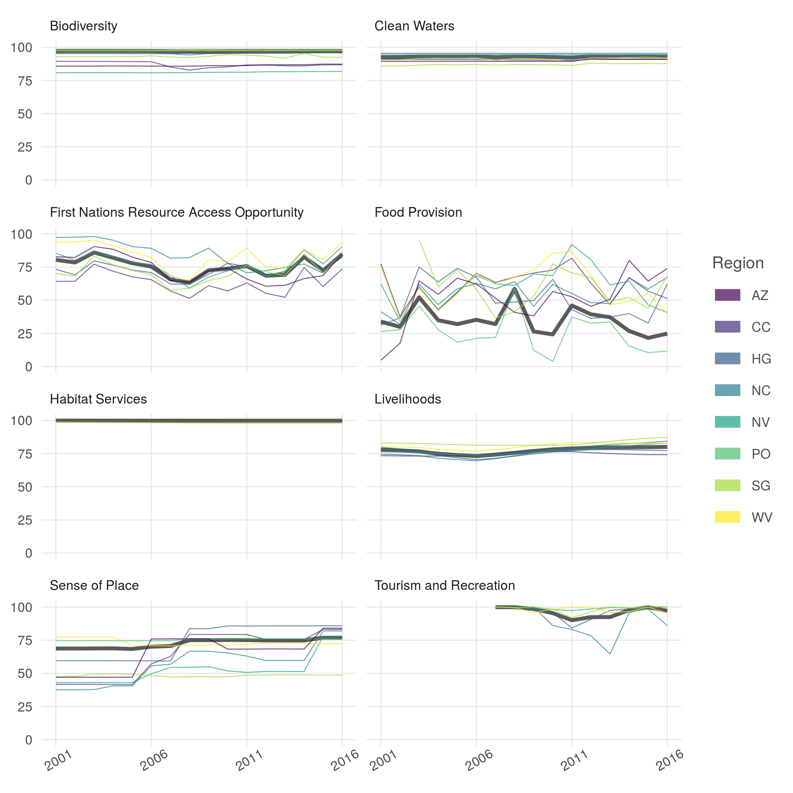

``` {r setup, echo = TRUE, message = FALSE, warning = FALSE}

knitr::opts_chunk$set(fig.width = 6, fig.height = 4, fig.path = 'Figs/',
                      echo = TRUE, message = FALSE, warning = FALSE)

source('~/github/ohibc/src/R/common.R')

dir_ohibc <- '~/github/ohibc'
dir_calc <- file.path(dir_ohibc, 'calc_ohibc')
dir_figs <- file.path(dir_ohibc, 'ms_figures')

source(file.path(dir_figs, 'fig_fxns.R'))

### provenance tracking
# library(provRmd); prov_setup()

```


# Figure 2: facets of scores by goal and region

``` {r plot_all_scores}

scores <- read_csv(file.path(dir_calc, 'scores_all.csv')) %>%
  filter(dimension %in% c('score')) %>%
  spread(dimension, score) %>%
  filter(!is.na(score)) %>%
  left_join(get_rgn_names(), by = c('region_id' = 'rgn_id'))

goal_scores <- scores %>%
  mutate(goal_name = goal_labels[goal]) %>%
  filter(nchar(goal) == 2)

scores_plot <- ggplot(goal_scores %>% 
                        filter(region_id != 0), 
                      aes(x = year, y = score, color = rgn_code)) +
  ggtheme_plot() +
  geom_line(data = goal_scores %>% 
              filter(region_id == 0), 
            aes(x = year, y = score), size = 1, color = 'grey20', alpha = .8) +
  geom_line(aes(group = region_id), alpha = .7, size = .25) +
  scale_x_continuous(breaks = c(2001, 2006, 2011, 2016)) +
  scale_y_continuous(limits = c(0, 100)) +
  theme(axis.text.x = element_text(angle = 30),
        axis.title  = element_blank(),
        strip.background = element_blank(),
        strip.text = element_text(hjust = 0)) +
  labs(color = 'Region') +
  scale_color_viridis_d() +
  guides(colour = guide_legend(override.aes = list(size = 3))) +
  facet_wrap( ~ goal_name, ncol = 2)

ggsave(file.path(dir_figs, 'fig_2_goal_score_facets.png'),
       height = 6, width = 6, dpi = 300)

```


