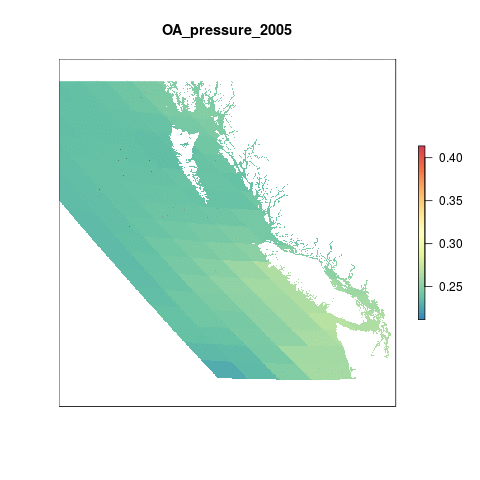

``` {r setup, echo = FALSE, message = FALSE, warning = FALSE}
knitr::opts_chunk$set(fig.width = 6, fig.height = 4, fig.path = 'Figs/',
                      echo = FALSE, message = FALSE, warning = FALSE)

library(rgdal)
library(raster)

dir_git <- '~/github/ohibc'
source(file.path(dir_git, 'src/R/common.R'))

dir_spatial <- path.expand(file.path(dir_git, 'prep/_spatial'))

### goal specific folders and info
goal      <- '_pressures'
scenario  <- 'v2017'
dir_goal  <- file.path(dir_git, 'prep', goal, scenario)
dir_goal_anx <- file.path(dir_M, 'git-annex/bcprep', goal, scenario)

library(provRmd); prov_setup()

### goal-specific source scripts
source(file.path(dir_goal, 'pressures_lyr_fxns.R'))

### other support functions
source(file.path(dir_git, 'src/R/rast_tools.R'))

reload <- FALSE

```

# Summary

This layer will determine ocean acidification values from the global rate of change layers; these layers already scale OA pressures appropriately.  The rescaling is based on the changes in aragonite saturation state according to:

$$\Delta \Omega_{year} = \frac{(\Omega_{base} - \Omega_{year})}{(\Omega_{base} - 1)}$$
    
In the global analysis, pressures for 2011-2016 are available with this rescaling; however, for this OHIBC analysis, we will begin with the global rasters for annual mean aragonite saturation state values, crop to BC, interpolate using inverse distance weighting, and then reproject to approx 1 km resolution (from CHI).

# Data

This script captures OA spatial data from the OHI Global assessments and determines scores for each OHIBC region.

The OA data layers for OHI Global are located on Mazu:

``` {r set_pressure_layer_dir}

oa_dir <- file.path(dir_M,'git-annex/globalprep/prs_oa')

oa_rasts <- list.files(oa_dir, pattern = '[0-9]{4}.tif$', recursive = TRUE, full.names = TRUE) %>%
  .[str_detect(., 'output')]

oa_rasts

```

**NOTE**: The 2005-2014 layers from v2015 are using the old reference point method (any change is same pressure regardless of how close to 1).  The v2016 and v2017 layers use the new reference point (reductions in arag sat state closer to one are penalized more heavily).  So 2005-2010 layers will need to be redone in this script using the new reference point; we will just do all the layers from scratch (starting with OHI mean aragonite saturation state calculations) for consistency.

## Data Source for global OA layer:

- **Reference**: [Feely et al.(2009)](https://darchive.mblwhoilibrary.org/bitstream/handle/1912/3180/22-4_feely.pdf?sequence=1&isAllowed=y)
- **Downloaded**: March 15, 2016
- **Description**:  Aragonite Saturation State  $\Omega_{arg}$
- **Native data resolution**: 1 degree cells
- **Time range**: 1880-1889 and 2005-2100, monthly data provided for each year. Future years are based on model projections for RCP 8.5. Previous years are hindcast/historical data.
- **Format**:  NetCDF

The global OA data prep script performs the following operations:

   a. Calculates the annual mean for 2016  
   b. Rescales each annual raster layer from 0 to 1 based on a biological threshold (&#937; <= 1) and the proportional change compared to a historical mean
   c. Interpolates the data to gap-fill for cells where there is no data
   d. Resamples the rescaled raster layer to 1km^2 cell resolution
   e. Mask the resampled data to select only those cells within the ocean

# Methods

## Create Mollweide OHIBC regions

Since the pressures layers are created in Mollweide projection for OHI Global, we will create a Mollweide version of the OHIBC regions for defining the analysis.  This allows us to avoid reprojecting the raster and adding another layer of resampling.

``` {r create_ohibc_rgn_mol}

if(!file.exists(file.path(dir_spatial, 'ohibc_rgn_mol.shp'))) {
  ohibc_rgn <- readOGR(dir_spatial, 'ohibc_rgn') %>%
    spTransform(CRS('+proj=moll +lon_0=0 +x_0=0 +y_0=0 +ellps=WGS84 +datum=WGS84 +units=m +no_defs'))
  
  writeOGR(ohibc_rgn, 
           dsn = dir_spatial, layer = 'ohibc_rgn_mol', 
           driver = 'ESRI Shapefile', overwrite = TRUE)
  
  ### ocean_rast is a raster with all land clipped out - at ~1km with value of 1. 
  ### Here we use it as a template for rasterizing the OHIBC regions for pressures.
  ocean_rast <- raster(file.path(oa_dir, 'v2016/int/ocean.tif')) %>%
    crop(ohibc_rgn_mol)
  
  ohibc_rgn_rast <- gdal_rast2(src = file.path(dir_spatial, 'ohibc_rgn_mol.shp'),
                               rast_base = ocean_rast,
                               dst = file.path(dir_goal, 'int/ohibc_rgn_mol_rast_934m.tif'),
                               value = 'rgn_id',
                               override_p4s = TRUE)

} else {
  git_prov(file.path(dir_spatial, 'ohibc_rgn_mol.shp'), filetype = 'output')
  git_prov(file.path(dir_goal, 'int/ohibc_rgn_mol_rast_934m.tif'), filetype = 'output')
}

rast_ohibc <- file.path(dir_goal, 'int/ohibc_rgn_mol_rast_934m.tif')

```


## Recreate OA pressures for BC using nonlinear rescaling

To recreate the BC layers using the current reference point, we load from OHI global these rasters:

* the historic reference point raster
* the annual mean rasters for the study years.

The calculation is performed using the same method as the global layers.  First step is to clip the global rasters to the extents of OHIBC, maintaining the original projection (Mollweide) and resolution to avoid coloring the underlying data any more than necessary.

``` {r clip_rasts_to_bc_extents}

oa_dir <- file.path(dir_M, 'git-annex/globalprep/prs_oa')

ohibc_rgn_mol <- raster(rast_ohibc)

rasts_raw <- list.files(file.path(oa_dir, 'v2017/int/annual_avg_moll'), 
                        pattern = 'tif$', recursive = TRUE, full.names = TRUE)

oa_stack_raw <- raster::stack(rasts_raw)

oa_stack_bc <- oa_stack_raw %>%
  crop(ohibc_rgn_mol)

bc_stack_filenames <- names(oa_stack_bc) %>%
  str_replace('global', '1_rast_bc') %>%
  file.path(dir_goal_anx, 'oa_rasts', .)

writeRaster(oa_stack_bc, bylayer = TRUE, filename = paste0(bc_stack_filenames, '.tif'), overwrite = TRUE)

```

### Animate OA mean aragonite sat state rasters

```{r animate_mean_arag_state}
reload <- FALSE

arag_animation_file <- file.path(dir_goal, 'Figs', 'oa_mean_arag_animation.gif')

if(!file.exists(arag_animation_file) | reload) {
  ohibc_rgn_rast <- raster(file.path(dir_spatial, 'raster/ohibc_rgn_raster_1000m.tif')) %>%
    crop(extent(c(xmin = 154000, xmax = 1.3e06, ymin = 168000, ymax = 1.2e6)))
  
  prs_stack <- stack(paste0(bc_stack_filenames, '.tif')) %>%
               projectRaster(ohibc_rgn_rast)
  
  names(prs_stack) <- paste0("OA_mean_arag_", str_extract(names(prs_stack), '[0-9]{4}'))
  
  animate_rast(prs_stack, 
               gif_file = arag_animation_file)
}

```


-----


## Rescale from 0 to 1

This pressure layer is rescaled so that all values lie between 0 and 1 using both a historical reference period and a biological reference point. All cells with values less than one, indicating an undersaturated state, are set equal to the highest stressor level, 1. For all other cells, rescaling the aragonite staturation state value to between 0 and 1 relies upon the change in saturation relative to the reference period.


### Historical Mean

The historical mean &#937 aragonite saturation state from 1880 - 1889 was calculated for OHI 2015. The same raster was used for OHI 2016 and is again used here as the baseline.

```{r histMean}

hist <- raster(file.path(dir_M, 'git-annex/globalprep/prs_oa/v2015/working/global_oa_1880_1889_arag_mean_moll.tif'))

colorscale = colorRampPalette(brewer.pal(9, 'Spectral'))(255) # rainbow color scheme

plot(hist, main = 'Mean Ωaragonite 1880-1889', 
     col = colorscale, box = FALSE, axes = FALSE)

```


### Rescale values at original resolution

``` {r rescale_2005_2010}

ohibc_rgn_mol <- raster(rast_ohibc)

arag_hist_rast <- raster(file.path(dir_M, 'git-annex/globalprep/prs_oa',
                                   'v2015/working', 
                                   'global_oa_1880_1889_arag_mean_moll.tif')) %>%
  crop(ohibc_rgn_mol)

arag_raw_files <- list.files(file.path(dir_goal_anx, 'oa_rasts'),
                         pattern = 'rast_bc_arag_avg_moll',
                         full.names = TRUE)

#for each layer, all values <=1 are assigned a 1, otherwise old-new/(old-1)

oaRescale <- function(rast_file, reload = FALSE) {
  ### rast_file <- arag_05_10_files[1]
  rast_yr <- str_extract(basename(rast_file), '[0-9]{4}')
    
  rescaled_rast_file <- file.path(dir_goal_anx, sprintf('oa_rasts/2_rast_bc_arag_rescaled_%s.tif', rast_yr))
  
  ### get seasonal mean aragonite raster for given year:
  rast_mean <- raster(rast_file) %>%
    crop(ohibc_rgn_mol)                 
  
  message('Rescaling raster ', rast_file)
  
  rast_diff <- (arag_hist_rast - rast_mean) / (arag_hist_rast - 1)
    ### create raster of the rescaled difference
  
  rast_rescale <- rast_mean
  
  values(rast_rescale)[values(rast_rescale) <= 1] <- 1   
    ### all values at or less than 1 are given a value of 1
  
  values(rast_rescale)[!is.na(values(rast_rescale)) & values(rast_rescale) > 1]  <- values(rast_diff)[!is.na(values(rast_mean)) & values(rast_mean) > 1] 
    ### all cells with values greater than 1 are swapped out with their amount of change scaled to how close to 1 
  
  values(rast_rescale)[values(rast_rescale) < 0] <- 0    
    ### all values less than 0 (indicating a decrease in acidity) are capped at 0

  writeRaster(rast_rescale, rescaled_rast_file, overwrite = TRUE)
    
}

tmp <- sapply(arag_raw_files, oaRescale)

```

### Interpolate

Since there are oceanic cells with no information in the raw data, we need to fill in these gaps. We do this by interpolating across the globe using the data we have with an Inverse Distance Weighting (IDW) function. Previously in Global (prior to 2017) this was done using `arcpy` from ArcGIS.


```{r interpolate}

library(gstat)

arag_resc_files <- list.files(file.path(dir_goal_anx, 'oa_rasts'), 
                              pattern = 'arag_rescaled', full.names = TRUE)

for(rast_file in arag_resc_files) {
  ### rast_file <- arag_resc_files[1]
  rast  <- raster(rast_file)
  
  message('Interpolating raster ', basename(rast_file))
  
  xy <- data.frame(xyFromCell(rast, 1:ncell(rast)))                         
    ### get xy coords into dataframe
  
  v  <- getValues(rast)                                                  
    ### get cell values 
  
  tmpdf <- cbind(xy, v) %>% 
    filter(!is.na(v))                           
    ### create dataframe of x,y, and values. remove NAs (throws error since these are cells we are interpolating over)
  
  ### define multivariate gstat model. power function = 2, this is default for idw models.
  mg <- gstat(id = "v", formula = v ~ 1, locations = ~ x + y, 
              data = tmpdf,
              nmax = 7, 
              set  = list(idp = 2)) 
  
  rast_interp <- interpolate(rast, mg)
    ### interpolate across NA cells
  
  writeRaster(rast_interp, file.path(rast_file %>%
                                       str_replace('/2_', '/3_') %>%
                                       str_replace('rescaled', 'resc_interp')))
}

```


### Reproject to new resolution

Using a global ocean raster (cropped to BC extents) as a template, resample the rescaled and interpolated rasters using nearest neighbor (ngb does not change the underlying values, as occurs with bilinear or bicubic), and mask land cells from the analysis.

``` {r resample_new_files}

### ocean_rast is a raster with all land clipped out - at 1km with value of 1. This is used as a mask
ocean_rast <- raster(file.path(oa_dir, 'v2016/int/ocean.tif')) %>%
  crop(ohibc_rgn_mol)


oaResample <- function(rast_file) {
  ### rast_file <- arag_resc_interp_files[1]
  rast_yr <- str_extract(basename(rast_file), '[0-9]{4}')
  out_rast_file <- file.path(dir_goal, 'oa_rasts', sprintf('4_prs_oa_bc_%s.tif', rast_yr))
  
  message('Resampling layer ', basename(rast_file))
  
  rast_resampled <- raster(rast_file) %>% 
    raster::resample(ocean_rast, method = 'ngb')
  
  rast_masked <- rast_resampled %>%
    mask(ocean_rast)
  
  writeRaster(rast_masked,
              filename = out_rast_file,
              overwrite = TRUE)
}

arag_resc_interp_files <- list.files(file.path(dir_goal_anx, 'oa_rasts'), pattern = 'resc_interp', full.names = TRUE)

tmp <- sapply(arag_resc_interp_files, oaResample)

```

### Animate OA pressures rasters

```{r}

oa_prs_animation_file <- file.path(dir_goal, 'Figs', 'oa_mean_arag_animation.gif')
reload <- TRUE

if(!file.exists(oa_prs_animation_file) | reload) {
  prs_rasts <- list.files(file.path(dir_goal, 'oa_rasts'), pattern = 'prs_oa_bc_[0-9]{4}', full.names = TRUE)
  
  ohibc_rgn_rast <- raster(file.path(dir_spatial, 'raster/ohibc_rgn_raster_1000m.tif')) %>%
    crop(extent(c(xmin = 154000, xmax = 1.3e06, ymin = 168000, ymax = 1.2e6)))
  
  prs_stack <- stack(prs_rasts) %>%
               projectRaster(ohibc_rgn_rast)
  
  names(prs_stack) <- paste0("OA_pressure_", str_extract(names(prs_stack), '[0-9]{4}'))
  
  animate_rast(prs_stack, 
               gif_file = oa_prs_animation_file)
}

```



-----

### Check "local" calculations against global calcs

Since this local calculation depends on cropping the global raster prior to interpolating, small differences may arise due to shifts in the raster origin or loss of nearby cell values due to cropping.  Here we briefly compare a locally-calculated raster to the cropped global for verification.  We will use the 2012 rasters for comparison.

Local calculation is that it depends on smaller input files (at larger resolutions) than using pre-calculated global rasters.  If little difference is noted, local calculation may be a big advantage for OHI+ users, who would no longer need to handle or process global fine-scale rasters for this pressure layer.

``` {r compare local method to global}

oa_dir <- file.path(dir_M, 'git-annex/globalprep/prs_oa')

oa_gl_rasts_12_15 <- list.files(oa_dir, pattern = '2012.tif$|2015.tif$', recursive = TRUE, full.names = TRUE) %>%
  .[str_detect(., 'output')] %>%
  .[!str_detect(., 'v2015')]

oa_stack <- raster::stack(oa_gl_rasts_12_15)

ohibc_rgn_mol <- raster(rast_ohibc)

out_rasts <- file.path(dir_goal, sprintf('oa_rasts/5_oa_lyr_test_gl_%s.tif', c(2012, 2015)))

for(rast in out_rasts[!file.exists(out_rasts)]) {
    ### rast <- rasts_to_do[1]
    rast_yr <- str_extract(basename(rast), '[0-9]{4}')
    
    message('Masking output rasters for BC ', rast_yr, ': \n  ', paste(out_rasts, collapse = '\n  '))
    stack_lyr <- names(oa_stack)[str_detect(names(oa_stack), rast_yr)]
    oa_rast_yr <- oa_stack[[stack_lyr]]
    
    oa_rast_yr_bc <- oa_rast_yr %>%
      crop(ohibc_rgn_mol) %>%
      mask(ohibc_rgn_mol)
  
    writeRaster(oa_rast_yr_bc, rast)
}
  
```

``` {r check_rasts}

oa_local_rasts_12_15 <- list.files(file.path(dir_goal, 'oa_rasts'),
                                   pattern = 'prs_oa_bc', full.names = TRUE) %>%
  .[str_detect(., '2012|2015')]

gl_2012 <- raster(out_rasts[[1]])
# gl_2015 <- raster(out_rasts[[2]])
loc_2012 <- raster(oa_local_rasts_12_15[[1]])
# loc_2015 <- raster(oa_local_rasts_12_15[[2]])

x2012 <- (loc_2012 - gl_2012) / loc_2012

plot(x2012)

hist(x2012, 
     main = 'Cell difference % (local - global / local)',
     xlab = 'percent difference', ylab = 'number of cells')

# mean(values(x2012), na.rm = TRUE) # -0.0004717973
# sd(values(x2012), na.rm = TRUE) # 0.01188621
```

Differences cluster in a reasonably normal distribution around zero, with mean = -0.0004717973 and sd = 0.01188621.

-----

## Calculate mean pressures per region

For each year, pull in the pressure raster and run zonal stats to find mean pressure in each region for each year.

``` {r get_mean_pressures}

prs_rasts <- list.files(file.path(dir_goal, 'oa_rasts'), 
                        pattern = 'prs_oa_bc_[0-9]{4}', 
                        full.names = TRUE) %>%
  stack()

rgn_rast <- raster(file.path(dir_goal, 'int/ohibc_rgn_mol_rast_934m.tif'))

prs_df <- raster::zonal(prs_rasts, rgn_rast, fun = 'mean') %>%
  as.data.frame() %>%
  rename(rgn_id = zone) %>%
  gather(year, pressure, -rgn_id) %>%
  mutate(year = str_extract(year, '[0-9]{4}') %>% as.integer())

write_csv(prs_df, file.path(dir_goal, 'output', 'prs_oa_ohibc.csv'))

DT::datatable(prs_df)
```

-----

## Calculate gapfilling proportional areas

Using a pressure raster prior to the interpolation step, we resample at the 934 m resolution, replacing cells with non-NA values with a 1 and cells with NA value with -1.

Taking a mean of this layer by OHIBC region will give a value between -1 (100% gapfill) and +1 (0% gapfill).

``` {r determine_gapfills}

### we will resample a non-interpolated layer to identify cells affected by interpolation:

pre_interp_files <- list.files(file.path(dir_goal_anx, 'oa_rasts'), 
                              pattern = 'arag_rescaled', full.names = TRUE)

### ocean_rast is a raster with all land clipped out - at 1km with value of 1.
### This is used as a template for resampling.
ocean_rast <- raster(file.path(oa_dir, 'v2016/int/ocean.tif')) %>%
  crop(ohibc_rgn_mol)

rast_resampled <- raster(pre_interp_files[1]) %>% 
  raster::resample(ocean_rast, method = 'ngb')

values(rast_resampled)[!is.na(values(rast_resampled))] <-  1 ### set valued cells to 1
values(rast_resampled)[is.na(values(rast_resampled))]  <- -1 ### set NA cells to -1
### when doing a mean on a region, 1 = 0% gapfilled, 0 = 50% gapfilled, -1 = 100% gapfilled etc.

rast_gapfill_masked <- rast_resampled %>%
  mask(ocean_rast)

writeRaster(rast_gapfill_masked,
            filename = file.path(dir_goal, 'oa_rasts', sprintf('6_prs_oa_bc_gapfill.tif', rast_yr)),
            overwrite = TRUE)
```

``` {r plot_gapfill}

library(tmap)

ohibc_rgn_bcalb <- readOGR(dir_spatial, 'ohibc_rgn_simple')

gf_rast <- raster(file.path(dir_goal, 'oa_rasts', sprintf('6_prs_oa_bc_gapfill.tif', rast_yr))) %>%
  projectRaster(crs = crs(ohibc_rgn_bcalb))

gf_plot <- tm_shape(gf_rast) + 
  tm_raster(palette = 'Spectral') +
  tm_shape(ohibc_rgn_bcalb) +
  tm_borders(col = 'grey30')

print(gf_plot)

```

``` {r calc_gapfills}

gf_rast <- raster(file.path(dir_goal, 'oa_rasts', sprintf('6_prs_oa_bc_gapfill.tif', rast_yr)))

rgn_rast <- raster(file.path(dir_goal, 'int/ohibc_rgn_mol_rast_934m.tif'))

gf_df <- raster::zonal(gf_rast, rgn_rast, fun = 'mean') %>%
  as.data.frame() %>%
  rename(rgn_id = zone) %>%
  mutate(pct_gf = (1 - mean) / 2) %>%
  select(rgn_id, pct_gf)

write_csv(gf_df, file.path(dir_goal, 'output', 'prs_oa_gapfill.csv'))

DT::datatable

```

-----

``` {r results = 'asis'}

prov_wrapup(commit_outputs = FALSE)

```
