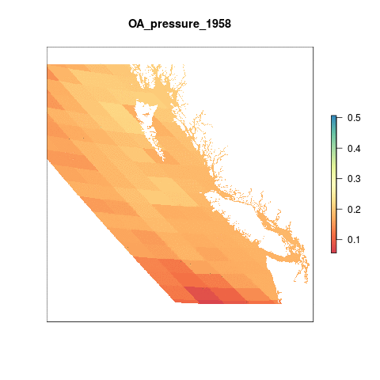
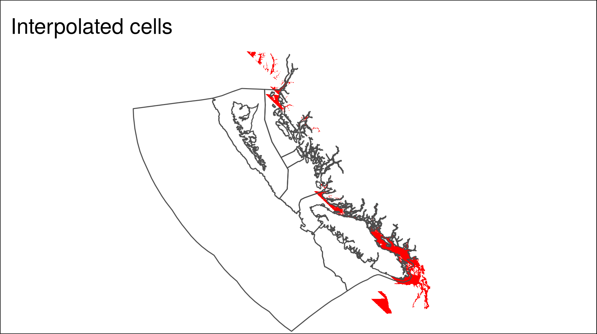

``` {r setup, echo = FALSE, message = FALSE, warning = FALSE}
knitr::opts_chunk$set(fig.width = 6, fig.height = 4, fig.path = 'figs/',
                      echo = FALSE, message = FALSE, warning = FALSE)

library(rgdal)
library(raster)

dir_git <- '~/github/ohibc'
source(file.path(dir_git, 'src/R/common.R'))

dir_spatial <- path.expand(file.path(dir_git, 'prep/_spatial'))

### goal specific folders and info
goal      <- '_pressures'
scenario  <- 'v2017'
dir_goal  <- file.path(dir_git, 'prep', goal, scenario)
dir_goal_anx <- file.path(dir_M, 'git-annex/bcprep', goal, scenario)

library(provRmd); prov_setup()

### goal-specific source scripts
source(file.path(dir_goal, 'pressures_lyr_fxns.R'))

### other support functions
source(file.path(dir_git, 'src/R/rast_tools.R'))

reload <- FALSE

```

# Summary

This layer will determine ocean acidification values from the global rate of change layers; these layers already scale OA pressures appropriately.  The rescaling is based on the changes in aragonite saturation state according to:

$$\Delta \Omega_{year} = \frac{(\Omega_{base} - \Omega_{year})}{(\Omega_{base} - 1)}$$
    
In the global analysis, pressures for 2011-2016 are available with this rescaling; however, for this OHIBC analysis, we will begin with the global rasters for annual mean aragonite saturation state values, crop to BC, interpolate using inverse distance weighting, and then reproject to approx 1 km resolution (from CHI).

# Data

This script captures OA spatial data from the OHI Global assessments and determines scores for each OHIBC region.

The OA data layers for OHI Global are located on Mazu.

``` {r set_pressure_layer_dir}

oa_dir <- file.path(dir_M,'git-annex/globalprep/prs_oa/v2017')

oa_rasts <- list.files(oa_dir, pattern = '[0-9]{4}.tif$', recursive = TRUE, full.names = TRUE) %>%
  .[str_detect(., 'output')]

# oa_rasts

```


## Data Source for global OA layer:

- **Reference**: [Feely et al.(2009)](https://darchive.mblwhoilibrary.org/bitstream/handle/1912/3180/22-4_feely.pdf?sequence=1&isAllowed=y)
- **Downloaded**: March 15, 2016
- **Description**:  Aragonite Saturation State  $\Omega_{arg}$
- **Native data resolution**: 1 degree cells
- **Time range**: 1880-1889 and 2005-2100, monthly data provided for each year. Future years are based on model projections for RCP 8.5. Previous years are hindcast/historical data.
- **Format**:  NetCDF

The global OA data prep script performs the following operations:

   a. Calculates the annual mean for 2016  
   b. Rescales each annual raster layer from 0 to 1 based on a biological threshold (&#937; <= 1) and the proportional change compared to a historical mean
   c. Interpolates the data to gap-fill for cells where there is no data
   d. Resamples the rescaled raster layer to 1km^2 cell resolution
   e. Mask the resampled data to select only those cells within the ocean

# Methods

## Create Mollweide OHIBC regions

Since the pressures layers are created in Mollweide projection for OHI Global, we will create a Mollweide version of the OHIBC regions for defining the analysis.  This allows us to avoid reprojecting the raster and adding another layer of resampling.

``` {r create_ohibc_rgn_mol}

if(!file.exists(file.path(dir_spatial, 'ohibc_rgn_mol.shp'))) {
  ohibc_rgn <- readOGR(dir_spatial, 'ohibc_rgn') %>%
    spTransform(CRS('+proj=moll +lon_0=0 +x_0=0 +y_0=0 +ellps=WGS84 +datum=WGS84 +units=m +no_defs'))
  
  writeOGR(ohibc_rgn, 
           dsn = dir_spatial, layer = 'ohibc_rgn_mol', 
           driver = 'ESRI Shapefile', overwrite = TRUE)
  
  ### ocean_rast is a raster with all land clipped out - at ~1km with value of 1. 
  ### Here we use it as a template for rasterizing the OHIBC regions for pressures.
  ocean_rast <- raster(file.path(oa_dir, 'v2016/int/ocean.tif')) %>%
    crop(ohibc_rgn_mol)
  
  ohibc_rgn_rast <- gdal_rast2(src = file.path(dir_spatial, 'ohibc_rgn_mol.shp'),
                               rast_base = ocean_rast,
                               dst = file.path(dir_goal, 'int/ohibc_rgn_mol_rast_934m.tif'),
                               value = 'rgn_id',
                               override_p4s = TRUE)

} else {
  git_prov(file.path(dir_spatial, 'ohibc_rgn.shp'), filetype = 'input')
  git_prov(file.path(dir_spatial, 'ohibc_rgn_mol.shp'), filetype = 'output')
  git_prov(file.path(dir_goal, 'int/ohibc_rgn_mol_rast_934m.tif'), filetype = 'output')
}


```


## Collect and crop OA pressures for BC

Each global raster is cropped to the same extents as the BC Mollweide raster and saved to git-annex/bcprep.  This is done for all rasters 1958-2020.  From this, a subset will be copied to GitHub for use in the actual calculations.

Note also that the interpolated cells raster is in this same location and will also be copied to GitHub.

``` {r clip_rasts_to_bc_extents}

rast_ohibc <- file.path(dir_goal, 'int/ohibc_rgn_mol_rast_934m.tif')
ohibc_rgn_mol <- raster(rast_ohibc)

oa_dir <- file.path(dir_M, 'git-annex/globalprep/prs_oa/v2017')

rasts_raw <- list.files(file.path(oa_dir, 'output'), 
                        pattern = 'tif$', recursive = TRUE, full.names = TRUE)

bc_stack_filenames <- basename(rasts_raw) %>%
  str_replace('oa_', '1_bc_oa_') %>%
  file.path(dir_goal_anx, 'oa_rasts', .)

reload <- FALSE

if(any(!file.exists(bc_stack_filenames)) | reload) {
  oa_stack_raw <- raster::stack(rasts_raw)
  
  oa_stack_bc <- oa_stack_raw %>%
    crop(ohibc_rgn_mol)
  
  writeRaster(oa_stack_bc, bylayer = TRUE, filename = bc_stack_filenames, overwrite = TRUE)

} else {
  message('BC OA rescaled pressure layers already exist')
  git_prov(rasts_raw,          filetype = 'input')
  git_prov(bc_stack_filenames, filetype = 'output')
}
```

### Animate OA pressure rasters

```{r animate_oa_pressures}

reload <- FALSE

oa_animation_file <- file.path(dir_goal, 'figs', 'oa_pressure_animation.gif')

animation_stack_files <- list.files(file.path(dir_goal_anx, 'oa_rasts'),
                                    pattern = 'bc_oa_prs', full.names = TRUE)

if(!file.exists(oa_animation_file) | reload) {
  ohibc_rgn_rast <- raster(file.path(dir_spatial, 'raster/ohibc_rgn_raster_1000m.tif')) %>%
    crop(extent(c(xmin = 154000, xmax = 1.3e06, ymin = 168000, ymax = 1.2e6)))
  
  oa_stack <- stack(animation_stack_files) %>%
    projectRaster(ohibc_rgn_rast, method = 'ngb')
  
  names(oa_stack) <- paste0("OA_pressure_", str_extract(names(oa_stack), '[0-9]{4}'))
  
  animate_rast(oa_stack, 
               gif_file = oa_animation_file)
} else {
  git_prov(animation_stack_files, filetype = 'input')
}

git_prov(oa_animation_file, filetype = 'plot')

```




-----

## Calculate mean pressures per region

For OHIBC we will focus on the years 2000-2017; these pressure layers will be copied from Mazu to GitHub for easy availability.  The gapfilling raster will also be copied for reference.

``` {r copy_rasters_to_github}

src_rasts <- list.files(file.path(dir_goal_anx, 'oa_rasts'),
                                  pattern = '.tif$', full.names = TRUE)
yrs <- c(2000:2017)

src_rasts <- c(src_rasts[str_detect(basename(src_rasts), paste(yrs, collapse = '|'))],
               src_rasts[str_detect(basename(src_rasts), 'interp')])

dst_rasts <- file.path(dir_goal, 'oa_rasts', basename(src_rasts))

x <- file.copy(from = src_rasts, to = dst_rasts, overwrite = TRUE)

git_prov(src_rasts, 'input')
git_prov(dst_rasts, 'output')

```

For each year, pull in the pressure raster and run zonal stats to find mean pressure in each region for each year.

``` {r get_mean_pressures}

prs_rasts <- list.files(file.path(dir_goal, 'oa_rasts'), 
                        pattern = 'bc_oa_prs_layer_[0-9]{4}', 
                        full.names = TRUE) %>%
  stack()

rgn_rast <- raster(file.path(dir_goal, 'int/ohibc_rgn_mol_rast_934m.tif'))

prs_df <- raster::zonal(prs_rasts, rgn_rast, fun = 'mean') %>%
  as.data.frame() %>%
  rename(rgn_id = zone) %>%
  gather(year, pressure, -rgn_id) %>%
  mutate(year = str_extract(year, '[0-9]{4}') %>% as.integer())

write_csv(prs_df, file.path(dir_goal, 'output', 'prs_oa_layer.csv'), nogit = TRUE)

git_prov(file.path(dir_goal, 'output', 'prs_oa_layer.csv'), filetype = 'output')

DT::datatable(prs_df %>% mutate(pressure = round(pressure, 4)))
```

``` {r plot_pressures}

prs_df <- read_csv(file.path(dir_goal, 'output', 'prs_oa_layer.csv')) %>%
  left_join(get_rgn_names(), by = 'rgn_id')

prs_plot <- ggplot(prs_df, aes(x = year, y = pressure, color = rgn_name, group = rgn_name)) +
  ggtheme_plot() +
  geom_line(show.legend = FALSE) +
  scale_color_brewer(palette = 'Dark2') +
  ylim(0, NA) +
  facet_wrap( ~ rgn_name) +
  labs(title = 'Ocean Acidification pressure',
       x = 'Year',
       y = 'Rescaled pressure score')

print(prs_plot)

```

-----

## Calculate gapfilling proportional areas

Using a pressure raster prior to the interpolation step, we resample at the 934 m resolution, replacing cells with non-NA values with a 1 and cells with NA value with -1.

Taking a mean of this layer by OHIBC region will give a value between -1 (100% gapfill) and +1 (0% gapfill).

``` {r plot_gapfill}

gf_map_file <- file.path(dir_goal, 'Figs', 'oa_gapfill_map.png')
reload <- FALSE

if(!file.exists(gf_map_file) | reload) {
  
  library(tmap)
  
  ohibc_rgn_bcalb <- readOGR(dir_spatial, 'ohibc_rgn_simple')
  
  gf_rast_bcalb <- list.files(file.path(dir_goal, 'oa_rasts'),
                        pattern = 'interp',
                        full.names = TRUE) %>%
    raster() %>%
    projectRaster(crs = crs(ohibc_rgn_bcalb), method = 'ngb')
  
  gf_rast_bcalb <- gf_rast_bcalb/gf_rast_bcalb
  
  gf_plot <- tm_shape(gf_rast_bcalb) + 
    tm_raster(palette = 'red',
              legend.show = FALSE) +
    tm_shape(ohibc_rgn_bcalb) +
    tm_borders(col = 'grey30') +
    tm_layout(title = 'Interpolated cells')
  
  save_tmap(gf_plot, gf_map_file, width = 6)

}

git_prov(gf_map_file, filetype = 'plot')

```



``` {r calc_gapfills}

gf_rast <- list.files(file.path(dir_goal, 'oa_rasts'),
                        pattern = 'interp',
                        full.names = TRUE) %>%
    raster()
### set non-NAs to 1:
gf_rast <- -1 * gf_rast/gf_rast
values(gf_rast)[is.na(values(gf_rast))] <- 1


rgn_rast <- raster(file.path(dir_goal, 'int/ohibc_rgn_mol_rast_934m.tif'))

gf_df <- raster::zonal(gf_rast, rgn_rast, fun = 'mean') %>%
  as.data.frame() %>%
  rename(rgn_id = zone) %>%
  mutate(pct_gf = (1 - mean) / 2) %>%
  select(rgn_id, pct_gf)

write_csv(gf_df, file.path(dir_goal, 'output', 'prs_oa_gapfill.csv'))

DT::datatable(gf_df %>% mutate(pct_gf = 100 * round(pct_gf, 3)))

```

-----

``` {r results = 'asis'}

prov_wrapup(commit_outputs = FALSE)

```
