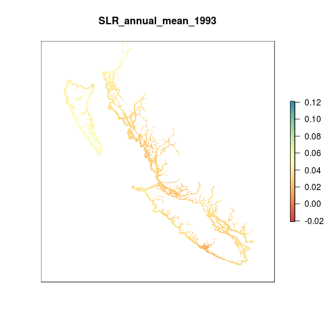

``` {r setup, echo = FALSE, message = FALSE, warning = FALSE}
knitr::opts_chunk$set(fig.width = 6, fig.height = 4, fig.path = 'figs/',
                      echo = FALSE, message = FALSE, warning = FALSE)

library(rgdal)
library(raster)

dir_git <- '~/github/ohibc'
source(file.path(dir_git, 'src/R/common.R'))

dir_spatial <- path.expand(file.path(dir_git, 'prep/_spatial'))

### goal specific folders and info
goal      <- '_pressures'
scenario  <- 'v2017'
dir_goal  <- file.path(dir_git, 'prep', goal, scenario)
dir_goal_anx <- file.path(dir_M, 'git-annex/bcprep', goal, scenario)

library(provRmd); prov_setup()

### goal-specific source scripts
source(file.path(dir_goal, 'pressures_lyr_fxns.R'))

### other support functions
source(file.path(dir_git, 'src/R/rast_tools.R'))

reload <- FALSE

```

# Summary

There are two parts to creating this layer:
  
  1. Data prep to get raw data into the correct format:
  
    * If necessary, read .nc.gz files from aviso: ftp://ftp.aviso.altimetry.fr/global/delayed-time/grids/climatology/monthly_mean/
    * unzip .gz files and then delete .gz 
    * Read monthly mean sea level data as rasters

  2. Creating the pressure layers for OHI Global:  
  
    * Clip all monthly rasters to the coast using a 3 nautical mile offshore buffer
    * Calculate annual mean sea level anomaly rasters from monthly data
    * Determine a reference point as the 99.99th quantile of the data across all years (1993 - 2015)
    * Rescale values from 0 to 1 using the reference point
    * Set to zero all negative values, indicating decreases in mean sea level
    * Resample raster to ~ 1km2 and reproject to Molleweide

This process is completed within the Global OHI 2017 prep script.  

For OHIBC, we modify the OHI 2017 script to process the data within the BC region, in BC Albers projection, using a 1000 meter raster of the 3 nautical mile buffer.

-----

# Data

The raw data are monthly mean sea level anomalies, in meters. The anomalies are calculated using a reference period of 1993 - 2012. The anomalies represent a cumulative anomaly (sea level rise over reference) rather than an instantaneous anomaly (rate of sea level rise).

Since these data have already been calculated using a reference point, we only need to create annual mean rasters for each year and then rescale from 0 to 1. In order to rescale each layer, the 99.99th quantile of the entire data distribution from 2011-2015 is used, rather than calculating the 99.99th quantile for each year. This way we have a consistent reference point across time that will be forecasted backwards and used in future OHI assessments when creating this layer.

* __Reference__: The altimeter products were produced and distributed by Aviso (http://www.aviso.altimetry.fr/), as part of the Ssalto ground processing segment. [AVISO MSLA heights, monthly means](http://www.aviso.altimetry.fr/en/data/products/sea-surface-height-products/global/msla-mean-climatology.html)
* __Downloaded__: March 18, 2016; August 1, 2017 (for 2016 data)     
* __Description__: Monthly mean sea level anomaly (meters above mean sea level)  
* __Native data resolution__: 0.25 degree grid cells  
* __Time range__: January 1993 - December 2016  
* __Format__: NetCDF  

The SLR data layers for OHI Global are located on Mazu in v2016 and v2017 output directories:

``` {r set_pressure_layer_dir}

slr_dir <- file.path(dir_M, 'git-annex/globalprep/prs_slr')

slr_rasts_raw <- list.files(slr_dir, pattern = '[0-9]{4}.tif$', recursive = TRUE, full.names = TRUE)

slr_rasts_raw <- slr_rasts_raw[str_detect(slr_rasts_raw, '/output/')]

```

# Methods

## Prepare BC sea level rise rasters

### Clip raw monthly sea level anomaly data to BC extents

Here we rasterize the NetCDF files, crop to BC extents, reproject into BC Albers, and mask to just coastal cells.

``` {r define_raw_files}

### define raw data file path (non-NCEAS folks will not have access to this data)
dir_anx_aviso <- file.path(dir_M, 'git-annex/globalprep/_raw_data/AVISO_slr')

### list all netCDF files
nc_files <- list.files(file.path(dir_anx_aviso),
                       full.names = TRUE,
                       recursive  = TRUE,
                       pattern = '.nc$')

nc_files <- nc_files[str_detect(nc_files, 'd2016/msla_monthly_mean|d2017')]

```

The raw monthly data looks like this:

``` {r plot_raw}

plot(raster(nc_files[1]),
     col = rev(colorRampPalette(brewer.pal(9, 'Spectral'))(255)), # rainbow color scheme 
     axes = FALSE, 
     main = "Sea Level Rise (m) January 2016")

```

The function `process_months_bc` performs these steps:

1. Rasterize each monthly NetCDF file
2. Rotate each raster so that the Atlantic Ocean is centered in the raster
3. Crop the raster to the extents of British Columbia (based on OHIBC regions extent)
4. Reproject the result to BC Albers at 1000 m resolution.

The output is saved in the folder `git-annex/bcprep/_pressures/v2017/slr_rasts/msla_monthly_bc`.

``` {r define_crop_function}

dir_msla <- file.path(dir_goal_anx, 'slr_rasts/msla_monthly_bc')

process_months_bc <- function(nc_file, ext_bc, rast_base, reload = FALSE) {
  
  # nc_file <- nc_files[1]
  month_yr <- str_extract(basename(nc_file), '[0-9]{4}..[0-9]{2}')
  
  dst_file <- file.path(dir_msla, sprintf('msla_monthly_bc_%s.tif', month_yr))
  
  if(file.exists(dst_file) & reload == FALSE) {
    message('File exists; skipping it')
    return()
  }
  
  # cat('Processing raster for', month_yr, '\n')
  message('Processing raster for ', month_yr)
    
  ### read in month raster
  slr_rast <- raster(nc_file) %>%
    rotate()
  
  ### define projection of the raster before reprojecting (WGS84)
  projection(slr_rast) <- "+init=epsg:4326"
  
  slr_crop <- crop(slr_rast, ext_bc)
  
  ### interpolate using inverse distance weighting
  xy <- data.frame(xyFromCell(slr_crop, 1:ncell(slr_crop)))
    ### get xy coords into dataframe
  v  <- getValues(slr_crop)
    ### get cell values 
  tmpdf <- cbind(xy, v)%>%filter(!is.na(v))
    ### create dataframe of x,y, and values. remove NAs (throws error since 
    ### these are cells we are interpolating over)
  mg <- gstat::gstat(id = "v", formula = v ~ 1, locations = ~ x + y, data = tmpdf,
                     nmax = 7, set = list(idp = 2))
    ### define model. power function = 2 is default for idw models
  garbage <- capture.output({
    slr_crop_interp <- interpolate(slr_crop, mg)
      ### interpolate across NA cells
    })

  ### reproject to BC Albers at 1000 m
  slr_crop_interp_bcalb <- slr_crop_interp %>%
    projectRaster(rast_base)
  
  ### mask with rast_base
  slr_crop_interp_bcalb_mask <- slr_crop_interp_bcalb %>%
    mask(rast_base)
  
  writeRaster(slr_crop_interp_bcalb_mask, 
              filename = dst_file,
              overwrite = TRUE)
  
  return(slr_crop_interp_bcalb_mask)
}

```

``` {r crop}

rast_base <- raster(file.path(dir_spatial, 'raster/ohibc_offshore_3nm_raster_1000m.tif'))

garbage <- capture.output({
  poly_bc_wgs84 <- rgdal::readOGR(dsn = dir_spatial,
                                  layer = 'ohibc_rgn_wgs84')
})

ext_bc <- extent(poly_bc_wgs84)
ext_bc <- extent(c(floor(ext_bc[1]), ceiling(ext_bc[2]),
                   floor(ext_bc[3]), ceiling(ext_bc[4])))

#apply the clipping function to all files
tmp <- lapply(nc_files, FUN = function(x) {
    # x <- nc_files[2]
    rast_result <- process_months_bc(x, ext_bc, rast_base, reload = FALSE)
  })

```


### Aggregate monthly mean sea level anomalies to annual

Annual mean sea level anomaly rasters are calculated from the monthly data. 

``` {r msla_monthly_to_annual}

dir_msla   <- file.path(dir_goal_anx, 'slr_rasts/msla_monthly_bc')
dir_annual <- file.path(dir_goal_anx, 'slr_rasts/msla_annual_bc')

msla_files <- list.files(dir_msla,
                         pattern = '.tif$',
                         full.names = TRUE)

yrs <- str_extract(basename(msla_files), '[0-9]{4}') %>%
  unique() %>% sort()

reload <- FALSE

for(yr in yrs) {
  # yr <- yrs[1]
  message('Year = ', yr)
  dst_file <- file.path(dir_annual, sprintf('msla_annual_bc_%s.tif', yr))
  if(file.exists(dst_file) & reload == FALSE) {
    message('File exists: ', dst_file)
    next()
  }
  msla_yr <- msla_files[str_detect(basename(msla_files), yr)]
  
  rast_annual_mean <- stack(msla_yr) %>%
    calc(mean, na.rm = TRUE)
  
  values(rast_annual_mean)[values(rast_annual_mean) == 0] <- NA
    ### any NAs get turned to zeroes due to na.rm = TRUE;
    ### ditch these as non-data cells
  
  writeRaster(rast_annual_mean,
              filename = dst_file, 
              overwrite = TRUE)
}

```

### Animate SLR annual mean rasters

```{r animate_slr_means}

reload <- FALSE

slr_animation_file <- file.path(dir_goal, 'figs', 'slr_pressure_animation.gif')

animation_stack_files <- list.files(file.path(dir_goal_anx, 'slr_rasts/msla_annual_bc'),
                                    pattern = '.tif$', full.names = TRUE)

if(!file.exists(slr_animation_file) | reload) {

  slr_stack <- stack(animation_stack_files) %>%
    crop(extent(c(xmin = 450000, xmax = 1.3e06, ymin = 300000, ymax = 1.2e6)))
  
  names(slr_stack) <- paste0("SLR_annual_mean_", str_extract(names(slr_stack), '[0-9]{4}'))
  
  garbage <- capture.output({
    animate_rast(slr_stack, 
                 gif_file = slr_animation_file)
  })
  
} else {
  git_prov(animation_stack_files, filetype = 'input')
}

git_prov(slr_animation_file, filetype = 'plot')

```



### Determine reference Point

The reference point is the 99.99th quantile of the entire data distribution from 1993 - 2016. Rather than the [same reference point](https://github.com/OHI-Science/ohiprep/blob/master/globalprep/supplementary_information/v2016/reference_points_pressures.csv) that was used in previous global assessments: 0.246225 m, instead we will use the 99.99th quantile of the BC-specific data distribution across all months (prior to taking mean).

``` {r determine_ref_pt}

dir_msla   <- file.path(dir_goal_anx, 'slr_rasts/msla_monthly_bc')

msla_files <- list.files(dir_msla,
                         pattern = '.tif$',
                         full.names = TRUE)

msla_stack <- raster::stack(msla_files)

# all_vals <- values(msla_stack)
# quantile(all_vals, 0.9999, na.rm = TRUE)
#    99.99% 
# 0.2951197 


# max(quantile(values(msla_stack))
# 0.4232954

```     

The 99.99%ile of all points (not just positive points) within the 3nm buffer of British Columbia is 0.2951197.  This will be our reference point for rescaling SLR pressure

###  Rescale annual SL anomalies from 0-1

Each annual raster is recaled from 0 to 1 using the reference point. If a value is greater than the reference point, it is automatically given a value of 1.  These final files are saved on Github.

``` {r rescale}

rescale_slr <- function(annual_file, ref_pt, reload = FALSE) {
  ### annual_file <- annual_files[1]
  yr <- str_extract(basename(annual_file), '[0-9]{4}')
  
  dst_file <- file.path(dir_goal, 'slr_rasts', sprintf('prs_slr_bc_%s.tif', yr))
  
  if(file.exists(dst_file)) {
    message('Rescaled raster exists: ', dst_file)
    return(raster(dst_file))
  }
  
  ann_mean_resc <- raster(annual_file) %>%
      calc(fun = function(x) ifelse(x < 0,   0, x)) %>% 
        ### set all negative values to 0
      calc(fun = function(x) ifelse(x > ref_pt, 1, x / ref_pt))
  
  writeRaster(ann_mean_resc, filename = dst_file,
              overwrite = TRUE)
  
  return(ann_mean_resc)
}

dir_annual <- file.path(dir_goal_anx, 'slr_rasts/msla_annual_bc')

annual_files <- list.files(dir_annual, pattern = '.tif$', full.names = TRUE)

annual_rescaled <- lapply(annual_files, FUN = function(x) rescale_slr(x, ref_pt = 0.2951197))

```


## Calculate mean pressures per region

From the clipped, reprojected, masked, and rescaled annual sea level anomalies, we now determine the mean value for each OHIBC region.

For each year, pull in the pressure raster and run zonal stats to find mean pressure in each region for each year.  Values are smoothed using a rolling 5-year mean (current plus prior 4 years).

``` {r get_mean_pressures}

prs_rasts <- list.files(file.path(dir_goal, 'slr_rasts'), 
                        pattern = 'prs_slr_bc', 
                        full.names = TRUE) %>%
  stack()

rgn_rast <- raster(file.path(dir_spatial, 'raster/ohibc_offshore_3nm_raster_1000m.tif'))

prs_df <- raster::zonal(prs_rasts, rgn_rast, fun = 'mean') %>%
  as.data.frame() %>%
  rename(rgn_id = zone) %>%
  gather(year, prs_raw, -rgn_id) %>% ### 'year' at this point is the original filename
  mutate(year = str_extract(year, '[0-9]{4}') %>% as.integer()) %>%
  group_by(rgn_id) %>%
  mutate(pressure = zoo::rollmean(prs_raw, 5, align = 'right', fill = NA)) %>%
  ungroup()

write_csv(prs_df, file.path(dir_goal, 'output', 'prs_slr_layer.csv'), nogit = TRUE)

message('wrote the file')
git_prov(file.path(dir_goal, 'output', 'prs_slr_layer.csv'), filetype = 'output')

DT::datatable(prs_df)
```

``` {r plot_pressures}

prs_df <- read_csv(file.path(dir_goal, 'output', 'prs_slr_layer.csv')) %>%
  left_join(get_rgn_names(), by = 'rgn_id')

prs_plot <- ggplot(prs_df, aes(x = year, y = pressure, color = rgn_name, group = rgn_name)) +
  ggtheme_plot() +
  geom_line(show.legend = FALSE) +
  scale_color_brewer(palette = 'Dark2') +
  ylim(0, NA) +
  facet_wrap( ~ rgn_name) +
  labs(title = 'Sea Level Rise pressure',
       x = 'Year',
       y = 'Rescaled pressure score')

print(prs_plot)

```

-----


``` {r results = 'asis'}

prov_wrapup(commit_outputs = FALSE)

```
