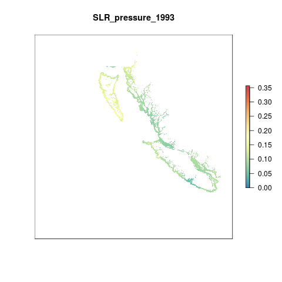

``` {r setup, echo = FALSE, message = FALSE, warning = FALSE}
knitr::opts_chunk$set(fig.width = 6, fig.height = 4, fig.path = 'Figs/',
                      echo = FALSE, message = FALSE, warning = FALSE)

library(rgdal)
library(raster)

dir_git <- '~/github/ohibc'
source(file.path(dir_git, 'src/R/common.R'))

dir_spatial <- path.expand(file.path(dir_git, 'prep/_spatial'))

### goal specific folders and info
goal      <- '_pressures'
scenario  <- 'v2017'
dir_goal  <- file.path(dir_git, 'prep', goal, scenario)
dir_goal_anx <- file.path(dir_M, 'git-annex/bcprep', goal, scenario)

library(provRmd); prov_setup()

### goal-specific source scripts
source(file.path(dir_goal, 'pressures_lyr_fxns.R'))

### other support functions
source(file.path(dir_git, 'src/R/rast_tools.R'))

reload <- FALSE

```

# Summary

There are two parts to creating this layer:
  
  1. Data prep to get raw data into the correct format:
  
    * If necessary, read .nc.gz files from aviso: ftp://ftp.aviso.altimetry.fr/global/delayed-time/grids/climatology/monthly_mean/
    * unzip .gz files and then delete .gz 
    * Read monthly mean sea level data as rasters

  2. Creating the pressure layers for OHI Global:  
  
    * Clip all monthly rasters to the coast using a 3 nautical mile offshore buffer
    * Calculate annual mean sea level anomaly rasters from monthly data
    * Determine a reference point as the 99.99th quantile of the data across all years (1993 - 2015)
    * Rescale values from 0 to 1 using the reference point
    * Set to zero all negative values, indicating decreases in mean sea level
    * Resample raster to ~ 1km2 and reproject to Molleweide

This process is completed within the Global OHI 2017 prep script.

For OHIBC these pressure layers are read in and cropped to BC extents for pressure calculations.

-----

# Data

The raw data are monthly mean sea level anomalies, in meters. The anomalies are calculated using a reference period of 1993 - 2012. The anomalies represent a cumulative anomaly rather than an instantaneous anomaly.

Since these data have already been calculated using a reference point, we only need to create annual mean rasters for each year and then rescale from 0 to 1. In order to rescale each layer, the 99.99th quantile of the entire data distribution from 2011-2015 is used, rather than calculating the 99.99th quantile for each year. This way we have a consistent reference point across time that will be forecasted backwards and used in future OHI assessments when creating this layer.

* __Reference__: The altimeter products were produced and distributed by Aviso (http://www.aviso.altimetry.fr/), as part of the Ssalto ground processing segment. [AVISO MSLA heights, monthly means](http://www.aviso.altimetry.fr/en/data/products/sea-surface-height-products/global/msla-mean-climatology.html)
* __Downloaded__: March 18, 2016   
* __Description__: Monthly mean sea level anomaly (meters above mean sea level)  
* __Native data resolution__: 0.25 degree grid cells  
* __Time range__: January 1993 - December 2015  
* __Format__: NetCDF  

The SLR data layers for OHI Global are located on Mazu:

``` {r set_pressure_layer_dir}

slr_dir <- file.path(dir_M, 'git-annex/globalprep/prs_slr/v2016/output')

slr_rasts <- list.files(slr_dir, pattern = '[0-9]{4}.tif$', recursive = TRUE, full.names = TRUE)

slr_rasts

```

# Methods

## Create Mollweide OHIBC regions

Since the pressures layers are created in Mollweide projection for OHI Global, we will create a Mollweide version of the OHIBC regions for defining the analysis.  This allows us to avoid reprojecting the raster and adding another layer of resampling.

``` {r create_ohibc_rgn_mol}

if(!file.exists(file.path(dir_spatial, 'ohibc_rgn_mol.shp'))) {
  ohibc_rgn <- readOGR(dir_spatial, 'ohibc_rgn') %>%
    spTransform(CRS('+proj=moll +lon_0=0 +x_0=0 +y_0=0 +ellps=WGS84 +datum=WGS84 +units=m +no_defs'))
  
  writeOGR(ohibc_rgn, 
           dsn = dir_spatial, layer = 'ohibc_rgn_mol', 
           driver = 'ESRI Shapefile', overwrite = TRUE)
  
  ### ocean_rast is a raster with all land clipped out - at ~1km with value of 1. 
  ### Here we use it as a template for rasterizing the OHIBC regions for pressures.
  ocean_rast <- raster(file.path(slr_dir, 'v2016/int/ocean.tif')) %>%
    crop(ohibc_rgn_mol)
  
  ohibc_rgn_rast <- gdal_rast2(src = file.path(dir_spatial, 'ohibc_rgn_mol.shp'),
                               rast_base = ocean_rast,
                               dst = file.path(dir_goal, 'int/ohibc_rgn_mol_rast_934m.tif'),
                               value = 'rgn_id',
                               override_p4s = TRUE)

} else {
  git_prov(file.path(dir_spatial, 'ohibc_rgn.shp'), filetype = 'input')
  git_prov(file.path(dir_spatial, 'ohibc_rgn_mol.shp'), filetype = 'output')
  git_prov(file.path(dir_goal, 'int/ohibc_rgn_mol_rast_934m.tif'), filetype = 'output')
}


```


## Collect and crop SLR pressures for BC

Each global raster is cropped to the same extents as the BC Mollweide raster and saved to git-annex/bcprep.  This is done for all rasters 1958-2020.  From this, a subset will be copied to GitHub for use in the actual calculations.

Note also that the interpolated cells raster is in this same location and will also be copied to GitHub.

``` {r clip_rasts_to_bc_extents}

rast_ohibc <- file.path(dir_goal, 'int/ohibc_rgn_mol_rast_934m.tif')
ohibc_rgn_mol <- raster(rast_ohibc)

slr_dir <- file.path(dir_M, 'git-annex/globalprep/prs_slr/v2016')

rasts_raw <- list.files(file.path(slr_dir, 'output'), 
                        pattern = 'tif$', recursive = TRUE, full.names = TRUE)

bc_stack_filenames <- basename(rasts_raw) %>%
  str_replace('slr_', '1_bc_slr_') %>%
  file.path(dir_goal_anx, 'slr_rasts', .)

reload <- FALSE

if(any(!file.exists(bc_stack_filenames)) | reload) {
  slr_stack_raw <- raster::stack(rasts_raw)
  
  slr_stack_bc <- slr_stack_raw %>%
    crop(ohibc_rgn_mol)
  
  writeRaster(slr_stack_bc, bylayer = TRUE, filename = bc_stack_filenames, overwrite = TRUE)

} else {
  message('BC SLR rescaled pressure layers already exist')
  git_prov(rasts_raw,          filetype = 'input')
  git_prov(bc_stack_filenames, filetype = 'output')
}
```

### Animate SLR pressure rasters

```{r animate_SLR}
reload <- FALSE

slr_animation_file <- file.path(dir_goal, 'Figs', 'slr_pressure_animation.gif')

animation_stack_files <- list.files(file.path(dir_goal_anx, 'slr_rasts'),
                                    pattern = 'bc_slr', full.names = TRUE)

if(!file.exists(slr_animation_file) | reload) {
  ohibc_rgn_rast <- raster(file.path(dir_spatial, 'raster/ohibc_rgn_raster_1000m.tif')) %>%
    crop(extent(c(xmin = 154000, xmax = 1.3e06, ymin = 168000, ymax = 1.2e6)))
  
  slr_stack <- stack(animation_stack_files) %>%
    projectRaster(ohibc_rgn_rast, method = 'ngb') %>%
    mask(ohibc_rgn_rast)
  
  names(slr_stack) <- paste0("SLR_pressure_", str_extract(names(slr_stack), '[0-9]{4}'))
  
  animate_rast(slr_stack, 
               gif_file  = slr_animation_file,
               rev_scale = TRUE)
} else {
  git_prov(animation_stack_files, filetype = 'input')
}

git_prov(slr_animation_file, filetype = 'plot')

```



NOTE: The 3 nm buffer from shore allows for some Alaskan coastal waters up north of Haida Gwaii.  Canada's EEZ maps indicate that these are Canadian waters, even if the land is US; as such, we will include these cells in the pressure calculations.

-----


## Rescale from 0 to 1

Sea level rise pressures at the global scale are scaled so that the 99.99%ile of all data globally is set to a pressure score of 1.  BC coastal waters are nowhere near this max value.  For BC pressures, we could rescale the layer so that the max SLR found in BC coastal waters receives a value of 1, simply by dividing by the max pressure found in the region (possibly within a specified time span as well).  For now, we will leave this alone.

## Calculate mean pressures per region

Rescaled SLR pressures rasters for year 2000 + are copied into the GitHub repo for easy access and reference.

``` {r copy relevant years to GitHub}

slr_prs_src <- list.files(file.path(dir_goal_anx, 'slr_rasts'),
                                    pattern = 'bc_slr', full.names = TRUE) %>%
  setNames(str_extract(basename(.), '[0-9]{4}'))

slr_prs_src <- slr_prs_src[names(slr_prs_src) %in% 2000:2017]

slr_prs_dst <- file.path(dir_goal, 'slr_rasts',
                         str_replace(basename(slr_prs_src), '1_bc_slr', '2_bc_slr_prs'))

file.copy(slr_prs_src, slr_prs_dst)

git_prov(slr_prs_src, filetype = 'input')
git_prov(slr_prs_dst, filetype = 'output')

```

For each year, pull in the pressure raster and run zonal stats to find mean pressure in each region for each year.

``` {r get_mean_pressures}

prs_rasts <- list.files(file.path(dir_goal, 'slr_rasts'), 
                        pattern = 'bc_slr_prs', 
                        full.names = TRUE) %>%
  stack()

rgn_rast <- raster(file.path(dir_goal, 'int/ohibc_rgn_mol_rast_934m.tif'))

prs_df <- raster::zonal(prs_rasts, rgn_rast, fun = 'mean') %>%
  as.data.frame() %>%
  rename(rgn_id = zone) %>%
  gather(year, pressure, -rgn_id) %>%
  mutate(year = str_extract(year, '[0-9]{4}') %>% as.integer())

write_csv(prs_df, file.path(dir_goal, 'output', 'prs_slr_layer.csv'), nogit = TRUE)

message('wrote the file')
git_prov(file.path(dir_goal, 'output', 'prs_slr_layer.csv'), filetype = 'output')

DT::datatable(prs_df)
```

``` {r plot_pressures}

prs_df <- read_csv(file.path(dir_goal, 'output', 'prs_slr_layer.csv')) %>%
  left_join(get_rgn_names(), by = 'rgn_id')

prs_plot <- ggplot(prs_df, aes(x = year, y = pressure, color = rgn_name, group = rgn_name)) +
  ggtheme_plot() +
  geom_line(show.legend = FALSE) +
  scale_color_brewer(palette = 'Dark2') +
  ylim(0, NA) +
  facet_wrap( ~ rgn_name) +
  labs(title = 'Ocean Acidification pressure',
       x = 'Year',
       y = 'Rescaled pressure score')

print(prs_plot)

```

-----


``` {r results = 'asis'}

prov_wrapup(commit_outputs = FALSE)

```
