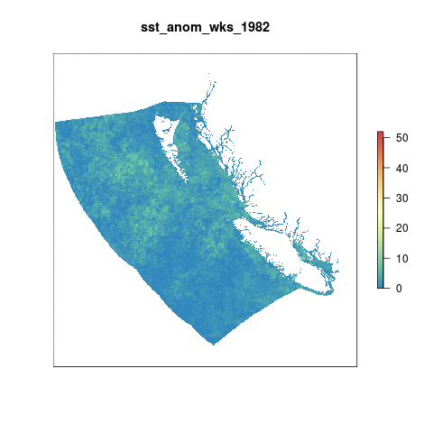
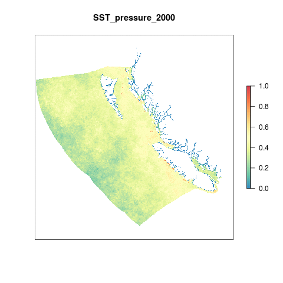

``` {r setup, echo = FALSE, message = FALSE, warning = FALSE}
knitr::opts_chunk$set(fig.width = 6, fig.height = 4, fig.path = 'Figs/',
                      echo = FALSE, message = FALSE, warning = FALSE)

library(rgdal)
library(raster)

dir_git <- '~/github/ohibc'
source(file.path(dir_git, 'src/R/common.R'))

dir_spatial <- path.expand(file.path(dir_git, 'prep/_spatial'))

### goal specific folders and info
goal      <- '_pressures'
scenario  <- 'v2017'
dir_goal  <- file.path(dir_git, 'prep', goal, scenario)
dir_goal_anx <- file.path(dir_M, 'git-annex/bcprep', goal, scenario)

library(provRmd); prov_setup()

### goal-specific source scripts
source(file.path(dir_goal, 'pressures_lyr_fxns.R'))

### other support functions
source(file.path(dir_git, 'src/R/rast_tools.R'))

reload <- FALSE

```

# Summary

For OHI Global Assessments, we calculated a climatology from 1982-2012 per cell using weekly data from CorTAD. We then calculated the number of times a given cell's weekly SST was greater than the climatological mean for that week (an anomalous week: mean temp greater than historical mean + one standard deviation) and summed the number of anomalous weeks in a single year. The maximum value a cell could have is 52 which would mean that cell had anomalous SST temperatures for each week of the year.

To account for annual variation, we look at Sea Surface Temperature anomalous weeks in 5 year periods, so the maximum value possible per cell is 260 anomalous weeks. To rescale the values from 0 to 1 we set a reference point. Previously, the reference point for SST has just been the maximum difference in anomalous weeks between the most recent time period and a historical reference period (1985-1989).

This time we have decided to use a reference point that represents a regime shift. Once a given cell is anomalous for more than 50% of a five-year period, it has shifted into a new regime. All cells that have a value greater than 130 weeks (51% of a 5 year time period) are assigned a 1. The rest of the cells are scaled to this reference point by dividing by 130.


# Data

Data comes from [CoRTAD version 5](http://www.nodc.noaa.gov/sog/cortad/)

See prs_sst/v2015/dataprep.R for preparation of the "annual_pos_anomalies" data.  

* __Source__: The [Coral Reef Temperature Anomaly Database Version 5 (CoRTAD)](https://data.nodc.noaa.gov/cgi-bin/iso?id=gov.noaa.nodc:0126774)  
* __Downloaded__: May 29, 2015  
* __Description__:  Sea Surface Temperature Anomalies (Kelvin)  
* __Native data resolution__: 4km^2^    
* __Time range__: 1982 - 2012  
* __Format__:  NetCDF  

# Methods

## Create rasters of BC annual anomalous weeks

### Global data layers

We're going to use the global data that was processed for OHI 2015 & used for OHI 2016. This data is held on a server at NCEAS.  These rasters are in WGS84 projection.

Raster values indicate the number of positive anomalous weeks each year.

``` {r global_data}

sst_global_files <- list.files(file.path(dir_M, 'git-annex/globalprep/prs_sst/v2015/tmp'), 
                               pattern = 'annual_pos_anomalies',
                               full.names = TRUE)
tmp <- raster(sst_global_files[31])
plot(tmp, main = "Sea Surface Temperature 2012", box = FALSE, axes = FALSE,
     legend.args = list(text = 'Anomalous Weeks', side = 4, font = 2, line = 2.5, cex = 0.8))

```

### Create WGS84 OHIBC regions

Since the pressures layers are created in Mollweide projection for OHI Global, we will create a Mollweide version of the OHIBC regions for defining the analysis.  This allows us to avoid reprojecting the raster and adding another layer of resampling.

``` {r create_ohibc_rgn_wgs84}

if(!file.exists(file.path(dir_spatial, 'ohibc_rgn_wgs84.shp'))) {
  ohibc_rgn <- readOGR(dir_spatial, 'ohibc_rgn') %>%
    spTransform(CRS('+proj=longlat +ellps=WGS84 +no_defs'))
  
  writeOGR(ohibc_rgn, 
           dsn = dir_spatial, layer = 'ohibc_rgn_wgs84', 
           driver = 'ESRI Shapefile', overwrite = TRUE)
  
} else {
  git_prov(file.path(dir_spatial, 'ohibc_rgn.shp'), filetype = 'input')
  git_prov(file.path(dir_spatial, 'ohibc_rgn_wgs84.shp'), filetype = 'output')
}

rast_ohibc <- file.path(dir_goal, 'int/ohibc_rgn_mol_rast_934m.tif')

```

### Crop global data to the BC region

Using the `crop` function from the `raster` package we crop all sea surface temperature rasters to our extent and then reproject them to the BC Albers projection for equal-area consistency across the assessment. We crop the global rasters first to reduce the time it takes to reproject the rasters.

```{r crop_to_bc}

wgs_ext <- sf::read_sf(dir_spatial, 'ohibc_rgn_wgs84') %>%
  sf::st_bbox() %>% 
  as.vector() %>% .[c(1, 3, 2, 4)] %>%
  extent()

ohibc_bcalb <- raster(file.path(dir_spatial, 'raster/ohibc_rgn_raster_1000m.tif'))

sst_global_files <- list.files(file.path(dir_M, 'git-annex/globalprep/prs_sst/v2015/tmp'), 
                               pattern = 'annual_pos_anomalies',
                               full.names = TRUE)

library(foreach); library(doParallel)
registerDoParallel(8)
reload <- FALSE
  
capture.output({ ### hide the text output
  foreach(sst_file = sst_global_files) %dopar% {
    # sst_file <- sst_global_files[10]
    yr <- str_extract(basename(sst_file), '[0-9]{4}')
    sst_file_bc <- file.path(dir_goal_anx, 'sst_rasts', paste0('1_annual_anoms_', yr, '.tif'))
  
    if(!file.exists(sst_file_bc) | reload) {
      tmp <- raster(sst_file) %>% 
        crop(wgs_ext) %>%        
        projectRaster(ohibc_bcalb, method = 'ngb') %>%
        mask(ohibc_bcalb, 
             filename = sst_file_bc, 
             overwrite = TRUE)
      git_prov(sst_file_bc, filetype = 'output')
    } else {
      message(sst_file_bc, ' already exists')
      git_prov(sst_file, filetype = 'input')
      git_prov(sst_file_bc, filetype = 'output')
    }
  }
})

tmp <- raster(file.path(dir_goal_anx, 'sst_rasts', '1_annual_anoms_2012.tif')) %>%
  crop(extent(c(xmin = 154000, xmax = 1.3e06, ymin = 168000, ymax = 1.2e6)))

plot(tmp, axes = FALSE, 
     main = "Sea Surface Temperature 2012",
     legend.args = list(text = 'Anomalous Weeks', 
                        side = 4, font = 2, line = 2.5, cex = 0.8))
```

## Recreate SST pressures for BC using 50% anomalous weeks reference point

### Visualize change over time

Plot annual high-temp anomalous weeks over the time series to a sense of how things have changed over time.

```{r animate_sst_weeks}

#rasterize each file in the list of files and then create a brick of rasters
sst_rast_files <- list.files(file.path(dir_goal_anx, 'sst_rasts'),
                        pattern = '1_annual_anom.+tif$',
                        full.names = TRUE) 

gif_file <- file.path(dir_goal, 'Figs', 'sst_anom_wks_animation.gif')

if(!file.exists(gif_file) | reload) {
  sst_rasts <- sst_rast_files %>%
    raster::stack() %>%
    setNames(paste0('sst_anom_wks_', str_extract(names(.), '[0-9]{4}'))) %>%
    crop(extent(c(xmin = 154000, xmax = 1.3e06, ymin = 168000, ymax = 1.2e6)))

animate_rast(sst_rasts, 
             gif_file = gif_file,
             scale_lim = c(0, 52),
             rev_scale = TRUE)
} else {
  git_prov(sst_rast_files, 'input')
}

git_prov(gif_file, filetype = 'plot')


```



### Five-year aggregates

Calculate total anomalous weeks for each 5-year window within the entire dataset.

``` {r aggregate_to_five-year_windows}

sst_rasts <- list.files(file.path(dir_goal_anx, 'sst_rasts'),
                        pattern = '1_annual_anom.+tif$',
                        full.names = TRUE)

sst_yrs <- str_extract(basename(sst_rasts), '[0-9]{4}') %>%
  as.integer() %>% range()

reload <- FALSE

for(yr in sst_yrs[1]:(sst_yrs[2] - 4)) { 
  # yr = 2005
  
  yrs <- yr:(yr + 4)
  
  sst_5yr_file <- file.path(dir_goal_anx, 'sst_rasts',
                             sprintf('2_sst_5yr_anoms_%s-%s.tif', min(yrs), max(yrs)))
  sst_window <- sst_rasts[str_extract(basename(sst_rasts), '[0-9]{4}') %in% yrs]

  if(!file.exists(sst_5yr_file) | reload) {
    message('Processing five-year SST rasters for years ', min(yrs), ' to ', max(yrs))
    sst_5yr_rast <- stack(sst_window) %>%
      sum()
    
    writeRaster(sst_5yr_rast,
                filename = sst_5yr_file,
                overwrite = TRUE)
  } else {
    message(sst_5yr_file, ' already exists')
    git_prov(sst_window, filetype = 'input')
    git_prov(sst_5yr_file, filetype = 'output')
  }
}

```

## Rescale SST to pressure scores 0-1

To account for annual variation, we look at Sea Surface Temperature anomalies in 5 year periods, so the maximum value possible per cell is 260 anomalous weeks. To rescale the values from 0 to 1 we need to set a reference point. For the Global assessment up through 2016, the reference point for SST has been the maximum difference in anomalous weeks between the most recent time period and a historical reference period (1985-1989).

For BC we have decided to use a reference point that represents a regime shift. Once a given cell is anomalous for more than 50% of a five-year period, it has shifted into a new regime. All cells that have a value greater than 130 weeks (51% of a 5 year time period) are assigned a pressure value of 1. The rest of the cells are scaled to this reference point proportionally.

```{r rescale_to_50pct}

sst_aggs <- list.files(file.path(dir_goal_anx, 'sst_rasts'),
                       pattern = '2_sst_5yr_anoms',
                       full.names = TRUE)

sstRescale <- function(rast_file, reload = FALSE) {
  ### rast_file <- sst_aggs[3]
  
  ### get the year from the file for naming the output raster
  yrs <- str_extract(basename(rast_file), '[0-9]{4}.+[0-9]{4}')
  
  sst_resc_file <- file.path(dir_goal_anx, 'sst_rasts',
                             sprintf('3_sst_5yr_rescaled_%s.tif', yrs))
 
  if(!file.exists(sst_resc_file) | reload) {
    message('Processing 5-yr sums to pressures for ', yrs)
    ### if a cell value is greater than or equal to the reference point (130 
    ### weeks), we assign a value of 1, otherwise it is divided by the ref point
    sst_rast <- raster(rast_file) 
    sst_rast <- sst_rast / 130 ### rescale to 130 weeks = 1.0
    values(sst_rast)[values(sst_rast) < 0] <- 0 ### negative set to zero
    values(sst_rast)[values(sst_rast) > 1] <- 1 ### above 130 wks set to 1
    
    writeRaster(sst_rast, sst_resc_file, overwrite = TRUE)
  } else {
    message(sst_resc_file, ' already exists')
    git_prov(rast_file, filetype = 'input')
    git_prov(sst_resc_file, filetype = 'output')
  }
}

for(rast_file in sst_aggs) {
  sstRescale(rast_file)
}

```

For each five-year window, the final year will be used to define the "pressure" year.  These pressure rasters will be saved via GitHub for access and viewing. 

``` {r copy_pressure_rasts_to_git}

sst_rescaled <- list.files(file.path(dir_goal_anx, 'sst_rasts'),
                       pattern = 'sst_5yr_rescaled',
                       full.names = TRUE)

### use a lookbehind to identify last year relative to first year in filename
sst_rescaled <- sst_rescaled %>%
  setNames(str_extract(basename(.), '(?<=([0-9]{4}.?))[0-9]{4}'))

sst_prs_src <- sst_rescaled[names(sst_rescaled) %in% 2000:2017]

sst_prs_dst <- file.path(dir_goal, 'sst_rasts', sprintf('4_prs_sst_bc_%s.tif', names(sst_prs_src)))

file.copy(from = sst_prs_src, to = sst_prs_dst, overwrite = TRUE)
git_prov(sst_prs_src, filetype = 'input')
git_prov(sst_prs_dst, filetype = 'output')

```

### Animate SST pressures rasters

```{r animate_pressure_rasts}

sst_prs_animation_file <- file.path(dir_goal, 'Figs', 'sst_pressure_animation.gif')
reload <- FALSE

prs_rasts <- list.files(file.path(dir_goal, 'sst_rasts'), 
                        pattern = 'prs_sst_bc', 
                        full.names = TRUE)

if(!file.exists(sst_prs_animation_file) | reload) {

  prs_stack <- stack(prs_rasts) %>%
    crop(extent(c(xmin = 154000, xmax = 1.3e06, ymin = 168000, ymax = 1.2e6)))
  
  names(prs_stack) <- paste0("SST_pressure_", str_extract(names(prs_stack), '[0-9]{4}'))
  
  animate_rast(prs_stack, 
               gif_file = sst_prs_animation_file,
               # scale_lim = c(0, .5),
               rev_scale = TRUE)
} else {
  git_prov(prs_rasts, filetype = 'input')
}

git_prov(sst_prs_animation_file, filetype = 'plot')

```



-----

## Calculate mean pressures per region

For each year, pull in the pressure raster and run zonal stats to find mean pressure in each region for each year.

``` {r get_mean_pressures}

prs_rasts <- list.files(file.path(dir_goal, 'sst_rasts'), 
                        pattern = 'prs_sst_bc_[0-9]{4}', 
                        full.names = TRUE) %>%
  stack()

rgn_rast <- raster(file.path(dir_spatial, 'raster/ohibc_rgn_raster_1000m.tif'))

prs_df <- raster::zonal(prs_rasts, rgn_rast, fun = 'mean') %>%
  as.data.frame() %>%
  rename(rgn_id = zone) %>%
  gather(year, pressure, -rgn_id) %>%
  mutate(year = str_extract(year, '[0-9]{4}') %>% as.integer())

write_csv(prs_df, file.path(dir_goal, 'output', 'prs_sst_layer.csv'))

# message('wrote the file')
# git_prov(file.path(dir_goal, 'output', 'prs_sst_layer.csv'), filetype = 'output')

DT::datatable(prs_df)
```

``` {r plot_pressures}

prs_df <- read_csv(file.path(dir_goal, 'output', 'prs_sst_layer.csv')) %>%
  left_join(get_rgn_names(), by = 'rgn_id')

prs_plot <- ggplot(prs_df, aes(x = year, y = pressure, color = rgn_name, group = rgn_name)) +
  ggtheme_plot() +
  geom_line(show.legend = FALSE) +
  scale_color_brewer(palette = 'Dark2') +
  ylim(0, NA) +
  facet_wrap( ~ rgn_name) +
  labs(title = 'Sea Surface Temperature pressure',
       x = 'Year',
       y = 'Rescaled pressure score')

print(prs_plot)

```

-----

## Calculate gapfilling proportional areas

No interpolation was performed on this layer so no gapfilling report is necessary.

-----

``` {r results = 'asis'}

prov_wrapup(commit_outputs = FALSE)

```
