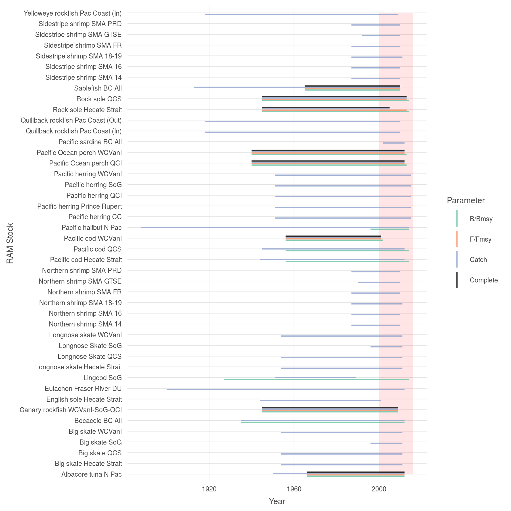

``` {r setup, echo = TRUE, message = FALSE, warning = FALSE}

knitr::opts_chunk$set(fig.width = 6, fig.height = 4, fig.path = 'Figs/',
                      echo = FALSE, message = FALSE, warning = FALSE)

dir_git     <- path.expand('~/github/ohibc')
source(file.path(dir_git, 'src/R/common.R'))  
dir_spatial <- file.path(dir_git, 'prep/spatial')  
dir_anx     <- file.path(dir_M, 'git-annex/bcprep')


### goal specific folders and info
goal      <- 'fis'
scenario  <- 'v2017'
dir_goal  <- file.path(dir_git, 'prep', goal, scenario)
dir_goal_anx <- file.path(dir_anx, goal, scenario)

### provenance tracking
library(provRmd); prov_setup()

### Kobe plot functions
source(file.path(dir_goal, 'kobe_fxns.R'))

### set up proj4string options: BC Albers and WGS84
p4s_wgs84 <- '+proj=longlat +datum=WGS84 +no_defs +ellps=WGS84 +towgs84=0,0,0'
p4s_bcalb <- '+proj=aea +lat_1=50 +lat_2=58.5 +lat_0=45 +lon_0=-126 +x_0=1000000 +y_0=0 +datum=NAD83 +units=m +no_defs +ellps=GRS80 +towgs84=0,0,0'

```

# Summary

Process RAM database for British Columbia fisheries stock status and harvest levels.  Each RAM stock will be filtered to the RAM stock ID and RAM area (to separate region-specific stocks), and then the stock status parameters B/Bmsy and F/Fmsy for that stock for each year reported.

Total catch data for each stock for each year will be used to determine final weightings.  Since the distribution of catch data is not differentiated within the reporting region, we will use SAUP and/or DFO spatial catch data to determine the distribution and allocate the total catch proportionally.

***

# Data Source 

**Reference**: RAM

**Downloaded**: 2016

**Description**:  Fishery status (B/B~msy~ and F/F~msy~) for stocks in BC waters

**Time range**: 1927-2015 (varies by stock)

**Format**:  .RData file

***
  
# Methods

Explore RAM:  Preliminary RAM database v. 3.8.  Load from .RData file, including time series and metadata.  This initial chunk explores the variables included in the data.

## BC-specific stocks

From global RAM data, filter to stocks whose region is 'Canada West Coast', and save to the 'int' folder in GitHub.

``` {r bc_specific}

model_data_file <- file.path(dir_anx, '_raw_data/ram_fisheries/d2017/RAM_v3.80/DB_Files_With_Model_Fit_Data/DBdata.RData')
# load(file.path(dir_anx, '_raw_data/ram_fisheries/d2017/RAM_v3.80/DB_Files_With_Assessment_Data/DBdata.RData'))
load(model_data_file)
git_prov(model_data_file, filetype = 'input')

ts <- as.data.frame(timeseries, stringsAsFactors = FALSE)
md <- as.data.frame(meta.data, stringsAsFactors = FALSE)

bc_fish_md <- md %>%
  filter(str_detect(region, 'Canada West'))

### Save only stocks with B/Bmsy and F/Fmsy or U/Umsy; also get Ctouse
### While there are also B/Bmgt and U/Umgt, there are no stocks that 
### contain *only* these vars.
bc_fish_ts <- ts %>%
  inner_join(bc_fish_md) %>%
  filter(!is.na(tsvalue)) %>%
  filter(str_detect(tsid, 'BdivBmsy|FdivFmsy|UdivUmsy|Ctouse'))

# param_check <- bc_fish_ts %>%
#   select(stockid, tsid, tsvalue, tsyear) %>%
#   spread(tsid, tsvalue)
### Ctouse is available for almost all observations; for the observations
### where Ctouse is NA, there is generally also no F/Fmsy (though Rock Sole
### seems to have some U/Umsy values.)

write_csv(bc_fish_ts, file.path(dir_goal, 'int/bc_stocks_ram.csv'))

bc_fish_display <- bc_fish_ts %>%
  group_by(stockid) %>%
  arrange(stockid, tsyear) %>%
  filter(tsyear == first(tsyear) | tsyear == last(tsyear)) %>%
  select(stockid, stocklong, tsid, tsyear, tsvalue, areaid)

DT::datatable(bc_fish_display)

```

### Examine time series of stocks

For each BC-specific stock, determine time series of B/Bmsy, F/Fmsy, and catch.

``` {r stocks_b_bmsy_f_fmsy}

bc_fish_ts <- read_csv(file.path(dir_goal, 'int/bc_stocks_ram.csv'))

bmsy_ts <- bc_fish_ts %>% 
  filter(str_detect(tsid, 'BdivBmsy')) %>%
  select(stock_id = stockid, 
         stock_name = stocklong, 
         param = tsid, 
         year = tsyear, 
         value = tsvalue, 
         sciname = scientificname, 
         dfo_area_id = areaid, 
         areaname) %>%
  mutate(year  = as.integer(year),
         value = as.numeric(value),
         param = 'B/Bmsy') %>%
  distinct()

fmsy_ts <- bc_fish_ts %>% 
  filter(str_detect(tsid, 'FdivFmsy|UdivUmsy')) %>%
  select(stock_id = stockid, 
         stock_name = stocklong, 
         param = tsid, 
         year = tsyear, 
         value = tsvalue, 
         sciname = scientificname, 
         dfo_area_id = areaid, 
         areaname) %>%
  mutate(year  = as.integer(year),
         value = as.numeric(value),
         param = ifelse(str_detect(param, 'FdivF'), 'F/Fmsy', 'U/Umsy')) %>%
  distinct()

### some dupes here, Pac Cod, with both F/Fmsy and U/Umsy.
fmsy_ts <- fmsy_ts %>%
  group_by(stock_id, year) %>%
  arrange(param) %>%
  filter(param == first(param)) %>% ### keep F/Fmsy
  ungroup()
### add the four-year rolling mean in the toolbox

catch_ts <- bc_fish_ts %>% 
  filter(str_detect(tsid, 'Ctouse')) %>%
  select(stock_id = stockid, 
         stock_name = stocklong, 
         param = tsid, 
         year = tsyear, 
         value = tsvalue, 
         sciname = scientificname, 
         dfo_area_id = areaid, 
         areaname) %>%
  mutate(year  = as.integer(year),
         value = as.numeric(value),
         param = 'Catch') %>%
  distinct()
### we may want to add the four-year rolling mean in the toolbox


write_csv(bmsy_ts,  file.path(dir_goal, 'output/ram_b_bmsy.csv'))
write_csv(fmsy_ts,  file.path(dir_goal, 'output/ram_f_fmsy.csv'))
write_csv(catch_ts, file.path(dir_goal, 'output/ram_catch.csv'))

```

``` {r plot_stock_timeseries}

span_df <- bind_rows(read_csv(file.path(dir_goal, 'output/ram_b_bmsy.csv')),
                     read_csv(file.path(dir_goal, 'output/ram_f_fmsy.csv')),
                     read_csv(file.path(dir_goal, 'output/ram_catch.csv'))) %>%
  mutate(param = ifelse(param == 'U/Umsy', 'F/Fmsy', param)) %>%
  left_join(read_csv(file.path(dir_goal, 'raw', 'ram_ids_to_names.csv'))) %>%
  group_by(stock_name_mod, param) %>%
  summarize(yr_min = min(year), yr_max = max(year)) %>%
  ungroup()

span_df2 <- span_df %>%
  bind_rows(x <- span_df %>%
              group_by(stock_name_mod) %>%
              complete(param = c('F/Fmsy', 'B/Bmsy', 'Catch')) %>%
              summarize(param = 'Complete', yr_min = max(yr_min), yr_max = min(yr_max))) %>%
  mutate(param = factor(param, levels = c('B/Bmsy', 'F/Fmsy', 'Catch', 'Complete')))

stock_ids <- span_df2$stock_name_mod %>% unique()
  

span_plot <- ggplot(span_df2, aes(x = stock_name_mod)) +
  ggtheme_plot(base_size = 7) +
  annotate('rect', ymin = 2000, ymax = 2016, 
           xmin = first(stock_ids), xmax = last(stock_ids), 
           fill = 'red', alpha = .1) +
  geom_linerange(aes(ymin = yr_min, ymax = yr_max, 
                     color = param),
                 position = position_dodge(width = .5), alpha = .8) +
  scale_color_manual(values = c('#66c2a5', '#fc8d62', '#8da0cb', 'black')) +
  coord_flip() +
  labs(x = 'RAM Stock ID',
       y = 'Year',
       color = 'Parameter')
# span_plot

ggsave(file.path(dir_goal, 'Figs', 'ram_stock_id_spans.png'), width = 6, height = 5)

```



## Plot stock status against modified Kobe

``` {r examine_each_stock, cache = FALSE}

stocks_ts_df <- bind_rows(read_csv(file.path(dir_goal, 'output/ram_b_bmsy.csv')),
                     read_csv(file.path(dir_goal, 'output/ram_f_fmsy.csv'))) %>%
  left_join(read_csv(file.path(dir_goal, 'raw', 'ram_ids_to_names.csv'))) %>%
  ungroup() %>%
  mutate(param = str_replace_all(tolower(param), '[^a-z]', '_') %>%
           str_replace_all('u', 'f')) %>%
  spread(key = param, value = value)

### apply four-year rolling mean to F/Fmsy
stocks_ts_df <- stocks_ts_df %>%
    mutate(f_fmsy_raw = f_fmsy) %>%
    arrange(stock_id, year) %>%
    group_by(stock_id) %>%
    filter(!is.na(f_fmsy)) %>%
    mutate(f_fmsy = zoo::rollmean(f_fmsy_raw, k = 4, align = 'right', fill = NA)) %>%
    ungroup() %>%
    select(-f_fmsy_raw)


stocks_ts_df <- stocks_ts_df %>%
  group_by(stock_id) %>%
  arrange(year) %>%
  mutate(last_bbmsy = last(b_bmsy),
         last_ffmsy = last(f_fmsy),
         last_datayear = last(year)) %>%
  ungroup()

spp_ids <- stocks_ts_df %>%
  .$stock_id %>%
  unique()

for(spp in spp_ids) {
  # spp <- spp_ids[1]
  stocks_ts1 <- stocks_ts_df %>%
    # filter(str_detect(tolower(stocklong), 'herring'))
    filter(stock_id == spp) %>%
    filter(!is.na(f_fmsy))
  
  bbmsy_lim <- max(round(max(stocks_ts1$b_bmsy, na.rm = TRUE) + .1, 1), 3.5)
  ffmsy_lim <- max(round(max(stocks_ts1$f_fmsy, na.rm = TRUE) + .1, 1), 2.5)
  
  kobe_df <- generate_kobe_df(f_fmsy_max = ffmsy_lim,
                           b_bmsy_max = bbmsy_lim,
                           bmax_val = .25,
                           fmin_val = .25)
  
  hcr_df <- data.frame(b_bmsy = c(0, .4, .8, bbmsy_lim),
                       f_fmsy = c(0,  0,  1, 1))
  
  plot_title <- stocks_ts1$stock_name_mod[1]
  
  kobe_stock_plot <- ggplot(data = kobe_df, aes(x = b_bmsy, y = f_fmsy)) +
    ggtheme_plot() + 
    geom_raster(alpha = .8, aes(fill = x_geom), show.legend = FALSE) +
    scale_fill_distiller(palette = 'RdYlGn', direction = 1) +
    geom_line(data = hcr_df, aes(x = b_bmsy, y = f_fmsy), color = 'black', size = 1.5, alpha = .6) +
    labs(title = plot_title,
         x = 'B/Bmsy',
         y = 'F/Fmsy') +
    annotate(geom = 'text', label = 'critical', x = .15, y = -.15, 
             size = 2, 
             color = 'grey20') + 
    annotate(geom = 'text', label = 'cautious', x =  .5, y = -.15, 
             size = 2, 
             color = 'grey20') + 
    annotate(geom = 'text', label = 'healthy',  x = 1.2, y = -.15, 
             size = 2, 
             color = 'grey20') + 
    annotate(geom = 'text', label = 'underexploited',  x = 2.5, y = -.15, 
             size = 2, 
             color = 'grey20') +
    geom_path(data = stocks_ts1, 
              show.legend = FALSE,
              aes(x = b_bmsy, y = f_fmsy, group = stock_id),
              color = 'grey30') +
    geom_point(data = stocks_ts1, 
               show.legend = FALSE,
              aes(x = last_bbmsy, y = last_ffmsy)) +
    geom_text(data = stocks_ts1 %>%
                mutate(year = ifelse(year/5 == round(year/5) | year == last_datayear, year, NA)), 
              aes(x = b_bmsy, y = f_fmsy, label = year), 
              hjust = 0, nudge_x = .05, size = 2)
  
  print(kobe_stock_plot)
  
  plot_file <- paste0('kobe_', str_replace_all(tolower(plot_title), ' ', '_'), '.png')
  ggsave(file.path(dir_goal, 'Figs', plot_file),
         width = 6, height = 4)
}

```

## Associate stocks with spatial boundaries

Spatial boundaries for RAM stocks are derived from shapefiles provided by DFO.  

* From dfo_khunter/d2017/boundaries.gdb:
    * QCI aka Haida Gwaii, WCVANI, QCS, SoG, CC
* From dfo_khunter/d2017/shrimp_trawl_areas/DFO_BC_SHRIMP_TRAWL_MGMT_AREA.shp:
    * SMA-14, SMA-FR, SMA-PRD
* From dfo_khunter/d2016/management_boundaries/groundfish_mgmt_areas/MajorMinor_GroundfishManagementAreas.shp:
    * 5AB
* BCW and PCOAST are union of all (areas 1-5) from boundaries.gdb
* WCVANI-SOG-QCI is the union of those areas (1, 4, 5)
* HS will be the area between Haida Gwaii island and the North Coast, bounded on the south by Area 5AB and bounded on the north at the level of the northeastern-most point of Haida Gwaii

FRDU is Fraser River Designatable Unit - since eulachon are harvested when they return to the mouth of the Fraser River, we will assume that this fishery falls entirely within Strait of Georgia region.  If SAUP data are available, perhaps we can use those instead.

``` {r get_dfo_boundary_info}

ram_area_ids <- read_csv(file.path(dir_goal, 'raw/ram_area_ids.csv'))

ram_stock_ids <- read_csv(file.path(dir_goal, 'output/ram_b_bmsy.csv')) %>%
  select(stock_id, stock_name, dfo_area_id) %>%
  distinct()

ram_stock_to_area <- ram_stock_ids %>%
  left_join(ram_area_ids)

write_csv(ram_stock_to_area, file.path(dir_goal, 'int/ram_stock_to_area.csv'))

```

``` {r match_dfo_areas_to_ohibc_rgns}

ohibc_rgns <- raster::raster(file.path(dir_spatial, 'raster/ohibc_rgn_raster_500m.tif'))
ram_areas  <- rgdal::readOGR(dsn = file.path(dir_goal_anx, 'stock_boundaries'), 
                             layer = 'stock_boundaries_bcalb')

rgn_to_ram_file <- file.path(dir_goal, 'int/ohibc_rgn_to_ram_area.csv')
reload <- FALSE

if(!file.exists(rgn_to_ram_file) | reload) {
  
  rgn_to_ram_area <- raster::extract(ohibc_rgns, ram_areas, progress = 'text') %>%
    lapply(FUN = function(x) data.frame(rgn_id = x))  %>%
    setNames(ram_areas@data$area_code) %>%
    bind_rows(.id = 'area_code') %>%
    group_by(rgn_id, area_code) %>%
    summarize(area_km2 = n() * .5 * .5) %>%
    left_join(ram_areas@data, by = 'area_code') %>%
    left_join(get_rgn_names(), by = 'rgn_id') %>%
    filter(!is.na(rgn_id))
  
  write_csv(rgn_to_ram_area, rgn_to_ram_file)
  
} else {
  
  git_prov(rgn_to_ram_file, filetype = 'output')
  
}


```

-----

``` {r provenance, results = 'asis'}
prov_wrapup(commit_outputs = FALSE)
```
