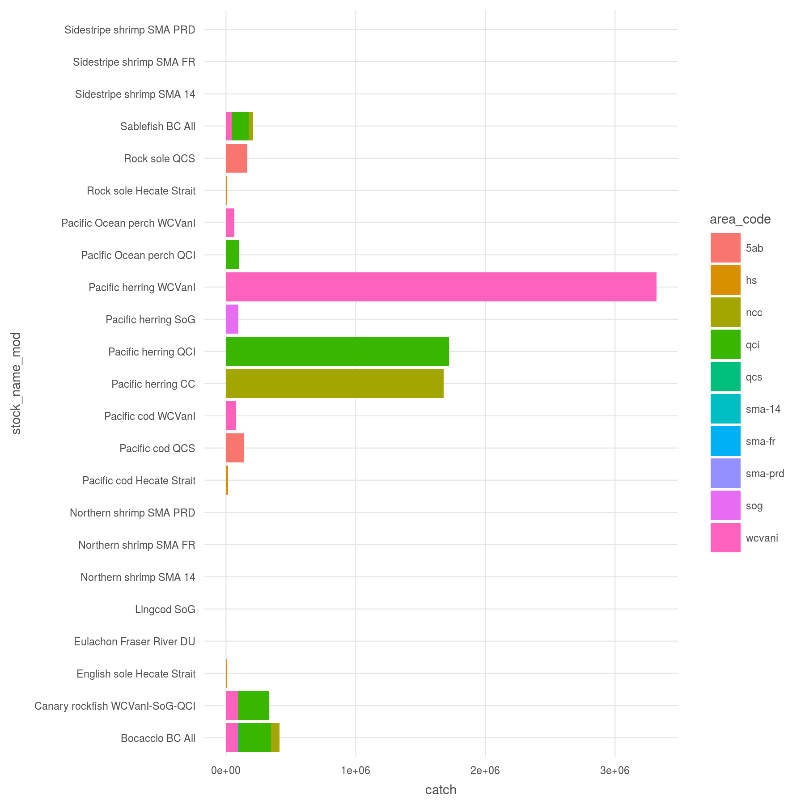
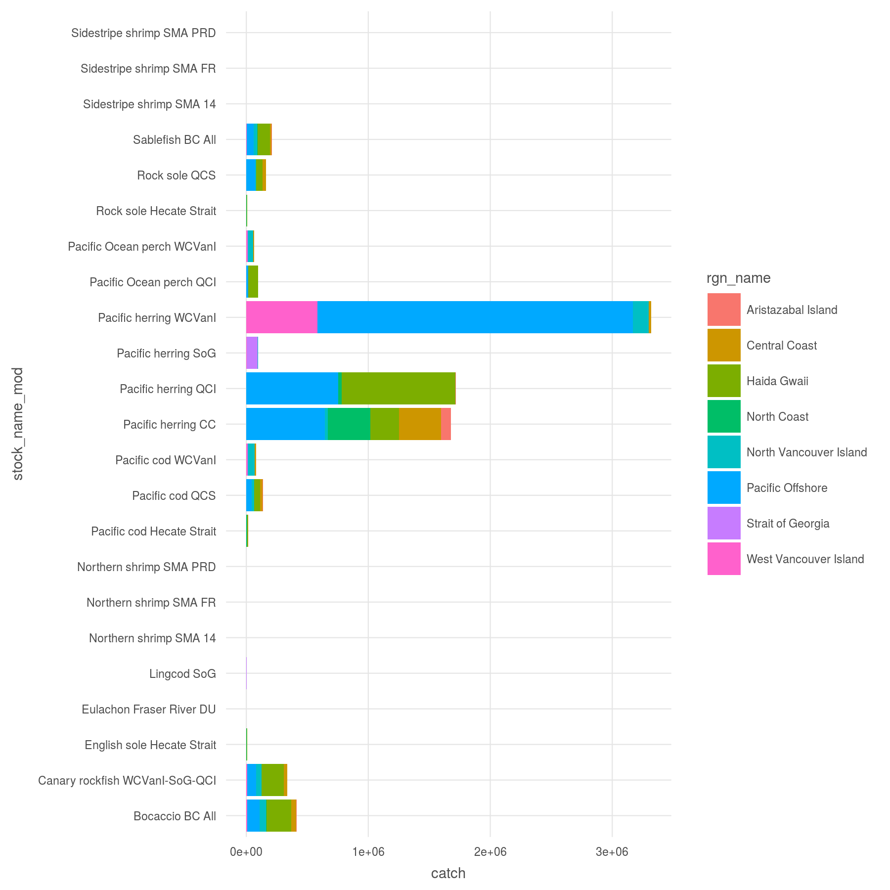

``` {r setup, echo = TRUE, message = FALSE, warning = FALSE}

knitr::opts_chunk$set(fig.width = 6, fig.height = 4, fig.path = 'Figs/',
                      echo = TRUE, message = FALSE, warning = FALSE)

library(data.table)
library(seaaroundus)
library(raster)

dir_git <- '~/github/ohibc'
source(file.path(dir_git, 'src/R/common.R'))  ### an OHIBC specific version of common.R
dir_spatial <- path.expand(file.path(dir_git, 'prep/spatial'))  ### github: general buffer region shapefiles
dir_anx     <- file.path(dir_M, 'git-annex/bcprep')


### goal specific folders and info
goal      <- 'fis'
scenario  <- 'v2017'
dir_goal  <- file.path(dir_git, 'prep', goal, scenario)
dir_goal_anx <- file.path(dir_anx, goal, scenario)

### provenance tracking
library(provRmd); prov_setup()

### set up proj4string options: BC Albers and WGS84
p4s_wgs84 <- '+proj=longlat +datum=WGS84 +no_defs +ellps=WGS84 +towgs84=0,0,0'
p4s_bcalb <- '+proj=aea +lat_1=50 +lat_2=58.5 +lat_0=45 +lon_0=-126 +x_0=1000000 +y_0=0 +datum=NAD83 +units=m +no_defs +ellps=GRS80 +towgs84=0,0,0'

```

# Summary

Process Sea Around Us data for British Columbia, to determine spatial distribution of catch for each species in BC.  The catch levels are used to weight the scores for fisheries stock status scores.  Stock status will be determined using RAM data for B/Bmsy and F/Fmsy.

The basic idea is to attribute each SAUP cell to an OHIBC region (or proportionally divide it across OHIBC regions) and to RAM stock regions. For each RAM-identified stock, we assign a SAUP surrogate stock by species or by closest taxon.

* First, SAUP catch data for the RAM stock is narrowed to just those cells that fall within the RAM stock region 
    * e.g. for West Coast Vancouver Island herring, we identify the SAUP cells that fall within the WCVanI region, and assign herring catches within those cells to that stock.
    * other SAUP herring cells are assigned to other RAM herring stocks accordingly.
* Once the stock-specific cells are identified, those cells are then assigned to OHIBC regions proportionally.

The final layer is a dataframe containing: year, OHIBC region, RAM area, SAUP info (taxonkey,sector,catch_type,reported), RAM stock ID, and then the total SAUP-reported catch for those parameters.

***

# Data Source 

**Reference**: http://www.seaaroundus.org/

**Downloaded**: 2016

**Description**:  Cell-by-cell catch (reported/unreported, industrial/artisanal/subsistence/recreational, landings/discard) for species across time

**Native data resolution**: 0.5° x 0.5°

**Time range**: 1950 - 2010

**Format**:  .dat data file

***
  
# Methods

## Create SAUP cell to BC region lookup

Using BC EEZ region bounding box, determine SAUP cells within that rectangle.  Extract against OHIBC regions.  For cells in multiple regions, assign weight according to proportion of area in each region.  Assume that cells attributed to a single region fall entirely within that region (e.g. cells with weight less than 1 due to fjords or edge of EEZ are re-normalized to a weight of 1)

Apparently SAUP uses LOICZID cell IDs so cell borders should be on the .00 and .50... do not select cells with a window that is right on the borders, since inclusion or exclusion on the borders is not clear.

``` {r identify_bc_cells}

rgn_to_saup_file <- file.path(dir_goal, 'int/rgn_to_saup_cells_ohibc.csv')

if(!file.exists(rgn_to_saup_file)) {
  
  ### Find cells for BC EEZ
  # bc_rgn <- readOGR(dir_spatial, 'ohibc_rgn') %>%
  #   spTransform(CRS('+init=epsg:4326'))
  # bbox(bc_rgn)
  # # min        max
  # # x -138.75908 -122.75493
  # # y   46.52686   55.93538
  xmin <- -138.75908; xmax <- -122.75493
  ymin <-   46.52686; ymax <-   55.93538
  
  bc_cells <- seaaroundus::getcells(sprintf('POLYGON ((%s %s, %s %s, %s %s, %s %s, %s %s))', 
                               xmin, ymin, xmin, ymax, xmax, ymax, xmax, ymin, xmin, ymin))
  
  
  ### Create raster of cell IDs
  saup_bc_rast   <- raster::raster(xmn = -139.0, xmx = -122.5, 
                                   ymn =   46.5, ymx =   56.0,
                                   resolution = .5)
  saup_bc_rast[] <- bc_cells
  
  ### Find area of each cell by cell ID
  area_df <- area(saup_bc_rast) %>%
    crosstab(saup_bc_rast, digits = 2) %>%
    filter(Freq == 1) %>%
    dplyr::select(cell_id  = Var2,
                  area_km2 = Var1) %>%
    mutate(cell_id  = as.integer(as.character(cell_id)),
           area_km2 = as.numeric(as.character(area_km2)))
  
  ### Identify cells that fall within BC regions (BC EEZ only);
  ### extract to a list then bind to data frame.
  bc_rgn <- readOGR(dir_spatial, 'ohibc_rgn') %>%
    spTransform(crs(saup_bc_rast))
  
  rgn_to_saup_list <- raster::extract(saup_bc_rast, bc_rgn, 
                                       weights = TRUE,
                                       normalizeWeights = FALSE) %>%
    lapply(FUN = function(x) as.data.frame(x, stringsAsFactors = FALSE)) %>%
    setNames(bc_rgn@data$rgn_id)
  
  ### weight is how much of cell is in EEZ; but this also includes area
  ### lost to land, not just to other regions.  Normalize cell weights
  ### to total *ocean* area; then attach area dataframe.
  rgn_to_saup <- rgn_to_saup_list %>%
    bind_rows(.id = 'rgn_id') %>%
    rename(cell_id = value) %>%
    group_by(cell_id) %>%
    mutate(weight = weight / sum(weight)) %>%
    ungroup() %>%
    left_join(area_df, by = 'cell_id') %>%
    rename(ohibc_wt = weight)
  
  values(saup_bc_rast)[!values(saup_bc_rast) %in% rgn_to_saup$cell_id] <- NA
  writeRaster(saup_bc_rast, 
              file.path(dir_goal, 'int/saup_bc_rast.tif'), 
              overwrite = TRUE)
  write_csv(rgn_to_saup, rgn_to_saup_file)

} else {
  message('Region-to-SAUP-cell lookup already exists; ', rgn_to_saup_file)
  
  git_prov(rgn_to_saup_file, filetype = 'output')
}

```

## Create SAUP cell to RAM region lookup

Using a similar method as above, determine the allocation of cells within regions defined for RAM stocks.  In this case, weighting will be used to divide catch between the five main RAM areas (`area_id` 1-5, `area_code` qci/ncc/qcs/sog/wcvani) but not for the standalone areas (shrimp trawl areas, 5AB, and HS)

``` {r identify_ram_cells}

ram_rgn_to_saup_file <- file.path(dir_goal, 'int/rgn_to_saup_cells_ram.csv')

if(!file.exists(ram_rgn_to_saup_file)) {
  
  ### Find cells for BC EEZ
  # bc_rgn <- readOGR(dir_spatial, 'ohibc_rgn') %>%
  #   spTransform(CRS('+init=epsg:4326'))
  # bbox(bc_rgn)
  # # min        max
  # # x -138.75908 -122.75493
  # # y   46.52686   55.93538
  xmin <- -138.75908; xmax <- -122.75493
  ymin <-   46.52686; ymax <-   55.93538
  
  bc_cells <- seaaroundus::getcells(sprintf('POLYGON ((%s %s, %s %s, %s %s, %s %s, %s %s))', 
                               xmin, ymin, xmin, ymax, xmax, ymax, xmax, ymin, xmin, ymin))
  
  
  ### Create raster of cell IDs
  saup_bc_rast   <- raster::raster(xmn = -139.0, xmx = -122.5, 
                                   ymn =   46.5, ymx =   56.0,
                                   resolution = .5)
  saup_bc_rast[] <- bc_cells
  
  ### Find area of each cell by cell ID
  area_df <- area(saup_bc_rast) %>%
    crosstab(saup_bc_rast, digits = 2) %>%
    filter(Freq == 1) %>%
    dplyr::select(cell_id  = Var2,
                  area_km2 = Var1) %>%
    mutate(cell_id  = as.integer(as.character(cell_id)),
           area_km2 = as.numeric(as.character(area_km2)))
  
  ### Identify cells that fall within BC regions (BC EEZ only);
  ### extract to a list then bind to data frame.
  ram_stock_rgn <- readOGR(file.path(dir_goal_anx, 'stock_boundaries'),
                           'stock_boundaries') %>%
    spTransform(crs(saup_bc_rast))
  
  ram_rgn_to_saup_df <- raster::extract(saup_bc_rast, ram_stock_rgn, 
                                       weights = TRUE,
                                       normalizeWeights = FALSE,
                                       progress = 'text') %>%
    lapply(FUN = function(x) as.data.frame(x, stringsAsFactors = FALSE)) %>%
    setNames(ram_stock_rgn@data$area_code) %>%
    bind_rows(.id = 'area_code') %>%
    rename(cell_id = value) %>%
    left_join(ram_stock_rgn@data, by = 'area_code')
  
  ### weight is how much of cell is in EEZ; but this also includes area
  ### lost to land, not just to other regions.  Normalize cell weights
  ### to total *ocean* area; then attach area dataframe.
  ram_main_rgns <- ram_rgn_to_saup_df %>%
    filter(area_code %in% c('ncc', 'qci', 'qcs', 'sog', 'wcvani')) %>%
    group_by(cell_id) %>%
    mutate(weight = weight / sum(weight)) %>%
    ungroup() 
  ram_other_rgns <- ram_rgn_to_saup_df %>%
    filter(!area_code %in% ram_main_rgns$area_code) %>%
    mutate(weight = 1)
  
  ram_rgns_to_saup_cells <- ram_main_rgns %>%
    bind_rows(ram_other_rgns) %>%
    rename(ram_wt = weight) %>%
    left_join(area_df, by = 'cell_id')
  
  write_csv(ram_rgns_to_saup_cells, ram_rgn_to_saup_file)

} else {
  message('Region-to-SAUP-cell lookup already exists; ', rgn_to_saup_file)
  
  git_prov(rgn_to_saup_file, filetype = 'output')
}

```

## Pare SAUP data down to BC region

Load SAUP data: allocation data (species-specific info by year) and allocation results (cell-specific info by species and year).

Pare results down to just observations that fall within BC cells; then pare the allocation data to just these species.  Combine the two into a single dataset (along with taxonomic info) and save to git-annex.

``` {r set_directories}

# Path to data
dir_data <- file.path(dir_M, 'git-annex/globalprep/_raw_data/SAUP/d2016/Data')
alloc_data_file    <- 'SeaAroundUs/AllocationData.dat'
alloc_results_file <- 'SeaAroundUs/AllocationResult.dat'
taxon_file         <- 'SeaAroundUs/taxon.dat'
entity_file        <- 'FishingEntity.dat'

```


``` {r load_saup_from_file}

saup_raw_file <- file.path(dir_goal_anx, 'saup/saup_bc_raw.csv')

reload <- FALSE

if(!file.exists(saup_raw_file) | reload) {
  # load the allocation info: allocation of each species per year
  data_dt <- fread(file.path(dir_data, alloc_data_file),
                   sep=';', showProgress = TRUE,
                   header = FALSE)
  colnames(data_dt) <- c('UniversalDataID', 'DataLayerID', 'FishingEntityID', 'Year', 'TaxonKey',
                         'InputTypeID', 'sector_type_name', 'catch_type_name',
                         'reporting_status_name')
  
  # load the Results data: for each UDI, allocated catch per cell
  results_dt <- fread(file.path(dir_data, alloc_results_file),
                      sep=';', showProgress = TRUE,
                      header = FALSE)
  colnames(results_dt) <- c('UniversalDataID', 'CellID', 'AllocatedCatch')
  
  setkey(results_dt, UniversalDataID)
  setkey(data_dt,    UniversalDataID)
  
  results_bc_dt <- results_dt[CellID %in% bc_cells]
  data_bc_dt    <- data_dt[UniversalDataID %in% results_bc_dt$UniversalDataID]
  
  saup_bc_dt <- data_bc_dt[results_bc_dt] ### essentially right_join(data_bc, results_bc)
  
  taxon_dt <- fread(file.path(dir_data, taxon_file),
                      sep=';', showProgress = TRUE,
                      header = FALSE)
  colnames(taxon_dt) <- c('TaxonKey', 'TaxonSciName', 'TaxonComName', 'TaxonGroup')
  setkey(taxon_dt, 'TaxonKey'); setkey(saup_bc_dt, 'TaxonKey')
  saup_bc_dt <- taxon_dt[saup_bc_dt]
  
  entity_dt <- fread(file.path(dir_data, entity_file),
                      sep=';', showProgress = TRUE,
                      header = FALSE)
  colnames(entity_dt) <- c('FishingEntityID', 'EntityName')
  setkey(entity_dt, 'FishingEntityID'); setkey(saup_bc_dt, 'FishingEntityID')
  saup_bc_dt <- entity_dt[saup_bc_dt]

  
  write_csv(saup_bc_dt, saup_raw_file)
  
} else {
  message('BC-specific SAUP data already present: ', saup_raw_file)
  
  git_prov(file.path(dir_data, alloc_data_file),    filetype = 'input')
  git_prov(file.path(dir_data, alloc_results_file), filetype = 'input')
  git_prov(file.path(dir_data, taxon_file),         filetype = 'input')
  git_prov(file.path(dir_data, entity_file),        filetype = 'input')
  
  git_prov(saup_raw_file, filetype = 'output')
  
}

```

## Summarize SAUP data to BC regions

From the overall BC SAUP data by species, year, and cell, combine this with the lookup of SAUP cells to BC regions and summarize catch for each species to each region.


``` {r summarize_to_rgn}

saup_raw_file <- file.path(dir_goal_anx, 'saup/saup_bc_raw.csv')

saup_bc_raw <- read_csv(saup_raw_file)

rgn_to_saup_cells <- read_csv(file.path(dir_goal, 'int/rgn_to_saup_cells_ohibc.csv'))
ram_to_saup_cells <- read_csv(file.path(dir_goal, 'int/rgn_to_saup_cells_ram.csv')) %>%
  select(-area_km2)

saup_bc_clean <- saup_bc_raw %>%
  setNames(tolower(names(.))) %>%
  filter(entityname == 'Canada') %>%
  dplyr::select(year,
         cell_id = cellid,
         allocatedcatch,
         taxonkey,
         taxonsciname,
         taxoncomname,
         taxongroup,
         sector_type_name,  ### "Industrial" "Subsistence" "Artisanal" "Recreational"
         catch_type_name,   ### "Landings" "Discards"
         reporting_status_name) %>% ### "Reported" "Unreported"
  inner_join(rgn_to_saup_cells, by = 'cell_id') %>%
  inner_join(ram_to_saup_cells, by = 'cell_id')


write_csv(saup_bc_clean, file.path(dir_goal_anx, 'saup/saup_bc_clean.csv'))

```

The `saup_bc_clean.csv` contains all taxa present in BC, but for our final output we will keep only those species whose taxon matches up with RAM stocks.  Of those, we will only keep species whose cells fall within RAM stock regions.

``` {r summarize_catch}

saup_bc_clean <- read_csv(file.path(dir_goal_anx, 'saup/saup_bc_clean.csv'))

ram_id_to_ram_area <- read_csv(file.path(dir_goal, 'raw', 'ram_area_ids.csv'))
ram_to_saup_spp <- read_csv(file.path(dir_goal, 'raw', 'saup_to_ram_ids.csv')) %>%
  select(saup_taxonkey, ram_stockid, ram_areaid) %>%
  distinct() %>%
  inner_join(ram_id_to_ram_area, by = c('ram_areaid' = 'dfo_area_id'))

saup_bc_sum <- saup_bc_clean %>%
  mutate(reported = (reporting_status_name == 'Reported')) %>%
  group_by(year,
           rgn_id,
           area_id,
           taxonkey,
           sector_type_name,
           catch_type_name,
           reported) %>%
  summarize(rgn_catch = round(sum(allocatedcatch * ohibc_wt * ram_wt), 2)) %>%
  ungroup()

saup_bc_sum <- saup_bc_sum %>%
  inner_join(ram_to_saup_spp, by = c('taxonkey' = 'saup_taxonkey', 'area_id'))

write_csv(saup_bc_sum, file.path(dir_goal, 'int/saup_bc_summary.csv'))

```

``` {r saup_to_ram_by_rgn}

# rgn_id,catch_total,ram_stock_id,dfo_stock,catch_wt

saup_catch_rgn_yr <- read_csv(file.path(dir_goal, 'int/saup_bc_summary.csv')) %>%
  group_by(year,
           rgn_id,
           taxonkey,
           ram_stockid) %>%
  summarize(rgn_catch = sum(rgn_catch)) %>%
  ungroup()

rgn_stock_wt_saup <- saup_catch_rgn_yr %>%
  group_by(rgn_id, taxonkey, ram_stockid) %>%
  summarize(catch_total = sum(rgn_catch)) %>%
  group_by(taxonkey, ram_stockid) %>%
  mutate(catch_wt = catch_total / sum(catch_total),
         catch_wt = ifelse(is.nan(catch_wt), 0, round(catch_wt, 5)))


saup_ids <- saup_bc_clean %>%
  dplyr::select(taxonkey, taxonsciname, taxoncomname, taxongroup) %>%
  distinct()

write_csv(rgn_stock_wt_saup, file.path(dir_goal, 'output/rgn_stock_wt_saup.csv'))
write_csv(saup_ids, file.path(dir_goal, 'int/saup_species_ids.csv'))

```

### Summary datatable (for most recent year only)

`r DT::datatable(saup_bc_sum %>% filter(year == max(year)))`

### Total catch by region (summed across all years)

``` {r plot_catch_by_rgn}

sum_by_ohibc_rgn <- read_csv(file.path(dir_goal, 'output/rgn_stock_wt_saup.csv')) %>%
  left_join(read_csv(file.path(dir_goal, 'raw', 'ram_ids_to_names.csv')),
            by = c('ram_stockid' = 'stock_id')) %>%
  left_join(get_rgn_names(), by = 'rgn_id')


ohibc_rgn_plot <- ggplot(sum_by_ohibc_rgn, aes(x = stock_name_mod, y = catch_total, fill = rgn_name)) +
  ggtheme_plot(base_size = 7) +
  geom_bar(stat = 'identity') +
  scale_fill_brewer(palette = 'Dark2') +
  coord_flip()

ohibc_rgn_plot <- ggplot(sum_by_ohibc_rgn, aes(x = stock_name_mod, y = catch_wt, fill = rgn_name)) +
  ggtheme_plot(base_size = 7) +
  geom_bar(stat = 'identity') +
  scale_fill_brewer(palette = 'Dark2') +
  coord_flip()

```





-----

``` {r provenance, results = 'asis'}
prov_wrapup(commit_outputs = FALSE)
```
