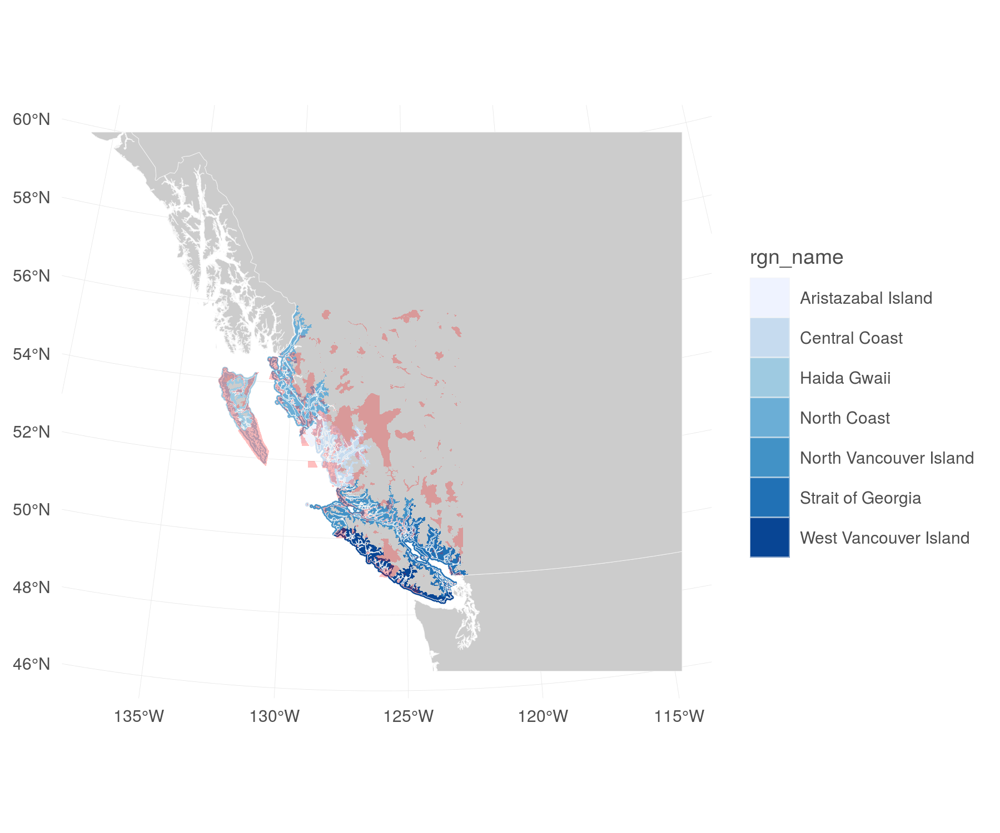

``` {r setup, echo = TRUE, message = FALSE, warning = FALSE}

knitr::opts_chunk$set(fig.width = 6, fig.height = 4, fig.path = 'figs/',
                      echo = TRUE, message = FALSE, warning = FALSE)

# library(sp)        # the classes and methods that make up spatial ops in R
# library(gdalUtils) # for gdal_rasterize() function
# library(maptools)  # tools for reading and manipulating spatial objects
# library(rgeos)
# library(rgdal)
library(raster)
library(sf)

dir_git  <- '~/github/ohibc'
source(file.path(dir_git, 'src/R/common.R'))

scenario <- 'v2017'

dir_spatial <- file.path(dir_git, 'prep/_spatial') 
dir_goal    <- file.path(dir_git, 'prep/lsp', scenario)
dir_rast    <- file.path(dir_goal, 'raster')

dir_anx <- file.path(dir_M, 'git-annex/bcprep') 
dir_goal_anx <- file.path(dir_anx, 'lsp', scenario)

### provenance tracking
library(provRmd); prov_setup()

source(file.path(dir_goal, 'lsp_fxns.R'))
source(file.path(dir_git, 'src/R/rast_tools.R'))

### set up the default BC projection to be BC Albers
p4s_bcalb <- c('bcalb' = '+init=epsg:3005')

rast_base <- raster(file.path(dir_spatial, 'raster/ohibc_rgn_raster_500m.tif'))

```

# Summary: OHIBC Lasting Special Places subgoal (Sense of Place)

The Lasting Special Places goal model is similar to the OHI Global model: a region's status is based upon percent of protected area within a certain amount inland and percent of protected area within 3 nautical mile offshore buffer, compared to a reference point of 30% protected area.  The major difference is that the inland zone for OHIBC will represent the coastal sub-watersheds, i.e. the sub-watersheds that intersect a 1 km inland buffer.

$$X_{LSP} = \frac{\frac{pA_{CMPA}}{pA_{refCMPA}} + \frac{pA_{CP}}{pA_{refCP}}}{2}$$

*pA* = percent of area within the inland or offshore buffer; *CMPA* = coastal marine protected area (3nm offshore); *CP* = coastline protected (coastal watersheds inland); and *refCMPA* = *refCP* = 30% reference point for both measures.

For BC, these calculations include additional layers: Tribal Parks layer from West Coast Vancouver Island and MaPP Special Management Zones allocated to cultural/historic/First Nations use.

This data prep script also prepares resilience layers for MPA coverage as % of 3 nm coastal zone and entire EEZ, including WDPA, Tribal Parks, and all MaPP zones except energy and aquaculture.

-----

# Data Sources

* WDPA database
* MaPP protected areas
    * Set year = 2015 as the date when the plans were released
* BC Provincial parks and ecological reserves
* Tribal parks

-----

# Methods: LSP layers

## Read in BC WDPA-MPA shapefile

We will create a BC-specific polygon subset of the WDPA global dataset, then rasterize to BC Albers at 500 m resolution.

NOTE: If BC WDPA file does not yet exist, `get_wdpa_poly()` creates it from the original WDPA-MPA file.  This takes a long time, due to reading in the full WDPA-MPA geodatabase into a SpatialPolygonsDataFrame.

``` {r set up BC WDPA polygons}

poly_wdpa_bc <- trim_wdpa_poly(p4s_bcalb, reload = FALSE)  
  ### defaults to BC Albers

```

-----

## Rasterize protected areas

### Rasterize BC WDPA-MPA shapefile 

The PEP data does not seem to have year data, so WDPA will be the priority dataset.  Create a total protected area raster in which values are year of protection, or 1 (or something similarly obvious) for areas protected under PEP but not under WDPA.

``` {r rasterize_WDPA}

wdpa_bc_shp_file  <- file.path(dir_goal_anx, 'int', 'wdpa_bc_bcalb.shp')
wdpa_bc_rast_file <- file.path(dir_rast, 'rast_wdpa_bc_500m.tif')

reload <- FALSE
if(!file.exists(wdpa_bc_rast_file) | reload) {
  wdpa_sf <- read_sf(wdpa_bc_shp_file)
  rast_wdpa <- fasterize::fasterize(wdpa_sf, rast_base,
                                    field = 'STATUS_YR',
                                    fun = 'min')
  writeRaster(rast_wdpa, wdpa_bc_rast_file, overwrite = TRUE)
}

```

### Rasterize BC Parks, Ecological Reserves, and Protected Areas data

Note that no "year" column exists in the PEP shapefile.  This raster will supplement the WDPA, and in general provides little to no additional information.  Assigning a value of -1 to protected cells will allow us to identify PEP areas (in a combined WDPA/PEP/tribal/MaPP raster).

``` {r rasterize_PEP}

pep_bc_shp_file  <- file.path(dir_anx, '_raw_data/databc', 
                              'prot_ecol_areas/d2017/TA_PARK_ECORES_PA_SVW',
                              'TA_PEP_SVW_polygon.shp')

# foreign::read.dbf(str_replace(pep_bc_shp_file, '.shp$', '.dbf')) %>%
#   head()
#   ADMIN_AREA OBJECTID ORC_PRIMRY ORC_SCNDRY SRV_GEN_PL                          PROT_NAME
# 1        695      913       3104         00       <NA> GILNOCKIE CREEK ECOLOGICAL RESERVE
# 2       1235      728       0079         00    6TU1893                          YAHK PARK
# 3        694      659       9680         00       <NA>                     GILNOCKIE PARK
# 4       1022      102       0112         00       <NA>                          RYAN PARK
# 5        455     1119       0338         00       <NA>             AKAMINA-KISHINENA PARK
# 6        793      348       0235         00       <NA>                 KIKOMUN CREEK PARK
#            PROT_DESG PROT_CODE PARK_CLASS     F_CODE SHAPE
# 1 ECOLOGICAL RESERVE        OI       <NA> FL98010400    NA
# 2    PROVINCIAL PARK        PP    Class A FA02550271    NA
# 3    PROVINCIAL PARK        PP    Class A FA02550271    NA
# 4    PROVINCIAL PARK        PP    Class A FA02550271    NA
# 5    PROVINCIAL PARK        PP    Class A FA02550271    NA
# 6    PROVINCIAL PARK        PP    Class A FA02550271    NA
pep_bc_rast_file <- file.path(dir_rast, 'rast_pep_bc_500m.tif')

if(!file.exists(pep_bc_rast_file) | reload) {
  
  pep_sf <- read_sf(pep_bc_shp_file)
  rast_pep <- fasterize::fasterize(pep_sf, rast_base,
                                    field = 'OBJECTID',
                                    fun = 'min')
  
  values(rast_pep)[!is.na(values(rast_pep))] <- -1
  writeRaster(rast_pep, pep_bc_rast_file, overwrite = TRUE)
}

```

### Rasterize tribal parks

Similarly, no "year" information is available for these parks.  Setting values to -2 will allow us to recognize tribal parks in a combined raster.

``` {r rasterize_tribal_parks}

tribal_shp_file  <- file.path(dir_anx, '_raw_data/tribal_parks', 
                              'd2017/ParksProtectedAreas_TribalParks',
                              'ParksProtectedAreas_TribalParks.shp')
# foreign::read.dbf(str_replace(tribal_shp_file, '.shp$', '.dbf')) %>%
#   head()
#                                                                 DESCRIP    CUSTODIAN    LAST_UPDAT
# 1                                                  Tranquil Tribal Park Tribal Parks February-2017
# 2                  Wah-nah-jus-Hilth-hoo-is (Meares Island) Tribal Park Tribal Parks February-2017
# 3 uuya thluk nish- "we take care of"- Ha'uukmin Tribal Park Designation Tribal Parks February-2017
# 4     qwa siin hap- "leave as it is"- Ha'uukmin Tribal Park Designation Tribal Parks February-2017
# 5                                                  Esowista Tribal Park Tribal Parks February-2017
# 6                        Ha-uukmin (Kennedy Lake Watershed) Tribal Park Tribal Parks February-2017
#                SHARING                              REVIEWER         SOURCE
# 1 WCA Planning Process  Robert Gunn- Enhancement Groups, ...   Tribal Parks
# 2 WCA Planning Process  Robert Gunn- Enhancement Groups, ...   Tribal Parks
# 3 WCA Planning Process  Robert Gunn- Enhancement Groups, ...   Tribal Parks
# 4 WCA Planning Process  Robert Gunn- Enhancement Groups, ...   Tribal Parks
# 5 WCA Planning Process  Robert Gunn- Enhancement Groups, ...   Tribal Parks
# 6 WCA Planning Process  Robert Gunn- Enhancement Groups, ...   Tribal Parks

tribal_rast_file <- file.path(dir_rast, 'rast_tribal_500m.tif')

if(!file.exists(tribal_rast_file) | reload) {

  ### No numeric field available; create a dummy attribute for rasterization
  shp_tribal <- read_sf(tribal_shp_file)
  shp_tribal$tmp_id <- -2
  
  rast_tribal <- fasterize::fasterize(shp_tribal, rast_base,
                                    field = 'tmp_id',
                                    fun = 'min')
  
  writeRaster(rast_tribal, tribal_rast_file, overwrite = TRUE)
}
```

### Rasterize MaPP zones

For MaPP protected areas and SMZs, assign a value of 2015 (the year that the MaPP plans were finalized).  We will exclude aquaculture and alternative energy development Special Management Zones for both MPA and LSP considertion; for LSP consideration, from the remaining PMZs and SMZs we will select areas protected for cultural value (i.e. 'traditional', 'cultural', 'First Nations', 'recreational').

``` {r aggregate_MaPP}

### create combined MaPP file selecting areas of cultural importance.  I want
### to do this using sf but having problems with write_sf()...

mapp_shp_files  <- list.files(file.path(dir_anx, '_raw_data/mapp', 
                              'MarineSpatialPlanZones'),
                              pattern = '.shp$',
                              full.names = TRUE)

lsp_mapp_shp_file <- file.path(dir_goal_anx, 'shp/mapp_lsp_zones.shp')
mpa_mapp_shp_file <- file.path(dir_goal_anx, 'shp/mapp_mpa_zones.shp')

if(any(!file.exists(c(lsp_mapp_shp_file, mpa_mapp_shp_file))) | reload) {
  ####################################=
  ### Start with MaPP MPA zones
  ####################################=
  mapps <- lapply(mapp_shp_files, 
                  FUN = function(x) {
                    sf::read_sf(x)
                  }) %>%
    setNames(basename(mapp_shp_files) %>% str_replace('_.+', ''))
  
  mapp_nc <- mapps[['NorthCoast']]
  mapp_nc <- mapp_nc %>%
    select(rgn = SubRegion, type = Type, mgmt = Management, 
           obj = Objective, name = Name)
  mapp_nc <- mapp_nc %>%
    filter(is.na(mgmt) | 
             !str_detect(tolower(mgmt), 
                         'renewable|aquaculture|future planning'))
  
  mapp_hg <- mapps[['HaidaGwaii']]
  mapp_hg <- mapp_hg %>%
    select(rgn = SubRegion, type = Type, mgmt = Management, 
           obj = Objective, name = Name)
  mapp_hg <- mapp_hg %>%
    filter(is.na(mgmt) | 
             !str_detect(tolower(mgmt), 
                         'alt.energy|shellfish aq'))
  
  mapp_cc <- mapps[['CentralCoast']]
  mapp_cc <- mapp_cc %>%
    select(rgn = SubRegion, type = Type, mgmt = ZoneType, 
           obj = AreaDecri, name = Group_)
  mapp_cc <- mapp_cc %>%
    filter(is.na(mgmt) | 
             !str_detect(tolower(mgmt), 
                         'renewable|aquaculture'))
  
  mapp_nvi <- mapps[['NorthVancouverIsland']]
  mapp_nvi <- mapp_nvi %>%
    select(rgn = SubRegion, type = Type, mgmt = Management, 
           obj = AreaDescri, name = Name)
  mapp_nvi <- mapp_nvi %>%
    filter(is.na(mgmt) | 
             !str_detect(tolower(mgmt), 
                         'renewable|aquaculture'))
  
  
  mapp_mpas <- rbind(mapp_nc, mapp_hg, mapp_cc, mapp_nvi) %>%
    mutate(year = 2015) %>%
    st_zm()
    ### st_zm() drops z and m dimensions
  
  st_write(mapp_mpas, mpa_mapp_shp_file, driver = 'ESRI Shapefile',
           delete_layer = TRUE)
  
  ####################################=
  ### Now for LSP zones
  ####################################=
  lsp_keywords <- c('tradition', 'cultur', 'historic', 
                    'first n', 'recreat', 'haida')
    
  mapp_lsp <- mapp_mpas %>%
    filter(str_detect(tolower(obj), paste(lsp_keywords, collapse = '|')))
    
  
  st_write(mapp_lsp, lsp_mapp_shp_file, driver = 'ESRI Shapefile',
           delete_layer = TRUE)
}
```

``` {r rasterize_MaPP_lsp}

lsp_mapp_shp <- read_sf(lsp_mapp_shp_file)

lsp_mapp_rast <- fasterize::fasterize(lsp_mapp_shp, rast_base,
                                      field = 'year',
                                      fun = 'min')

writeRaster(lsp_mapp_rast, file.path(dir_rast, 'rast_mapp_lsp_500m.tif'),
            overwrite = TRUE)

```

### Create protected area raster by combining all protected areas 

Priorities will be given to WDPA-MPA polygons with years associated with each cell.  MaPP areas will be given a year of 2015 (year of finalizing the plans).  Other protected areas will be assumed to have been there since the start of our analysis.

``` {r combine_rasters}

rast_wdpa   <- raster(file.path(dir_rast, 'rast_wdpa_bc_500m.tif'))
rast_mapp   <- raster(file.path(dir_rast, 'rast_mapp_lsp_500m.tif'))
rast_tribal <- raster(file.path(dir_rast, 'rast_tribal_500m.tif'))
rast_pep    <- raster(file.path(dir_rast, 'rast_pep_bc_500m.tif'))

rast_lsp_w_mapp_file <- file.path(dir_rast, 'rast_lsp_500m_w_mapp.tif')

if(!file.exists(rast_lsp_w_mapp_file) | reload) {
  rast_lsp <- rast_wdpa
  
  ### The logic here: all rasters should line up.  An NA cell in the top-level
  ### raster gets replaced by the matching cell in the next-level raster,
  ### whether that's an NA or a new value.  And so on.
  values(rast_lsp)[is.na(values(rast_lsp))] <-
    values(rast_mapp)[is.na(values(rast_lsp))]
  values(rast_lsp)[is.na(values(rast_lsp))] <- 
    values(rast_tribal)[is.na(values(rast_lsp))]
  values(rast_lsp)[is.na(values(rast_lsp))] <- 
    values(rast_pep)[is.na(values(rast_lsp))]
  
  writeRaster(rast_lsp, rast_lsp_w_mapp_file, 
              overwrite = TRUE)
}
  
  ### repeat for non-MaPP version
  
rast_lsp_no_mapp_file <- file.path(dir_rast, 'rast_lsp_500m_no_mapp.tif')

if(!file.exists(rast_lsp_no_mapp_file) | reload) {
  rast_lsp_no_mapp <- rast_wdpa
  
  values(rast_lsp_no_mapp)[is.na(values(rast_lsp_no_mapp))] <- 
    values(rast_tribal)[is.na(values(rast_lsp_no_mapp))]
  values(rast_lsp_no_mapp)[is.na(values(rast_lsp_no_mapp))] <- 
    values(rast_pep)[is.na(values(rast_lsp_no_mapp))]
  
  writeRaster(rast_lsp_no_mapp, rast_lsp_no_mapp_file, 
              overwrite = TRUE)
}

```

-----

## Set up coastal buffer rasters

Buffer shapefiles are located in `github/ohibc/prep/_spatial`.  Global LSP uses 1 km inland and 3nm offshore buffers, while resilience requires analysis over the entire EEZ.  For OHI Howe Sound, we used the inland extent of the entire Squamish watershed.  For OHIBC, we make a compromise: include coastal sub-watersheds that intersect with the 1 km buffer.

* Rasterize the watersheds using the value of watershed ID to 500 m
* Crosstabulate with the 500m 1km inland buffer to identify watersheds that intersect with the coastline
* create a raster of these features, with a rgn_id value to reflect the region ID with the greatest amount of overlap.

The buffer rasters are created in a separate .R script: `r file.path(dir_spatial, '_rasterize_buffers.r')`.

### Map of coastal buffers and protected area:

``` {r plot raster}

map_file <- file.path(dir_goal, 'figs', 'protected_area_map.png')

if(!file.exists(map_file) | reload) {
  poly_3nm <- sf::read_sf(dsn = dir_spatial,
                          layer = 'ohibc_offshore_3nm')
  map_ext <- st_bbox(poly_3nm)[c(1, 3, 2, 4)] %>%
    extent()
  poly_land <- sf::read_sf(dsn = dir_spatial,
                           layer = 'ohibc_us_can')
  
  rast_inland <- raster(file.path(dir_spatial, 'watershed/ohibc_coastal_watersheds_500m.tif')) %>%
    rasterToPoints() %>%
    data.frame()  %>%
    left_join(get_rgn_names(), by = c('ohibc_coastal_watersheds_500m' = 'rgn_id'))
  rast_lsp   <- raster(file.path(dir_rast, 'rast_lsp_500m_no_mapp.tif')) %>%
    crop(map_ext) %>%
    rasterToPoints() %>%
    data.frame()
  
  x <- ggplot() +
    ggtheme_plot() +
    geom_sf(data = poly_land, fill = 'grey80', size = .1, color = 'grey96') +
    geom_raster(data = rast_inland, aes(x = x, y = y, fill = rgn_name)) +
    geom_sf(data = poly_3nm, aes(fill = rgn_name), size = .1, color = 'grey96') +
    geom_raster(data = rast_lsp,   aes(x = x, y = y), fill = 'red', alpha = .25) +
    scale_fill_brewer(palette = 'Blues') +
    theme(axis.title = element_blank())
  
  ggsave(map_file, height = 5)
}

```



-----

## Calculate goal layers

``` {r lsp_zonal_stats}

zonal_3nm_file    <- file.path(dir_goal, 'int', 'zonal_stats_3nm_no_mapp.csv')
zonal_inland_file <- file.path(dir_goal, 'int', 'zonal_stats_inland_no_mapp.csv')

if(any(!file.exists(c(zonal_3nm_file, zonal_inland_file))) | reload) {
  
  rast_3nm_file    <- file.path(dir_spatial, 
                                'raster/ohibc_offshore_3nm_raster_500m.tif')
  rast_inland_file <- file.path(dir_spatial, 
                                'watershed/ohibc_coastal_watersheds_500m.tif')
  rast_lsp_file   <- file.path(dir_rast, 'rast_lsp_500m_no_mapp.tif')
  
  rast_3nm    <- raster(rast_3nm_file)
  rast_inland <- raster(rast_inland_file)
  rast_lsp    <- raster(rast_lsp_file)
  
  
  ### NOTE: The crosstab function returns this warning - does it affect the
  ### outcomes, or does the function coerce the correct outcome?
      # Warning message:
      # In FUN(X[[i]], ...) : integer overflow - use sum(as.numeric(.))
  
  ptm <- proc.time()
  stats_3nm <- raster::crosstab(rast_lsp, rast_3nm, useNA = TRUE, 
                                progress = 'text') %>%
    as.data.frame() %>%
    setNames(c('year', 'rgn_id', 'n_cells')) %>%
    mutate(year   = as.integer(as.character(year)),
           rgn_id = as.integer(as.character(rgn_id))) %>%
    arrange(rgn_id, year)
  
  stats_inland <- raster::crosstab(rast_lsp, rast_inland, useNA = TRUE, 
                                   progress = 'text') %>%
    as.data.frame() %>%
    setNames(c('year', 'rgn_id', 'n_cells')) %>%
    mutate(year   = as.integer(as.character(year)),
           rgn_id = as.integer(as.character(rgn_id))) %>%
    arrange(rgn_id, year)
  
  message('Elapsed: ', (proc.time() - ptm)[3], ' sec')
  
  write_csv(stats_3nm, zonal_3nm_file)
  write_csv(stats_inland, zonal_inland_file)
}
```

``` {r lsp_zonal_stats_with_mapp}

zonal_3nm_file_w_mapp    <- file.path(dir_goal, 'int', 'zonal_stats_3nm_w_mapp.csv')
zonal_inland_file_w_mapp <- file.path(dir_goal, 'int', 'zonal_stats_inland_w_mapp.csv')

if(any(!file.exists(c(zonal_3nm_file_w_mapp, zonal_inland_file_w_mapp))) | reload) {

  rast_3nm_file    <- file.path(dir_spatial, 
                                'raster/ohibc_offshore_3nm_raster_500m.tif')
  rast_inland_file <- file.path(dir_spatial, 
                                'watershed/ohibc_coastal_watersheds_500m.tif')
  rast_lsp_file   <- file.path(dir_rast, 'rast_lsp_500m_w_mapp.tif')
  
  rast_3nm    <- raster(rast_3nm_file)
  rast_inland <- raster(rast_inland_file)
  rast_lsp    <- raster(rast_lsp_file)
  
  
  ### NOTE: The crosstab function returns this warning - does it affect the
  ### outcomes, or does the function coerce the correct outcome?
      # Warning message:
      # In FUN(X[[i]], ...) : integer overflow - use sum(as.numeric(.))
  
  ptm <- proc.time()
  stats_3nm <- raster::crosstab(rast_lsp, rast_3nm, useNA = TRUE, 
                                progress = 'text') %>%
    as.data.frame() %>%
    setNames(c('year', 'rgn_id', 'n_cells')) %>%
    mutate(year   = as.integer(as.character(year)),
           rgn_id = as.integer(as.character(rgn_id))) %>%
    arrange(rgn_id, year)
  
  stats_inland <- raster::crosstab(rast_lsp, rast_inland, useNA = TRUE, 
                                   progress = 'text') %>%
    as.data.frame() %>%
    setNames(c('year', 'rgn_id', 'n_cells')) %>%
    mutate(year   = as.integer(as.character(year)),
           rgn_id = as.integer(as.character(rgn_id))) %>%
    arrange(rgn_id, year)
  
  message('Elapsed: ', (proc.time() - ptm)[3], ' sec')
  
  write_csv(stats_3nm, zonal_3nm_file_w_mapp)
  write_csv(stats_inland, zonal_inland_file_w_mapp)
}
```

Once the WDPA raster is cross-tabulated against the OHI region rasters (both 3 nm offshore and 1 km inland) we have the number of protected cells, identified by year of protection, within each region.  NA values are unprotected cells.  The total of NA and valued cells gives total area of each region.

### Summary of zonal stats dataframes (3 nm offshore):

``` {r}
stats_3nm <- read_csv(zonal_3nm_file, nogit = TRUE)
print(summary(stats_3nm))
```

### Summary of zonal stats dataframes (coastal watersheds inland):

``` {r}
stats_inland <- read_csv(zonal_inland_file, nogit = TRUE)
print(summary(stats_inland))
```

-----

## Calculate protected area and total area by region

Grouping by rgn_id, the total number of cells per region is determined by summing cell counts across ALL years, including cells with year == NA (unprotected cells).  We can then determine the protected area for each year by looking at the cumulative sum of cells up to any given year.  Note that this step will also trim the dataframe to only instances since 1980 (though protected area pre-1980 is still counted).

Since the cells are 500 m on a side, we can easily calculate area by multiplying cell count * 0.25 km^2^ per cell.

Finally we can calculate the status of a region for any given year by finding the ratio of protected:total and normalizing by the goal's target of 30% protected area.


``` {r summarize_zonal_stats_no_mapp}

lsp_thresh <- 0.30

rgn_names <- get_rgn_names()

stats_3nm    <- read_csv(zonal_3nm_file)
stats_inland <- read_csv(zonal_inland_file)

### Determine total cells per region (n_cells_tot) and then a cumulative
### total of cells per region.
lsp_inland <- stats_inland %>%
  group_by(rgn_id) %>%
  arrange(rgn_id, year) %>%
  mutate(n_cells_tot = sum(n_cells),
         n_cells_cum = cumsum(n_cells),
         a_tot_km2   = n_cells_tot / 4,
         a_prot_km2  = n_cells_cum / 4) %>%
  complete(year = full_seq(1990:2016, 1), nesting(rgn_id)) %>%
  fill(-year, -rgn_id, -n_cells) %>%
  filter(!is.na(rgn_id)) %>%
  ungroup() %>%
  mutate(pct_prot   = round(n_cells_cum / n_cells_tot, 4),
         lsp_status = round(ifelse(pct_prot > lsp_thresh, 1, (pct_prot / lsp_thresh)), 2)) %>%
  left_join(rgn_names, by = 'rgn_id') %>%
  distinct()

lsp_3nm <- stats_3nm %>%
  group_by(rgn_id) %>%
  arrange(rgn_id, year) %>%
  mutate(n_cells_tot = sum(n_cells),
         n_cells_cum = cumsum(n_cells),
         a_tot_km2   = n_cells_tot / 4,
         a_prot_km2  = n_cells_cum / 4) %>%
  complete(year = full_seq(1990:2016, 1), nesting(rgn_id)) %>%
  fill(-year, -rgn_id, -n_cells) %>%
  filter(!is.na(rgn_id)) %>%
  ungroup() %>%
  filter(!is.na(year))  %>% 
    ### this ditches non-protected cell counts but already 
    ### counted in n_cells_tot
  mutate(pct_prot   = round(n_cells_cum / n_cells_tot, 4),
         lsp_status = round(ifelse(pct_prot > lsp_thresh, 1, (pct_prot / lsp_thresh)), 2)) %>%
  left_join(rgn_names, by = 'rgn_id') %>%
  distinct()

write_csv(lsp_3nm, file.path(dir_goal, 'int', 'area_lsp_3nm.csv'))
write_csv(lsp_inland, file.path(dir_goal, 'int', 'area_lsp_inland.csv'))

```

``` {r summarize_zonal_stats_w_mapp}

lsp_thresh <- 0.30

rgn_names <- get_rgn_names()

stats_3nm    <- read_csv(zonal_3nm_file_w_mapp)
stats_inland <- read_csv(zonal_inland_file_w_mapp)

### Determine total cells per region (n_cells_tot) and then a cumulative
### total of cells per region.
lsp_inland <- stats_inland %>%
  group_by(rgn_id) %>%
  arrange(rgn_id, year) %>%
  mutate(n_cells_tot = sum(n_cells),
         n_cells_cum = cumsum(n_cells),
         a_tot_km2   = n_cells_tot / 4,
         a_prot_km2  = n_cells_cum / 4) %>%
  complete(year = full_seq(1990:2016, 1), nesting(rgn_id)) %>%
  fill(-year, -rgn_id, -n_cells) %>%
  filter(!is.na(rgn_id)) %>%
  ungroup() %>%
  mutate(pct_prot   = round(n_cells_cum / n_cells_tot, 4),
         lsp_status = round(ifelse(pct_prot > lsp_thresh, 1, (pct_prot / lsp_thresh)), 2)) %>%
  left_join(rgn_names, by = 'rgn_id') %>%
  distinct()

lsp_3nm <- stats_3nm %>%
  group_by(rgn_id) %>%
  arrange(rgn_id, year) %>%
  mutate(n_cells_tot = sum(n_cells),
         n_cells_cum = cumsum(n_cells),
         a_tot_km2   = n_cells_tot / 4,
         a_prot_km2  = n_cells_cum / 4) %>%
  complete(year = full_seq(1990:2016, 1), nesting(rgn_id)) %>%
  fill(-year, -rgn_id, -n_cells) %>%
  filter(!is.na(rgn_id)) %>%
  ungroup() %>%
  filter(!is.na(year))  %>% 
    ### this ditches non-protected cell counts but already 
    ### counted in n_cells_tot
  mutate(pct_prot   = round(n_cells_cum / n_cells_tot, 4),
         lsp_status = round(ifelse(pct_prot > lsp_thresh, 1, (pct_prot / lsp_thresh)), 2)) %>%
  left_join(rgn_names, by = 'rgn_id') %>%
  distinct()

write_csv(lsp_3nm, file.path(dir_goal, 'int', 'area_lsp_3nm_w_mapp.csv'))
write_csv(lsp_inland, file.path(dir_goal, 'int', 'area_lsp_inland_w_mapp.csv'))

```

### Protected areas and status (3 nm offshore, 2010+ only):

``` {r}
DT::datatable(lsp_3nm %>% 
                filter(year >= 2010) %>% 
                select(-contains('cell')), 
              caption = '3 nautical mile offshore zone - area in km^2^')
```

### Protected areas and status (1 km inland, 2010+ only):

``` {r}
DT::datatable(lsp_inland %>% 
                filter(year >= 2010) %>% 
                select(-contains('cell')), 
              caption = 'coastal watershed inland zone - area in km^2^')
```

-----

## Combine scores for inland and offshore, and writing output layers

The status is based on a simple arithmetic average of the inland and offshore status values. 

``` {r combine_inland_and_offshore}

lsp_3nm <- read_csv(file.path(dir_goal, 'int', 'area_lsp_3nm.csv'))
lsp_inland <- read_csv(file.path(dir_goal, 'int', 'area_lsp_inland.csv'))

lsp_df <- lsp_inland %>%
  dplyr::select(rgn_id, year, rgn_name,
                lsp_st_inland = lsp_status,
                a_prot_inland = a_prot_km2,
                a_tot_inland  = a_tot_km2) %>%
  full_join(lsp_3nm %>% 
              dplyr::select(rgn_id, year, rgn_name,
                            lsp_st_3nm = lsp_status,
                            a_prot_3nm = a_prot_km2,
                            a_tot_3nm  = a_tot_km2),
            by = c('rgn_id', 'rgn_name', 'year')) %>%
  mutate(lsp_st_inland = ifelse(is.na(lsp_st_inland), 0, lsp_st_inland),
         lsp_st_3nm = ifelse(is.na(lsp_st_3nm), 0, lsp_st_3nm),
         lsp_status = (lsp_st_inland + lsp_st_3nm) / 2) %>%
  distinct()

write_csv(lsp_df, file.path(dir_goal, 'int', 'area_lsp_total.csv'))

a_lsp_inland_file   <- file.path(dir_goal, 'output', 
                                  'lsp_protected_inland_ws.csv')
a_lsp_offshore_file <- file.path(dir_goal, 'output', 
                                  'lsp_protected_offshore3nm.csv')
a_tot_inland_file    <- file.path(dir_goal, 'output', 
                                  'lsp_a_total_inland_ws.csv')
a_tot_offshore_file  <- file.path(dir_goal, 'output', 
                                  'lsp_a_total_offshore3nm.csv')

write_csv(lsp_df %>% 
            select(rgn_id, year, a_prot_inland), 
          a_lsp_inland_file)

write_csv(lsp_df %>% 
            select(rgn_id, year, a_prot_3nm), 
          a_lsp_offshore_file)

write_csv(lsp_df %>% 
            select(rgn_id, year, a_tot_inland), 
          a_tot_inland_file)

write_csv(lsp_df %>% 
            select(rgn_id, year, a_tot_3nm), 
          a_tot_offshore_file)

```

``` {r combine_inland_and_offshore_w_mapp}

lsp_3nm1 <- read_csv(file.path(dir_goal, 'int', 'area_lsp_3nm_w_mapp.csv'))
lsp_inland1 <- read_csv(file.path(dir_goal, 'int', 'area_lsp_inland_w_mapp.csv'))

lsp_df1 <- lsp_inland1 %>%
  dplyr::select(rgn_id, year, rgn_name,
                lsp_st_inland = lsp_status,
                a_prot_inland = a_prot_km2,
                a_tot_inland  = a_tot_km2) %>%
  full_join(lsp_3nm1 %>% 
              dplyr::select(rgn_id, year, rgn_name,
                            lsp_st_3nm = lsp_status,
                            a_prot_3nm = a_prot_km2,
                            a_tot_3nm  = a_tot_km2),
            by = c('rgn_id', 'rgn_name', 'year')) %>%
  mutate(lsp_st_inland = ifelse(is.na(lsp_st_inland), 0, lsp_st_inland),
         lsp_st_3nm = ifelse(is.na(lsp_st_3nm), 0, lsp_st_3nm),
         lsp_status = (lsp_st_inland + lsp_st_3nm) / 2) %>%
  distinct()

write_csv(lsp_df1, file.path(dir_goal, 'int', 'area_lsp_total_w_mapp.csv'))

a_lsp_inland_file   <- file.path(dir_goal, 'output', 
                                  'lsp_protected_inland_ws_w_mapp.csv')
a_lsp_offshore_file <- file.path(dir_goal, 'output', 
                                  'lsp_protected_offshore3nm_w_mapp.csv')
a_tot_inland_file    <- file.path(dir_goal, 'output', 
                                  'lsp_a_total_inland_ws_w_mapp.csv')
a_tot_offshore_file  <- file.path(dir_goal, 'output', 
                                  'lsp_a_total_offshore3nm_w_mapp.csv')

write_csv(lsp_df1 %>% 
            select(rgn_id, year, a_prot_inland), 
          a_lsp_inland_file)

write_csv(lsp_df1 %>% 
            select(rgn_id, year, a_prot_3nm), 
          a_lsp_offshore_file)

write_csv(lsp_df1 %>% 
            select(rgn_id, year, a_tot_inland), 
          a_tot_inland_file)

write_csv(lsp_df1 %>% 
            select(rgn_id, year, a_tot_3nm), 
          a_tot_offshore_file)

```

We save outputs for the following layers (also versions with MaPP regions for later comparison):

* ``r a_lsp_inland_file``: inland protected area (km^2^) for each region (since 1980)
* ``r a_lsp_offshore_file``: offshore protected area  (km^2^) for each region (since 1980)
* ``r a_tot_inland_file``: inland 1 km total area (km^2^) for each region
* ``r a_tot_offshore_file``: offshore 3 nm total area  (km^2^) for each region

From these layers, we can also estimate the status and trend.  "Official" values will be determined in the toolbox?  Trend is based on linear model going back ___ten years___ from each status year to smooth trend values, since addition of new MPAs is rather sporadic.

``` {r estimate status and trend by year}

lsp_df <- read_csv(file.path(dir_goal, 'int', 'area_lsp_total.csv'))

status_df <- lsp_df %>% 
  select(rgn_id, year, lsp_status)

trend_span <- 10

trend_df <- data.frame()
for (i in 1990:2016) { # i <- 2013
  tmp_status <- status_df %>%
    filter(year <= i & year > (i - trend_span))
  tmp_trend <- tmp_status %>%
    group_by(rgn_id) %>%
    do(trend_lm = lm(lsp_status ~ year, data = .)$coefficients[2]) %>%
    mutate(year     = i,
           trend_lm = unlist(trend_lm))

  trend_df <- trend_df %>%
    bind_rows(tmp_trend)
}

trend_df1 <- status_df %>%
  left_join(trend_df, by = c('rgn_id', 'year')) %>%
  mutate(lsp_trend = round(trend_lm / lag(lsp_status, trend_span), 5) * 5,
         lsp_trend = ifelse(lsp_trend < -1, -1, lsp_trend),
         lsp_trend = ifelse(lsp_trend > 1, 1, lsp_trend)) %>% ### clip to +/- 1
  filter(!is.na(lsp_trend)) %>%
  select(-lsp_status, -trend_lm)

lsp_status_trend_summary <- rgn_names %>% 
  left_join(status_df, by = 'rgn_id') %>% 
  left_join(trend_df1, by = c('rgn_id', 'year')) %>%
  arrange(desc(year), rgn_id) %>%
  filter(year >= 1990)

write_csv(lsp_status_trend_summary, file.path(dir_goal, 'summary', 'lsp_status_trend.csv'))

```

``` {r estimate status and trend by year w mapp}

lsp_df <- read_csv(file.path(dir_goal, 'int', 'area_lsp_total_w_mapp.csv'))

status_df <- lsp_df %>% 
  select(rgn_id, year, lsp_status)

trend_span <- 10

trend_df <- data.frame()
for (i in 1990:2016) { # i <- 2013
  tmp_status <- status_df %>%
    filter(year <= i & year > (i - trend_span))
  tmp_trend <- tmp_status %>%
    group_by(rgn_id) %>%
    do(trend_lm = lm(lsp_status ~ year, data = .)$coefficients[2]) %>%
    mutate(year     = i,
           trend_lm = unlist(trend_lm))

  trend_df <- trend_df %>%
    bind_rows(tmp_trend)
}

trend_df1 <- status_df %>%
  left_join(trend_df, by = c('rgn_id', 'year')) %>%
  mutate(lsp_trend = round(trend_lm / lag(lsp_status, trend_span), 5) * 5,
         lsp_trend = ifelse(lsp_trend < -1, -1, lsp_trend),
         lsp_trend = ifelse(lsp_trend > 1, 1, lsp_trend)) %>% ### clip to +/- 1
  filter(!is.na(lsp_trend)) %>%
  select(-lsp_status, -trend_lm)

lsp_status_trend_summary <- rgn_names %>% 
  left_join(status_df, by = 'rgn_id') %>% 
  left_join(trend_df1, by = c('rgn_id', 'year')) %>%
  arrange(desc(year), rgn_id) %>%
  filter(year >= 1990)

write_csv(lsp_status_trend_summary, file.path(dir_goal, 'summary', 'lsp_status_trend_w_mapp.csv'))

```

### Status and trend estimates:

`r DT::datatable(lsp_status_trend_summary, caption = 'LSP status and trend estimates')`

-----

## Plot scores time series

To examine results, we plot the estimated status and trend over time.

``` {r spp_plot_scores_over_time, fig.height = 4, fig.width = 6, fig.align = 'center'}

library(ggplot2)
library(plotly)

lsp_status_trend_summary <- read_csv(file.path(dir_goal, 'summary', 'lsp_status_trend.csv'))

status_ts_plot <- ggplot(lsp_status_trend_summary %>%
                           filter(!is.na(year)),
                         aes(x = year, y = lsp_status, color = rgn_name, group = rgn_name)) +
  ggtheme_plot() +
  geom_line(size = 2, alpha = .6) +
  scale_color_brewer(palette = 'Dark2') +
  labs(x = 'year',
       y = 'LSP status',
       title = 'LSP status over time',
       color = 'Region')

print(status_ts_plot)

trend_ts_plot <- ggplot(lsp_status_trend_summary %>%
                           filter(!is.na(year) &!is.na(lsp_trend)),
                         aes(x = year, y = lsp_trend, color = rgn_name, group = rgn_name)) +
  ggtheme_plot() +
  geom_line(size = 2, alpha = .6) +
  scale_color_brewer(palette = 'Dark2') +
  labs(x = 'year',
       y = 'LSP trend',
       title = 'LSP trend over time',
       color = 'Region')

print(trend_ts_plot)

```

### scores over time with MaPP included

``` {r spp_plot_scores_over_time_w_mapp, fig.height = 4, fig.width = 6, fig.align = 'center'}

lsp_status_trend_summary <- read_csv(file.path(dir_goal, 'summary', 'lsp_status_trend_w_mapp.csv'))

status_ts_plot <- ggplot(lsp_status_trend_summary %>%
                           filter(!is.na(year)),
                         aes(x = year, y = lsp_status, color = rgn_name, group = rgn_name)) +
  ggtheme_plot() +
  geom_line(size = 2, alpha = .6) +
  scale_color_brewer(palette = 'Dark2') +
  labs(x = 'year',
       y = 'LSP status',
       title = 'LSP status over time, incl MaPP',
       color = 'Region')

print(status_ts_plot)

trend_ts_plot <- ggplot(lsp_status_trend_summary %>%
                           filter(!is.na(year) &!is.na(lsp_trend)),
                         aes(x = year, y = lsp_trend, color = rgn_name, group = rgn_name)) +
  ggtheme_plot() +
  geom_line(size = 2, alpha = .6) +
  scale_color_brewer(palette = 'Dark2') +
  labs(x = 'year',
       y = 'LSP trend',
       title = 'LSP trend over time',
       color = 'Region')

print(trend_ts_plot)

```

-----

# Methods: MPA Resilience layers

## Rasterize protected areas

For this calculation, we will use the same WDPA, PEP, and Tribal parks layers; but the MaPP layer will include all Protected Management Areas and Special Management Areas except for renewable energy and aquaculture zones.

UPDATE:  MaPP areas WILL NOT be included as resilience since they are not legally binding yet.

### Rasterize MaPP MPAs

MaPP MPA shapefile was created along with the LSP shapefile, the primary difference being that LSP focuses on traditional/cultural/First Nations uses rather than all protections; here we rasterize the MPA file.

``` {r rasterize_MaPP_mpas}

mpa_mapp_shp <- read_sf(mpa_mapp_shp_file)

mpa_mapp_rast <- fasterize::fasterize(mpa_mapp_shp, rast_base,
                                      field = 'year', fun = 'min')

writeRaster(mpa_mapp_rast, file.path(dir_rast, 'rast_mapp_mpa_500m.tif'),
            overwrite = TRUE)

```

### Create protected area raster by combining all protected areas 

Priorities will be given to WDPA-MPA polygons with years associated with each cell.  MaPP areas will not be included here as they are not officially designated/protected.  Other protected areas will be assumed to have been there since the start of our analysis.

``` {r combine_MPA_rasters}

rast_wdpa <- raster(file.path(dir_rast, 'rast_wdpa_bc_500m.tif'))
# mpa_rast_mapp <- raster(file.path(dir_rast, 'rast_mapp_mpa_500m.tif'))
rast_tribal <- raster(file.path(dir_rast, 'rast_tribal_500m.tif'))
rast_pep  <- raster(file.path(dir_rast, 'rast_pep_bc_500m.tif'))

rast_mpa_file <- file.path(dir_rast, 'rast_mpa_500m.tif')

rast_mpa <- rast_wdpa

### The logic here: all rasters should line up.  An NA cell in the top-level
### raster gets replaced by the matching cell in the next-level raster,
### whether that's an NA or a new value.  And so on.
# values(rast_mpa)[is.na(values(rast_mpa))] <- 
#   values(mpa_rast_mapp)[is.na(values(rast_mpa))]
  ### don't include MaPP here!
values(rast_mpa)[is.na(values(rast_mpa))] <- 
  values(rast_tribal)[is.na(values(rast_mpa))]
values(rast_mpa)[is.na(values(rast_mpa))] <- 
  values(rast_pep)[is.na(values(rast_mpa))]

writeRaster(rast_mpa, rast_mpa_file, 
            overwrite = TRUE)

```

-----

## Calculate resilience layers

``` {r mpa_zonal_stats}

zonal_3nm_mpa_file <- file.path(dir_goal, 'int', 'zonal_stats_mpa_3nm.csv')
zonal_eez_mpa_file <- file.path(dir_goal, 'int', 'zonal_stats_mpa_eez.csv')

rast_3nm <- raster(file.path(dir_spatial, 'raster', 
                             'ohibc_offshore_3nm_raster_500m.tif'))
rast_eez <- raster(file.path(dir_spatial, 'raster', 
                             'ohibc_rgn_raster_500m.tif'))
rast_mpa <- raster(file.path(dir_rast, 'rast_mpa_500m.tif'))

### NOTE: The crosstab function returns this warning - does it affect the
### outcomes, or does the function coerce the correct outcome?
    # Warning message:
    # In FUN(X[[i]], ...) : integer overflow - use sum(as.numeric(.))

ptm <- proc.time()
stats_3nm_mpa <- raster::crosstab(rast_mpa, rast_3nm, 
                                  useNA = TRUE, progress = 'text') %>%
  as.data.frame() %>%
  setNames(c('year', 'rgn_id', 'n_cells')) %>%
  mutate(year   = as.integer(as.character(year)),
         rgn_id = as.integer(as.character(rgn_id))) %>%
  arrange(rgn_id, year)

stats_eez_mpa <- raster::crosstab(rast_mpa, rast_eez, 
                                  useNA = TRUE, progress = 'text') %>%
  as.data.frame() %>%
  setNames(c('year', 'rgn_id', 'n_cells')) %>%
  mutate(year   = as.integer(as.character(year)),
         rgn_id = as.integer(as.character(rgn_id))) %>%
  arrange(rgn_id, year)

message('Elapsed: ', (proc.time() - ptm)[3], ' sec')

write_csv(stats_3nm_mpa, zonal_3nm_mpa_file)
write_csv(stats_eez_mpa, zonal_eez_mpa_file)

```

## Calculate protected area and total area by region

Grouping by rgn_id, the total number of cells per region is determined by summing cell counts across ALL years, including cells with year == NA (unprotected cells).  We can then determine the protected area for each year by looking at the cumulative sum of cells up to any given year.  Note that this step will also trim the dataframe to only instances since 1980 (though protected area pre-1980 is still counted).

Since the cells are 500 m on a side, we can easily calculate area by multiplying cell count * 0.25 km^2^ per cell.

Next we can calculate the MPA resilience value of a region for any given year by finding the ratio of protected:total and normalizing by the goal's target of 30% protected area.

In addition to presence of MPAs, we also want to include a measure of effectiveness.  To this end, we modify the protected area by the proportion of MPAs with management plans in place, with a target of 100%.  For example, if a region has 33% of its marine area protected in MPAs, but only 70% of protected areas have management plans, then the adjusted percentage is .33 * .70 = .231 = 23.1%, which earns a resilience score of 77.  Note that our management plans data is coast-wide, not regionalized.

``` {r summarize_MPA_zonal_stats}

rgn_names <- get_rgn_names()

stats_3nm <- read_csv(zonal_3nm_mpa_file)
stats_eez <- read_csv(zonal_eez_mpa_file)

mpa_mgmt_file <- file.path(dir_anx, '_raw_data/fisheries_resilience',
                           'fisheries_resilience.xlsx')
mpa_mgmt_plans <- readxl::read_excel(mpa_mgmt_file, 
                                     sheet = 'ProtectAreaPlans') %>%
  setNames(c('year', 'mgmt_plan_pct'))

git_prov(mpa_mgmt_file, filetype = 'input')

### Determine total cells per region (n_cells_tot) and then a cumulative
### total of cells per region
mpa_eez_raw <- stats_eez %>%
  group_by(rgn_id) %>%
  arrange(rgn_id, year) %>%
  mutate(n_cells_tot = sum(n_cells),
         n_cells_cum = cumsum(n_cells),
         a_tot_km2   = n_cells_tot / 4,
         a_prot_km2  = n_cells_cum / 4) %>%
  complete(year = full_seq(1990:2016, 1), nesting(rgn_id)) %>%
  fill(-year, -rgn_id, -n_cells) %>%
  filter(!is.na(rgn_id)) %>%
  ungroup() 

mpa_eez <- mpa_eez_raw %>%
  left_join(mpa_mgmt_plans, by = 'year') %>%
  group_by(rgn_id) %>%
  fill(mgmt_plan_pct) %>%
  ungroup() %>%
  mutate(pct_prot = (n_cells_cum / n_cells_tot),
         pct_prot = round(pct_prot * mgmt_plan_pct / 0.3, 4),
         pct_prot = ifelse(pct_prot > 1, 1, pct_prot)) %>%
  select(rgn_id, year, pct_prot) %>%
  distinct() %>%
  filter(!is.na(pct_prot))

mpa_3nm_raw <- stats_3nm %>%
  group_by(rgn_id) %>%
  arrange(rgn_id, year) %>%
  mutate(n_cells_tot = sum(n_cells),
         n_cells_cum = cumsum(n_cells),
         a_tot_km2   = n_cells_tot / 4,
         a_prot_km2  = n_cells_cum / 4) %>%
  complete(year = full_seq(1990:2016, 1), nesting(rgn_id)) %>%
  fill(-year, -rgn_id, -n_cells) %>%
  filter(!is.na(rgn_id)) %>%
  ungroup()

mpa_3nm <- mpa_3nm_raw %>%
  left_join(mpa_mgmt_plans, by = 'year') %>%
  group_by(rgn_id) %>%
  fill(mgmt_plan_pct) %>%
  ungroup() %>%
  mutate(pct_prot = (n_cells_cum / n_cells_tot),
         pct_prot = round(pct_prot * mgmt_plan_pct / 0.3, 4),
         pct_prot = ifelse(pct_prot > 1, 1, pct_prot)) %>%
  select(rgn_id, year, pct_prot) %>%
  distinct() %>%
  filter(!is.na(pct_prot))

write_csv(mpa_3nm, file.path(dir_goal, 'output', 'mpa_pct_3nm.csv'))
write_csv(mpa_eez, file.path(dir_goal, 'output', 'mpa_pct_eez.csv'))

DT::datatable(mpa_3nm, caption = 'MPA coverage in 3nm coastal zone')
DT::datatable(mpa_eez, caption = 'MPA coverage in exclusive economic zone')

```

-----

``` {r, results = 'asis'}
prov_wrapup(commit_outputs = FALSE)
```

