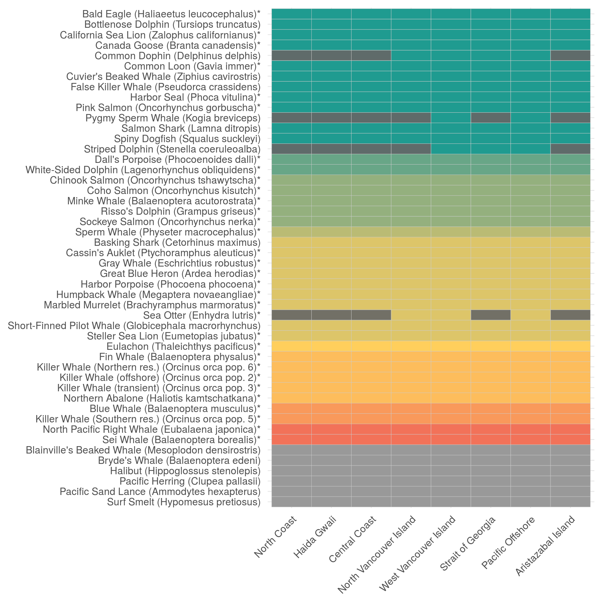
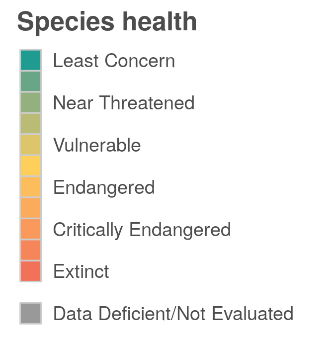
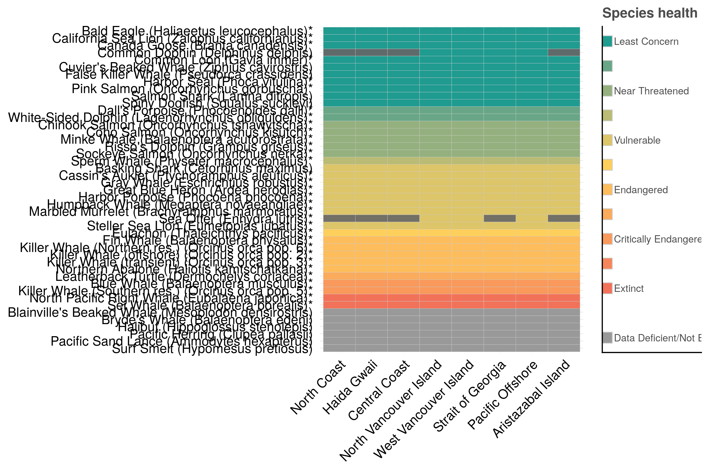

``` {r setup, echo = TRUE, message = FALSE, warning = FALSE}

knitr::opts_chunk$set(fig.width = 6, fig.height = 4, fig.path = 'Figs/',
                      echo = TRUE, message = FALSE, warning = FALSE)

library(rgdal)
library(raster)
source('~/github/ohibc/src/R/common.R')  ### an OHIBC specific version of common.R

scenario <- 'v2017'
goal     <- 'spp_ico'
dir_git  <- '~/github/ohibc'
dir_goal <- file.path(dir_git, 'prep', goal, scenario)
dir_rgn  <- file.path(dir_git, 'prep/spatial')

dir_goal_anx        <- file.path(dir_M, 'git-annex/bcprep', goal, scenario) 
dir_goal_anx_global <- file.path(dir_M, 'git-annex/globalprep', goal, scenario)

# library(provRmd); prov_setup()

source(file.path(dir_goal, 'spp_fxn.R'))

### set up proj4string options: BC Albers and WGS84
p4s_bcalb <- c('bcalb' = '+init=epsg:3005')
p4s_wgs84 <- c('wgs84' = '+init=epsg:4326')

```

# Summary: OHIBC Iconic Species

This script prepares layers (species presence and species health) for Iconic Species subgoal in 
British Columbia's coastal regions.  Spatial data from IUCN and Aquamaps is
combined with extinction risk information from IUCN and conservation rank
info based on province-level NatureServe categories.

Iconic Species status is based upon a simple average of species
health for species found within each OHIBC region.

From Halpern et al (2012):

> The reference point is to have the risk status of all assessed species as Least Concern (i.e., a goal score = 1.0). Species that have not been assessed or labeled as data deficient are not included in the calculation.

**Mean risk status for OHIBC:**

$$\bar{R} = \frac{\displaystyle\sum_{species}(Risk)}{n_{spp}}$$

**Iconic Species goal model**

$$X_{SPP} = (1 - \bar{R}_{ICO}) * 100%$$

where:

* $X_{ICO}$ is Species goal status
* $\bar{R}$ is mean extinction risk for identified species within OHIBC (different subsets for ICO and SPP)
* *Risk* is scaled value for species extinction risk category, based on: 
    * 'LC' = 0.0, 'NT' = 0.2, 'VU' = 0.4, 'EN' = 0.6, 'CR' = 0.8, 'EX' = 1.0
* ICO trend is calculated as the linear trend of the average extinction risk categories over time.

-----

# Data sources

See goal_prep_spp.Rmd for data sources

-----

# Methods

The goal_prep_spp.Rmd script creates files for species info and species area within each OHIBC region, for all species present within OHIBC regions, as determined by AquaMaps and IUCN (incl. BirdLife International).

-----

## Identify OHIBC iconic species

Combining global ICO list with CORI-supplied ICO list, we come up with a master list of all iconic species within the OHIBC region.

``` {r generate_ico_list}

spp_ohibc <- read_csv(file.path(dir_goal, 'int/spp_list_clean.csv')) %>%
  select(sciname, am_sid, iucn_sid, map_iucn_sid) %>%
  distinct()
  
### This includes all species, including DD and N.E. species, found within
### OHIBC regions according to AM, IUCN, BLI.

### Set up the raw list, to be edited into a usable format
# ico_list_gl <- read_csv(file.path(dir_goal, 'raw/ico_list_global.csv')) %>%
#   select(sciname = `Specie Scientific Name`,
#          comname = `Specie Common Name`) %>%
#   mutate(comname = tools::toTitleCase(comname)) %>%
#   inner_join(spp_ohibc, by = 'sciname') %>%
#   mutate(include = TRUE) %>%
#   distinct() %>%
#   write_csv(file.path(dir_goal, 'raw/ico_list_gl_incl.csv'))
ico_list_gl <- read_csv(file.path(dir_goal, 'raw/ico_list_gl_prepped.csv')) %>%
  filter(include == TRUE) %>%
  select(-include)
### from this list, we include: 
  # ico_list_gl %>% group_by(spp_group) %>% summarize(n = n())
  #         spp_group     n
  # 1  CHONDRICHTHYES     8
  # 2  MARINE_MAMMALS    19
  # 3 REPTILES_marine     4
### may want to exclude some.  Particularly reptiles; these are
### probably from AquaMaps and don't include any subpop info from IUCN.

ico_list_cori <- read_csv(file.path(dir_goal, 'raw/ico_list_cori.csv')) %>%
  filter(!str_detect(comments, 'elimin')) %>% ### some spp tagged to not include
  mutate(comname = tools::toTitleCase(comname)) %>%
  select(sciname, comname) %>%
  filter(!is.na(sciname)) %>%
  left_join(spp_ohibc, by = 'sciname') %>%
  distinct()

### NOTE: Canada goose is on this list, but species info is not included.
### Will need to extract spatial info from IUCN separately... see ico_custom_spp_info.Rmd

ico_spp_custom <- read_csv(file.path(dir_goal, 'int/spp_custom_scored.csv')) %>%
  select(sciname, iucn_sid) %>%
  distinct()
ico_spp_custom_vec <- ico_spp_custom$iucn_sid %>%
  setNames(ico_spp_custom$sciname)

ico_list_cori <- ico_list_cori %>%
  mutate(iucn_sid = ifelse(is.na(iucn_sid), ico_spp_custom_vec[sciname], iucn_sid),
         map_iucn_sid = ifelse(is.na(map_iucn_sid), ico_spp_custom_vec[sciname], map_iucn_sid))

ico_list <- ico_list_gl %>%
  bind_rows(ico_list_cori) %>%
  filter(!is.na(sciname)) %>%
  distinct() %>%
  arrange(sciname)

write_csv(ico_list, file.path(dir_goal, 'int', 'ico_list_ohibc.csv'))

```


-----

## Gather assessment info for iconic species

For the identified species, we attach the assessment info generated in the SPP goal.  Some species have not been assessed or are data deficient.  Some species (i.e., Canada goose) are not included in SPP and so these data are created in a separate custom script.

``` {r summarize_ico}

ico_list <- read_csv(file.path(dir_goal, 'int', 'ico_list_ohibc.csv')) %>%
  select(sciname, comname, iucn_sid, am_sid)
spp_scored <- read_csv(file.path(dir_goal, 'int', 'spp_list_scored.csv')) %>%
  rename(population_name = comname) %>%
  # filter(!is.na(iucn_sid)) %>%
  bind_rows(read_csv(file.path(dir_goal, 'int', 'spp_custom_scored.csv')))

ico_info_ts <- ico_list %>%
  left_join(spp_scored, by = c('sciname', 'iucn_sid', 'am_sid')) %>%
  mutate(year = ifelse(is.na(year) & !is.na(risk_score), 2017, year))

### ico_list %>% filter(!sciname %in% ico_info_timeseries$sciname)
write_csv(ico_info_ts, file.path(dir_goal, 'int/ico_info_timeseries.csv'))

```

``` {r fix_the_custom_orcas}

ico_info_ts <- read_csv(file.path(dir_goal, 'int/ico_info_timeseries.csv')) 

orca_ts_raw <- ico_info_ts %>%
  filter(str_detect(sciname, 'Orcinus orca')) %>%
  select(-cosewic_trend, -population_name) %>%
  distinct()

orca_ts_full <- bind_rows(
  orca_ts_raw %>%
    mutate(sciname = 'Orcinus orca pop. 2',
           comname = 'Killer Whale (Northeast Pacific Offshore Population)',
           pr_score = .6,
           risk_score = .6,
           cosewic_trend = -0.0373),
  orca_ts_raw %>%
    mutate(sciname = 'Orcinus orca pop. 3',
           comname = 'Killer Whale (West Coast Transient Population)',
           pr_score = .6,
           risk_score = .6,
           cosewic_trend = -0.5000),
  orca_ts_raw %>%
    mutate(sciname = 'Orcinus orca pop. 5',
           comname = 'Killer Whale (Northeast Pacific Southern Resident Population)',
           pr_score = .8,
           risk_score = .8,
           cosewic_trend = -0.0821),
  orca_ts_raw %>%
    mutate(sciname = 'Orcinus orca pop. 6',
           comname = 'Killer Whale (Northeast Pacific Northern Resident Population)',
           pr_score = .6,
           risk_score = .6,
           cosewic_trend = 0.0000))

ico_info_ts_fixed <- ico_info_ts %>%
  filter(!str_detect(sciname, 'Orcinus orca')) %>%
  bind_rows(orca_ts_full) %>%
  mutate(risk_source = ifelse(is.na(pr_score), 'iucn', 'bc'))

write_csv(ico_info_ts_fixed, file.path(dir_goal, 'int/ico_info_ts_incl_orcas.csv'))

```

### OHIBC Iconic Species

The most recent assessment info for OHIBC Iconic Species:

`r DT::datatable(ico_info_ts %>% filter(is.na(year) | year == max(year, na.rm = TRUE)))`

-----

## Write layers

Layers for ICO:

* ICO spp info and categories time series (sciname, comname, iucn_sid, year, risk_score, pr_score, cat_ts) - NOTE not the same as for SPP, since Orcas are expanded out and custom species added (Branta canadensis)
* ICO species by region (sciname, iucn_sid, rgn_id)

``` {r write_ico_spp_info_and_score_timeseries} 

ico_risk_ts <- read_csv(file.path(dir_goal, 'int/ico_info_ts_incl_orcas.csv')) %>%
  select(sciname, comname, iucn_sid, am_sid, year, risk_score, risk_source, cat_ts) %>%
  distinct()
write_csv(ico_risk_ts, file.path(dir_goal, 'output', 'ico_risk_by_year.csv'))

ico_trend <- read_csv(file.path(dir_goal, 'int/ico_info_ts_incl_orcas.csv')) %>%
  select(sciname, comname, iucn_sid, am_sid, iucn_pop_trend = pop_trend, cosewic_trend) %>%
  distinct()
write_csv(ico_trend, file.path(dir_goal, 'output', 'ico_trend_by_id.csv'))

```

Spatial distribution of ICO species can be taken from the SPP list; this does not include Canada Goose however, so this is added from the custom spatial output (`ico_custom_spp_info.Rmd`).

``` {r spatialize_and_summarize}

ico_spp <- read_csv(file.path(dir_goal, 'output/ico_risk_by_year.csv')) %>%
  select(sciname, comname, iucn_sid, am_sid) %>%
  distinct()


### Get custom spatial info for Canada Goose
iucn_ico_rgn_custom <- read_csv(file.path(dir_goal, 'spatial/BOTW_custom.csv')) %>%
  inner_join(read_csv(file.path(dir_goal, 'spatial/rgn2cell.csv')), by = 'loiczid') %>%
  select(iucn_sid, rgn_id) %>%
  distinct()

spp_rgn <- read_csv(file.path(dir_goal, 'output', 'spp_area_by_rgn.csv')) %>%
  bind_rows(iucn_ico_rgn_custom) %>%
  inner_join(ico_spp, by = c('iucn_sid', 'am_sid')) %>%
  select(iucn_sid, am_sid, rgn_id, sciname, comname) %>%
  distinct()

### Fix Bald Eagle - listed only in two regions...
bald_eagle_rgn <- spp_rgn %>%
  filter(comname == 'Bald Eagle') %>%
  complete(rgn_id = c(1:8), nesting(iucn_sid, am_sid, sciname, comname))

spp_rgn <- spp_rgn %>%
  bind_rows(bald_eagle_rgn) %>%
  distinct()

write_csv(spp_rgn, file.path(dir_goal, 'output', 'ico_spp_by_rgn.csv'))

```

-----

# Visualize ICO health by region

Create a heatmap showing species health by region (for most recent assessment)

``` {r get_ico_layers}

ico_risk <- read_csv(file.path(dir_goal, 'output', 'ico_risk_by_year.csv')) %>%
  mutate(year = ifelse(is.na(year), 2017, year)) %>%
  group_by(sciname, comname) %>%
  fill(risk_score, risk_source, cat_ts, .direction = 'down') %>%
  filter(year == max(year)) %>%
  ungroup() %>%
  select(sciname, comname, risk_score, risk_source)

ico_rgns <- read_csv(file.path(dir_goal, 'output', 'ico_spp_by_rgn.csv')) %>%
  select(sciname, comname, rgn_id) %>%
  distinct()

ico_df <- ico_risk %>%
  full_join(ico_rgns, by = c('sciname', 'comname'))

write_csv(ico_df, file.path(dir_goal, 'int', 'ico_df_for_heatmap.csv'))
```


``` {r create_heatmap}

ico_df <- read_csv(file.path(dir_goal, 'int', 'ico_df_for_heatmap.csv')) %>%
  mutate(present = TRUE) %>%
  complete(rgn_id = full_seq(rgn_id, 1), nesting(sciname, comname, risk_score, risk_source)) %>%
  mutate(present = ifelse(is.na(present), FALSE, present)) %>%
  mutate(comname = str_replace(comname, 'Northeast Pacific Offshore Population', 'offshore'),
         comname = str_replace(comname, 'West Coast Transient Population', 'transient'),
         comname = str_replace(comname, 'Northeast Pacific Southern Resident Population', 'Southern res.'),
         comname = str_replace(comname, 'Northeast Pacific Northern Resident Population', 'Northern res.'))

ico_table_info <- ico_df %>%
  mutate(ico_health = round(1 - risk_score, 1)) %>%
  arrange(desc(risk_score), desc(comname))

### rearrange to get the NAs on top
ico_table_info <- ico_table_info %>%
  filter(is.na(ico_health)) %>%
  bind_rows(ico_table_info %>%
              filter(!is.na(ico_health)))

ico_order <- ico_table_info %>%
  filter(present) %>%
  select(comname, sciname) %>%
  distinct() %>%
  mutate(name_order = 1:n())

ico_table_labeled <- ico_table_info %>%
  left_join(ico_order, by = c('comname', 'sciname')) %>%
  mutate(ico_lab = paste0(comname, ' (', sciname, ')'),
         ico_lab = ifelse(risk_source == 'iucn', ico_lab, paste0(ico_lab, '*'))) %>%
  left_join(get_rgn_names(), by = c('rgn_id')) %>%
  transform(rgn_name = reorder(rgn_name, rgn_id)) %>%
  transform(ico_lab = reorder(ico_lab, name_order))

 # ico_plot <- ggplot(ico_table_labeled, aes(x = n_ico, y = 0.3, fill = ico_health)) +
#   geom_bar(stat = 'identity', width = 1, color = 'grey80', size = .25) +
#   geom_text(aes(label = ico_lab, y = .35), 
#             size = 2.5 * 1.8,
#             color = 'grey20',
#            # angle = 90, 
#             hjust = 0) +
#   geom_text(aes(label = cat_lab, y = 0),
#             nudge_y = .02, 
#             size = 2.5 * 1.5,
#             color = 'black',
#             # angle = 90, 
#             hjust = 0) +
#   scale_fill_gradient2(low = '#F27259', mid = '#FFCF5C', high = '#1F9B90', 
#                        midpoint = 0.5,
#                        breaks = c(0, .2, .4, .6, .8, 1.0),
#                        labels = c('EX', 'CR', 'EN', 'VU', 'NT', 'LC'))+
#   scale_y_continuous(limits = c(0, 3)) +
#   coord_flip() +
#   labs(fill = 'Species health') + 
#   facet_wrap( ~ rgn_name)

### Turn it into a heat map!

ico_heatmap <- ggplot(data = ico_table_labeled, aes(x = rgn_name, y = ico_lab)) +
  ggtheme_plot() +
  geom_tile(fill = 'grey40') +
  geom_tile(aes(fill = ico_health, alpha = present), color = 'grey80') +
  scale_fill_gradient2(low = '#F27259', mid = '#FFCF5C', high = '#1F9B90',
                       midpoint = 0.5,
                       breaks = c(0, .2, .4, .6, .8, 1.0),
                       labels = c('EX', 'CR', 'EN', 'VU', 'NT', 'LC'),
                       na.value = 'grey60',
                       guide = 'none') +
  scale_alpha_discrete(guide = 'none') +
  theme(axis.text.x = element_text(angle = 45, hjust = 1),
        axis.title  = element_blank())


ggsave(file.path(dir_goal, 'Figs/ico_heatmap.png'),
       width = 6, height = 6, units = 'in', dpi = 300)
ggsave(file.path(dir_goal, 'Figs/ico_heatmap_lo_res.png'),
       width = 6, height = 6, units = 'in', dpi = 100)
```



``` {r plot_ico_cat_legend}

cat_list <- data.frame(label_y    = c(-.2, seq(0, 1, 0.1)),
                       ico_health = c(NA,  seq(0, 1, 0.1)),
                       label      = c('Data Deficient/Not Evaluated',
                                      'Extinct', '', 
                                      'Critically Endangered', '',
                                      'Endangered', '',
                                      'Vulnerable', '',
                                      'Near Threatened', '',
                                      'Least Concern'),
                       stringsAsFactors = FALSE)


ico_legend <- ggplot(cat_list, aes(x = 0, y = label_y, fill = ico_health)) +
  theme(axis.ticks = element_blank(),
        text = element_text(family = 'Helvetica', color = 'gray30', size = 8),
        plot.title = element_text(size = rel(1.25), hjust = 0, face = 'bold'),
        legend.key = element_rect(colour = NA, fill = NA),
        panel.border     = element_blank(),
        panel.background = element_blank(),
        panel.grid = element_blank(),
        axis.title = element_blank(),
        axis.text  = element_blank(),
        legend.position = 'none',
        title = element_text(size = 10)) +
  geom_point(size = 5, shape = 22, color = 'grey80') +
  geom_text(aes(label = label, x = .04), 
            size = 3.2,
            color = 'grey30',
            # angle = 90, 
            hjust = 0) +
  scale_fill_gradient2(low = '#F27259', mid = '#FFCF5C', high = '#1F9B90', 
                       midpoint = 0.5,
                       breaks = seq(0, 1, 0.1),
                       na.value = 'grey60') +
  scale_y_continuous(limits = c(-.2, 1)) +
  scale_x_continuous(limits = c(0, .5)) +
  labs(title = 'Species health')

### Saving it at these height/width squishes the squares together into
### a single color bar...
ggsave(file.path(dir_goal, 'Figs/spp_ico_legend.png'),
       height = 2.3, width = 2.2, units = 'in', dpi = 300)
ggsave(file.path(dir_goal, 'Figs/spp_ico_legend_lo_res.png'),
       height = 2.3, width = 2.2, units = 'in', dpi = 100)
```



```{r}
library(cowplot)
dualplot <- plot_grid(ico_heatmap, ico_legend, align = 'h', nrow = 1, ncol = 2, rel_widths = c(5, 1))

ggsave(plot = dualplot, filename = 'Figs/ico_heatmap_with_legend.png', height = 6, width = 9, dpi = 300)
```



-----

``` {r provenance, results = 'asis'}

# prov_wrapup()

```
