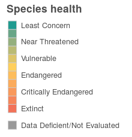

``` {r setup, echo = TRUE, message = FALSE, warning = FALSE}

knitr::opts_chunk$set(fig.width = 6, fig.height = 4, fig.path = 'Figs/',
                      echo = TRUE, message = FALSE, warning = FALSE)

library(rgdal)
library(raster)
source('~/github/ohibc/src/R/common.R')  ### an OHIBC specific version of common.R

scenario <- 'v2017'
goal     <- 'spp_ico'
dir_git  <- '~/github/ohibc'
dir_goal <- file.path(dir_git, 'prep', goal, scenario)
dir_spatial <- file.path(dir_git, 'prep/_spatial')

dir_goal_anx        <- file.path(dir_M, 'git-annex/bcprep/spp_ico', scenario) 
dir_goal_global     <- file.path('~/github/ohiprep/globalprep/spp_ico', scenario)
dir_goal_anx_global <- file.path(dir_M, 'git-annex/globalprep/spp_ico', scenario)

library(provRmd); prov_setup()

source(file.path(dir_goal, 'spp_fxn.R'))

### set up proj4string options: BC Albers and WGS84
p4s_bcalb <- c('bcalb' = '+init=epsg:3005')
p4s_wgs84 <- c('wgs84' = '+init=epsg:4326')
```

# Summary: OHIBC Species Subgoal (Biodiversity)

This script prepares scores (status and trend) for species richness in 
British Columbia's coastal regions.  Spatial data from IUCN and Aquamaps is
combined with extinction risk information from IUCN and conservation rank
info based on province-level NatureServe categories.

Currently, the Species Richness sub-goal model is identical to the OHI Global 
model: a region's status is based upon an area-weighted average of species
health across each BC reporting region.

From Halpern et al (2012):

> The target for the Species sub-goal is to have all species at a risk status of Least Concern. We scaled the lower end of the biodiversity goal to be 0 when 75% species are extinct, a level comparable to the five documented mass extinctions and would constitute a catastrophic loss of biodiversity. The Status of assessed species was calculated as the area- and threat status-weighted average of the number of threatened species within each 0.5 degree grid cell.

For BC, our calculation will be slightly different, though the end result will be identical.

**Species area-weighted risk:**  For each species within a region, the risk score is weighted by the proportion of the species' range within the given region.  To determine the mean area-weighted risk, the area-weighted risks are summed and divided by the total number of species within the region.

$$R_{spp/rgn} = (Risk)*\frac{\displaystyle\sum_{rgn}(A_{cell} * pA_{cell/rgn})}{A_{rgn}}$$

$$\bar{R}_{spp} = \frac{\displaystyle\sum_{species}(R_{spp/rgn})}{n_{spp}}$$

**Species goal model**

$$X_{SPP} = \frac{((1 - \bar{R}_{spp}) - 0.25)}{(1 - 0.25)} * 100%$$

where:

* $X_{SPP}$ is Species goal status
* $R_{spp/rgn}$ is area-weighted extinction risk for one species within a region
* $\bar{R}_{spp}$ is area-weighted mean extinction risk for a region
* $A_{cell}$ is cell area
* $pA_{cell-rgn}$ is percent of cell area included in region
* *Risk* is scaled value for species extinction risk category, based on: 
    * 'LC' = 0.0, 'NT' = 0.2, 'VU' = 0.4, 'EN' = 0.6, 'CR' = 0.8, 'EX' = 1.0
* SPP trend is calculated by examining the linear trend of mean extinction risk category, based upon the time series of risk categories from the IUCN Red List.  This calculation is performed in functions.R.

-----

# Data sources

AquaMaps

* From http://www.aquamaps.org/main/home.php: "AquaMaps are computer-generated predictions of natural occurrence of marine species, based on the environmental tolerance of a given species with respect to depth, salinity, temperature, primary productivity, and its association with sea ice or coastal areas."
* Citation: Kaschner, K., J. Rius-Barile, K. Kesner-Reyes, C.Garilao, S.O. Kullander, T. Rees and R. Froese (2015). AquaMaps: Predicted range maps for aquatic species. World wide web electronic publication, www.aquamaps.org, Version 08/2015.

IUCN Red List spatial data: species range map shapefiles

* Species range map shapefiles downloaded from: http://www.iucnredlist.org/technical-documents/spatial-data
* Citation: IUCN 2016. The IUCN Red List of Threatened Species. Version 2015.3. <http://www.iucnredlist.org>. Downloaded on 9 December 2016.

IUCN Red List species index: list of all IUCN red list species, incl IUCN species ID and extinction risk category

* Extinction risk categories, past assessments, and habitat information, by species, downloaded from: http://apiv3.iucnredlist.org/
* Citation: IUCN 2016. The IUCN Red List of Threatened Species. Version 2016-3. <http://www.iucnredlist.org>. Downloaded <date of last script process>.

NatureServe/BC CDC conservation rank info from BC Species and Ecosystems Explorer: 

* BC Conservation Data Centre: http://www.env.gov.bc.ca/atrisk/toolintro.html
* NatureServe conservation status: http://explorer.natureserve.org/ranking.htm#global
* Citation: B.C. Conservation Data Centre. 2016. BC Species and Ecosystems Explorer. B.C. Ministry of Environment, Victoria B.C. Available: <http://a100.gov.bc.ca/pub/eswp/>.  Downloaded on 30 November 2016.

-----

# Methods

## Define assessment regions 

Using OHIBC region polygons, determine 0.5° raster cells corresponding to OHIBC and to each region.  Save raster to local directory for later use.

``` {r setup_region-to-cell_lookup}

rgn2cell_file <- file.path(dir_goal, 'spatial/rgn2cell.csv')
loiczid_rast_file <- file.path(dir_goal, 'spatial/loiczid.tif')

if(!file.exists(rgn2cell_file) | !file.exists(loiczid_rast_file)) {
  ### Read in OHIBC polygons, transform to WGS84 CRS
  rgn_lyr <- 'ohibc_rgn'
  
  message(sprintf('Reading OHIBC regions shapefile...\n  %s/%s.shp', dir_spatial, rgn_lyr))
  poly_bc_rgn <- readOGR(dsn     = path.expand(dir_spatial), 
                         layer   = rgn_lyr,
                         verbose = FALSE, 
                         stringsAsFactors = FALSE) %>%
    spTransform(p4s_wgs84)
  
  poly_bc_rgn@data <- poly_bc_rgn@data %>%
    mutate(rgn_id = as.integer(rgn_id))
  
  rgn_p4s <- proj4string(poly_bc_rgn)
  message('Region loaded: CRS = \n  ', rgn_p4s)
  
  rgn2cell_list <- spp_rgn2cell(poly_bc_rgn, reload = TRUE)
  
  write_csv(rgn2cell_list[[1]], rgn2cell_file)
  writeRaster(rgn2cell_list[[2]], loiczid_rast_file, overwrite = TRUE)
  
} else {
  
  git_prov(c(rgn2cell_file, loiczid_rast_file), filetype = 'output')
  
}

```


## Identify BC-specific species

* Data-set specific idiosyncracies:
    * For AquaMaps, we select a threshold (currently 0%) to set the minimum probability of occurrence that determines species "presence."
    * For IUCN, no threshold is needed; but the shapefiles include a "presence" attribute in which a value of 5 indicates a region in which a subpopulation has become extinct.  We use this to manually reset local extinction risk to EX.
    * Note that for IUCN, we determine the proportional area when extracting polygons; currently we just consider any presence to fill the cell (similar to assuming even a low AquaMaps probability to indicate presence within the entire cell) - so proportional area is ignored in the calculations.
* Data outputs: 
    1. Species (`am_sid` or `iucn_sid`) presence by cell id (`loiczid`), including `cell_area`, `rgn_id`, and proportion of cell within the region (`prop_area`).  For IUCN, also includes `subpop`.
        * `am_spp_area_by_rgn.csv` and `iucn_spp_area_by_rgn.csv`
    2. Species (`am_sid` or `iucn_sid`) by region (`rgn_id`), including total area in each OHIBC region (`spp_area`) and proportional area within each region (`spp_pct_area`). For IUCN, also includes `subpop`.
        * `am_spp_cells_bc.csv` and `iucn_spp_cells_bc.csv`

``` {r identify_am_ohibc_species}

reload <- FALSE

### collect AquaMaps species local to BC

am_spp_cells_file <- file.path(dir_goal, 'int/am_spp_cells_bc.csv')
am_spp_rgn_file   <- file.path(dir_goal, 'int/am_spp_area_by_rgn.csv')

if(!file.exists(am_spp_rgn_file) | reload) {
  
  rgn2cell_df <- read_csv(file.path(dir_goal, 'spatial/rgn2cell.csv')) %>%
  group_by(rgn_id) %>%
  mutate(area_tot = sum(cell_area * prop_area)) %>%
  ungroup()

  ### Load Aquamaps species per cell table
  am_spp_cells_global_file <- file.path(dir_goal_anx_global, 'int/am_cells_spp_prob0.csv')

  am_spp_cells <- read_csv(spp_cell_file) %>%
    select(am_sid = speciesid, loiczid) ### drop probability column - use all cells!

  ### filter out to just cells in BC regions, then summarize area by species ID and region
  message('Trimming AquaMaps global species list to local species only, then determining area per region...')
  am_spp_cells_bc <- rgn2cell_df %>%
    left_join(am_spp_cells, by = 'loiczid')
  
  am_spp_rgn_area <- am_spp_cells_bc %>%
    group_by(am_sid, rgn_id) %>%
    summarize(spp_area     = sum(cell_area * prop_area),
              spp_pct_area = sum(cell_area * prop_area / area_tot))

  message(sprintf('Writing Aquamaps species area per region file to: \n  %s', am_spp_rgn_file))
  write_csv(am_spp_cells_bc %>% select(-area_tot, -rgn_name), am_spp_cells_file)
  write_csv(am_spp_rgn_area, am_spp_rgn_file)
  
  # head(am_spp_rgn_area)
  # head(am_spp_cells_bc %>% select(-area_tot, -rgn_name))
  
} else {
  
  git_prov(am_spp_rgn_file, filetype = 'output')
  
}
```

``` {r get_iucn_ohibc_spp}

### collect IUCN species local to BC

iucn_spp_cells_file <- file.path(dir_goal, 'int/iucn_spp_cells_bc.csv')
iucn_spp_rgn_file <- file.path(dir_goal, 'int/iucn_spp_area_by_rgn.csv')

if(!file.exists(iucn_spp_rgn_file) | reload) {
  
  rgn2cell_df <- read_csv(file.path(dir_goal, 'spatial/rgn2cell.csv')) %>%
  group_by(rgn_id) %>%
  mutate(area_tot = sum(cell_area * prop_area)) %>%
  ungroup()

  iucn_spp_cells_global_file <- file.path(dir_goal_anx_global, 'int/iucn_cells_spp.csv')

  iucn_spp_cells <- read_csv(iucn_spp_cells_global_file)

  iucn_spp_cells_bc <- rgn2cell_df %>%
    rename(prop_area_rgn = prop_area) %>%
    left_join(iucn_spp_cells %>%
                select(-prop_area),
              by = 'loiczid') %>%
    filter(presence != 5) %>%
    select(-presence) %>%
    distinct()
  
  iucn_spp_rgn_area <- iucn_spp_cells_bc %>%
    group_by(iucn_sid, rgn_id, subpop) %>%
    summarize(spp_area     = sum(cell_area * prop_area_rgn),
              spp_pct_area = sum(cell_area * prop_area_rgn / area_tot)) %>%
    ungroup()
  
  message('Writing IUCN species area per region file to ', iucn_spp_rgn_file)
  write_csv(iucn_spp_cells_bc %>% select(-area_tot, -rgn_name), iucn_spp_cells_file)
  write_csv(iucn_spp_rgn_area, iucn_spp_rgn_file)
  
  # head(iucn_spp_rgn_area)
  # head(iucn_spp_cells_bc %>% select(-area_tot, -rgn_name))

} else {
  
  git_prov(iucn_spp_rgn_file, filetype = 'output')
  
}

```

-----

## Generate species lookup table from IUCN API

Currently this uses the global species lookup table. To see how this list is generated, check out [`~/ohiprep/globalprep/spp_ico/v2017/spp_data_prep.Rmd`](https://rawgit.com/OHI-Science/ohiprep/master/globalprep/spp_ico/v2017/spp_data_prep.html).

The global species list includes the following columns: 
am_sid, iucn_sid, map_iucn_sid, map_subpop, sciname, category, spp_group, trend

Because we are working on a smaller region, some species with both AM and IUCN maps may not actually be present in both regional datasets.  So we must set the `spatial_source` according to:

* if the `map_iucn_sid` is in the `iucn_spp_cells` dataframe, use iucn.
* otherwise, it must be aquamaps.

``` {r create_ohibc_spp_list}

spp_bc_file <- file.path(dir_goal, 'int/spp_list_base.csv')
iucn_spp_cells_file <- file.path(dir_goal, 'int/iucn_spp_area_by_rgn.csv')
am_spp_cells_file   <- file.path(dir_goal, 'int/am_spp_area_by_rgn.csv')

if(!file.exists(spp_bc_file)) {
  
  iucn_spp <- read_csv(iucn_spp_cells_file) %>%
    filter(!is.na(iucn_sid)) %>%
    select(iucn_sid, subpop) %>%
    distinct()
  am_spp <- read_csv(am_spp_cells_file) %>%
    filter(!is.na(am_sid)) %>%
    select(am_sid) %>%
    distinct()
  
  spp_global_file <- file.path(dir_goal_global, 'int/spp_list_cleaned.csv')
  spp_info_global <- read_csv(spp_global_file)
  
  spp_info_iucn <- spp_info_global %>%
    inner_join(iucn_spp, by = c('map_iucn_sid' = 'iucn_sid', 'map_subpop' = 'subpop'))
  
  spp_info_am <- spp_info_global %>%
    inner_join(am_spp, by = 'am_sid')
  
  spp_info_ohibc <- bind_rows(spp_info_iucn, spp_info_am) %>%
    distinct() %>%
    mutate(spatial_source = ifelse(map_iucn_sid %in% spp_info_iucn$map_iucn_sid, 'iucn', 'am'))
  
  write_csv(spp_info_ohibc, spp_bc_file)
  
} else {
  
  # git_prov(c(iucn_spp_cells_file, am_spp_cells_file), filetype = 'input')
  git_prov(spp_bc_file, filetype = 'output')

}


```

<font size = 1>

`r DT::datatable(read_csv(spp_bc_file, nogit = TRUE))`

</font>


-----

## Append BC-specific species risk assessment codes

Data downloaded from BC Species and Ecosystems Explorer includes information on global status and provincial status for species, as assessed by NatureServe.

See [this table]('iucn_to_ns.html') for info on NatureServe codes

``` {r append_bcsee_scores, echo = TRUE}

spp_bc_file <- file.path(dir_goal, 'int/spp_list_base.csv')

spp_info <- read_csv(spp_bc_file) %>%
  mutate(sciname = str_replace(sciname, 'Clupea pallasii pallasii', 'Clupea pallasii')) %>%
  ### while this is N.E. it shows up in the ICO list.
  spp_append_bcsee() %>%
  distinct()

### let's clean up this file and ditch the legacy columns.  Lose the reference
### columns, and to ditch multi-listings, group by am_sid and iucn_sid; then
### take the mean category and trend across all multi-listed species.
### Multi-listings are due to multiple province-level scores for certain
### species
spp_clean <- spp_info %>%
  dplyr::select(am_sid, iucn_sid, 
         sciname, spp_group, 
         map_iucn_sid, map_subpop,
         pr_score = status_pr_score,
         cat_code, pop_trend,
         spatial_source) %>%
  distinct() %>%
  group_by(sciname) %>%
  mutate(pr_score = mean(pr_score, na.rm = TRUE),
         pr_score = ifelse(is.nan(pr_score), NA, pr_score)) %>%
  ungroup() %>%
  distinct()

### still a pesky doubled up species: Leatherback turtle!
spp_clean <- spp_clean %>%
  mutate(am_sid = ifelse(sciname == 'Dermochelys coriacea', 'Rep-4381', am_sid)) %>%
  filter(!(sciname == 'Dermochelys coriacea' & is.na(map_iucn_sid)))

# y <- spp_info %>%
#   filter(sciname %in% spp_info$sciname[duplicated(spp_info$sciname)])
# z <- unique(y$sciname)
# zz <- spp_clean %>% filter(sciname %in% z)
# x <- spp_clean %>% filter(sciname %in% ico_spp_probs)

write_csv(spp_clean, file.path(dir_goal, 'int/spp_list_clean.csv'))

```

-----

## Append time-series species risk assessment codes

Time series risk assessments are determined in the global SPP analysis.  In this analysis, we will prefer province-level risk assessments over IUCN time-series assessments.  We will keep all instances, including N.E. and DD species instances, because some of these may show up in the ICO analysis (e.g. _Clupea pallasii_)

### COSEWIC scores to calculate trends for species with province-specific scores.

***Note:*** COSEWIC scores will only be used to calculate trends, not status.  Status will come from NatureServe province-level scores taken from BC Species and Ecosystem Explorer, which rely on COSEWIC data but are more geographically specific.  In some cases, this may capture Canada-wide trends rather than local.  Trend here is calculated based on population health (1 - risk) and calculated as a change over five years (not annual).

``` {r process_cosewic_time_series}
spp_clean <- read_csv(file.path(dir_goal, 'int/spp_list_clean.csv'))

cosewic_file <- file.path(dir_M, 'git-annex/bcprep/_raw_data/sara/d2017/oceans_health_may_2017_data_request_bc_pco.csv')

cosewic_df <- read_csv(cosewic_file) %>%
  setNames(tolower(names(.)) %>% str_replace_all('[^a-z]+', '_')) %>%
  select(sciname = scientific_name,
         comname = common_name_population_name_,
         assess_year = most_recent_assessment_date,
         status, status_change, stat_hist_raw = status_history) %>%
  filter(sciname %in% spp_clean$sciname) %>%
  mutate(status      = tolower(status),
         stat_hist_raw = str_replace_all(stat_hist_raw, '[^a-zA-Z0-9\\. \\-]', ''), ### remove unhelpful punctuation
         stat_hist   = tolower(stat_hist_raw),
         comname     = str_replace_all(comname, '[^a-zA-Z0-9\'\\- ]', ''), ### remove unhelpful punctuation
         assess_year = str_match(assess_year, '[0-9]{2}$') %>% as.integer(),
         assess_year = ifelse(assess_year > 20, assess_year + 1900, assess_year + 2000)) %>%
  distinct()

# cosewic_df$status %>% unique()
### From http://www.cosewic.gc.ca/default.asp?lang=En&n=ED199D3B-1&offset=8&toc=show:
# Extinct (X) A wildlife species that no longer exists.
# Extirpated (XT) A wildlife species that no longer exists in the wild in Canada, but exists elsewhere.
# Endangered (E) A wildlife species facing imminent extirpation or extinction.
# Threatened (T) A wildlife species that is likely to become an endangered if nothing is done to reverse the factors leading to its extirpation or extinction.
# Special Concern (SC) A wildlife species that may become threatened or endangered because of a combination of biological characteristics and identified threats.
# Data Deficient (DD) A category that applies when the available information is insufficient (a) to resolve a wildlife species' eligibility for assessment or (b) to permit an assessment of the wildlife species' risk of extinction.
# Not At Risk (NAR) A wildlife species that has been evaluated and found to be not at risk of extinction given the current circumstances.
### Comparing these categories to provincial rankings, these seem to be the best fit:
cosewic_risk_lookup <- c("not at risk"     = 0,
                         "special concern" = .4, ### consider analogous to IUCN vulnerable
                         "threatened"      = .6, ### consider analogous to IUCN endangered
                         "endangered"      = .8, ### consider analogous to IUCN critically endangered
                         "extinct"         = 1,  
                         "data deficient"  = NA) 

### Divide status history into clauses to parse out assessments
cosewic_history <- cosewic_df %>%
  select(sciname, comname, stat_hist) %>%
  mutate(stat_hist = str_split(stat_hist, '\\.|and may|and november')) %>% 
    ### divide into sentences; also divide by "and" between two assessment dates
    ### (for e.g. "confirmed in November 2003 *and* May 2014")
  unnest(stat_hist) %>%
  mutate(year = str_extract(stat_hist, '[0-9]{4}') %>% as.integer(),
           ### get year
         status_text = str_extract(stat_hist, paste(names(cosewic_risk_lookup), collapse = '|'))) %>%
           ### get text that matches one of the COSEWIC categories
  filter(stat_hist != '') %>%                  
    ### ditch empty lines
  filter(!(str_detect(stat_hist, 'split') & !str_detect(stat_hist, 'designated'))) %>%  
    ### ditch splits; keep only the ones that also include designations
  group_by(sciname, comname) %>%
  fill(status_text, .direction = 'down') %>% 
    ### this fills any "reexamined and confirmed" statuses; group_by maybe not
    ### technically necessary but better safe than sorry
  ungroup() %>%
  select(-stat_hist)

# cosewic_history %>% filter(is.na(status_text)) %>% .$stat_hist %>% unique()

cosewic_scores_df <- cosewic_df %>%
  full_join(cosewic_history, by = c('sciname', 'comname')) %>%
  mutate(cosewic_risk_score = cosewic_risk_lookup[status_text]) %>%
  select(sciname, comname, 
         status = status_text, year, cosewic_risk_score,
         status_history = stat_hist_raw)

x <- cosewic_scores_df %>%
  group_by(sciname, comname) %>%
  mutate(n_obs = n(),
         years = paste(year, collapse = ', ')) %>%
  ungroup() %>%
  select(sciname, comname, n_obs, cosewic_risk_score) %>%
  distinct() %>%
  group_by(sciname, comname) %>%
  mutate(n_obs_distinct = n()) %>%
  ungroup()
  
cosewic_trend <- cosewic_scores_df %>%
  filter(!is.na(year) & !is.na(cosewic_risk_score)) %>%
  mutate(cosewic_health = (1 - cosewic_risk_score)) %>%
  group_by(sciname, comname) %>%
  do(trend = lm(cosewic_health ~ year, data = .)[['coefficients']]['year']) %>%
  mutate(trend = round(trend, 5) * 5) %>%
  ungroup()

cosewic_status_trend_df <- cosewic_scores_df %>%
  left_join(cosewic_trend, by = c('sciname', 'comname'))
  
write_csv(cosewic_status_trend_df, file.path(dir_goal, 'int/cosewic_st_tr_timeseries.csv'))

```

<font size = 1>

`r DT::datatable(cosewic_status_trend_df)`

</font>

### Create a complete score chart

Here we combine the clean species info list, which contains IUCN and AquaMaps IDs, scientific names, and snapshot of IUCN category, BCSEE category, and IUCN population trend, with the IUCN time series of categories, and then with the COSEWIC trends.

``` {r complete_time_series}

spp_clean <- read_csv(file.path(dir_goal, 'int/spp_list_clean.csv'))

spp_risk_ts <- read_csv(file.path(dir_goal_global, 'int', 'spp_cat_timeseries_raw.csv')) %>%
  select(iucn_sid, year, cat_ts, risk_score = cat_ts_score) %>%
  filter(iucn_sid %in% spp_clean$iucn_sid)
### This will be expanded upon in the toolbox.

spp_trend_cosewic <- read_csv(file.path(dir_goal, 'int/cosewic_st_tr_timeseries.csv')) %>%
  select(sciname, comname, cosewic_trend = trend) %>%
  distinct() %>%
  left_join(spp_clean %>% select(sciname, iucn_sid), by = 'sciname')

spp_scored <- read_csv(file.path(dir_goal, 'int/spp_list_clean.csv')) %>%
  filter(!(is.na(map_iucn_sid) & is.na(am_sid))) %>%
  left_join(spp_risk_ts, by = 'iucn_sid') %>%
  left_join(spp_trend_cosewic, by = c('iucn_sid', 'sciname'))
### Note: still some N.E. and DD species here... keep 'em in b/c some
### of these show up in ICO (e.g. Clupea pallasii)

spp_scored <- spp_scored %>% 
  mutate(risk_score = ifelse(!is.na(pr_score), pr_score, risk_score),
         cat_ts = ifelse(is.na(cat_ts), cat_code, cat_ts)) %>%
  select(-cat_code)

write_csv(spp_scored, file.path(dir_goal, 'int', 'spp_list_scored.csv'))

```

-----

## Create output layers

Output layers will include:

* Species info lookup: AM and IUCN SIDs (incl. IUCN map ID and subpop), sciname, spatial source
* Species ID (AM and IUCN) by region, incl. proportional area within each region
* Species category score time series by IUCN ID and year
* Species population trend by IUCN ID

### Save species info lookup

``` {r save_spp_info_lookup}
spp_info_layer <- read_csv(file.path(dir_goal, 'int', 'spp_list_scored.csv')) %>%
  select(am_sid, iucn_sid, sciname, map_iucn_sid, map_subpop, spp_group, spatial_source) %>%
  distinct()

write_csv(spp_info_layer, file.path(dir_goal, 'output', 'spp_info_by_id.csv'))
```

### Generate area-weighted summary of species by ID and name

For each species in the scored list, attach the region and area values.  

``` {r generate_spp_rgn_area_lookup}

spp_source_info <- read_csv(file.path(dir_goal, 'int', 'spp_list_scored.csv')) %>%
  select(am_sid, iucn_sid, sciname, spatial_source) %>%
  distinct()

### NOTE: Also deal with pesky Leatherback subpop stuff.
iucn_spp_rgn_area <- read_csv(file.path(dir_goal, 'int', 'iucn_spp_area_by_rgn.csv')) %>%
  mutate(spatial_source = 'iucn') %>%
  mutate(iucn_sid = ifelse(iucn_sid == 6494 & subpop == 'West Pacific', 46967817, iucn_sid)) %>%
  inner_join(spp_source_info)
  
am_spp_rgn_area   <- read_csv(file.path(dir_goal, 'int', 'am_spp_area_by_rgn.csv')) %>%
  mutate(spatial_source = 'am') %>%
  inner_join(spp_source_info)

spp_rgn_area <- iucn_spp_rgn_area %>%
  bind_rows(am_spp_rgn_area) %>%
  filter(!is.na(rgn_id)) %>%
  select(iucn_sid, am_sid, rgn_id, spp_area, spp_pct_area, spatial_source) %>%
  mutate(spp_area     = round(spp_area, 5),
         spp_pct_area = round(spp_pct_area, 5)) %>%
  distinct()

write_csv(spp_rgn_area, file.path(dir_goal, 'output', 'spp_area_by_rgn.csv'))

```

### Save species category score time series and population trend layers

For species with BC-specific status, we will use COSEWIC trend where available, otherwise NA.  For species with global IUCN scores and a time series of assessments, we will use the linear regression of the time series of species health.  For species with global IUCN scores and no time series, we will use population trend text field, otherwise NA.

``` {r save_spp_cat_and_trend_layers}

spp_list_scored <- read_csv(file.path(dir_goal, 'int', 'spp_list_scored.csv'))

spp_trend_layer <- spp_list_scored %>%
  group_by(iucn_sid, am_sid, pop_trend) %>%
  summarize(cosewic_trend = mean(cosewic_trend, na.rm = TRUE)) %>%
  mutate(cosewic_trend = ifelse(is.nan(cosewic_trend), NA, cosewic_trend)) %>%
  ungroup() %>%
  rename(iucn_pop_trend = pop_trend) %>%
  distinct()
write_csv(spp_trend_layer, file.path(dir_goal, 'output', 'spp_trend_by_id.csv'))

spp_risk_ts_layer <- spp_list_scored %>%
  mutate(risk_source = ifelse(is.na(pr_score), 'iucn', 'bc')) %>%
  select(iucn_sid, am_sid, risk_score, risk_source, year, cat_ts) %>%
  distinct()
write_csv(spp_risk_ts_layer, file.path(dir_goal, 'output', 'spp_risk_by_year.csv'))

```

# Estimate goal model

## Summarize mean category & trend per region

In this section we estimate the model calculations:

* We calculate area-weighted mean extinction risk score across all species identified in each region, based on NatureServe province-level rankings where available, and IUCN category ranks elsewhere.
* From the region-level summary of risk, we estimate the SPP goal status based on the goal model equation.

This layer is saved to be used as a resilience layer.

``` {r generate_means_per_rgn}

spp_area_by_rgn <- read_csv(file.path(dir_goal, 'output', 'spp_area_by_rgn.csv'))

### Flesh out the time series
spp_risk_by_yr <- read_csv(file.path(dir_goal, 'output', 'spp_risk_by_year.csv')) %>%
  filter(!is.na(year)) %>%
  complete(year = full_seq(year, period = 1), nesting(iucn_sid, am_sid)) %>%
  group_by(iucn_sid, am_sid) %>%
  arrange(year) %>%
  fill(risk_score, .direction = 'up') %>%
  fill(risk_score, .direction = 'down') %>%
  filter(year >= 1990) %>%
  select(iucn_sid, am_sid, year, risk_score) %>%
  ungroup()

spp_risk_by_rgn <- spp_area_by_rgn %>%
  inner_join(spp_risk_by_yr, by = c('iucn_sid', 'am_sid')) %>%
  filter(!is.na(risk_score))

spp_risk_rgn_yr <- spp_risk_by_rgn %>%
  group_by(rgn_id, year) %>%
  summarize(mean_risk_score = sum(risk_score * spp_pct_area) / n()) %>%
  mutate(status = (.75 - mean_risk_score) / .75,
         status = round(status, 5),
         mean_risk_score = round(mean_risk_score, 5))

spp_status_eez <- spp_risk_rgn_yr %>%
  select(rgn_id, year, status)

write_csv(spp_status_eez, file.path(dir_goal, 'output/spp_status_eez.csv'))

```

<font size = 1>

`r DT::datatable(spp_risk_rgn_yr)`

</font>

-----

## Summarize status within 3 nm of shore

Create final outputs for 3nm zone for resilience calculations.  In this step, rather than using full assessment regions, only the three-nautical-mile offshore zone is examined.

``` {r calc_3nm_spp_areas}

### Read in OHIBC 3nm offshore polygons, in WGS84 CRS
rgn_lyr <- 'ohibc_offshore_3nm'
poly_bc_3nm <- readOGR(dsn = path.expand(dir_spatial), layer = rgn_lyr,
                       verbose = FALSE, stringsAsFactors = FALSE) %>%
    spTransform(p4s_wgs84)
poly_bc_3nm@data$rgn_id <- as.integer(poly_bc_3nm@data$rgn_id)

rgn2cell_3nm_df <- spp_rgn2cell(poly_bc_3nm, rgn_tag = '_3nm', reload = FALSE)[[1]] %>%
  group_by(rgn_id) %>%
  mutate(area_tot = sum(cell_area * prop_area)) %>%
  ungroup()

### collect AquaMaps and IUCN species within 3 nm regions

am_spp_cells_bc <- read_csv(file.path(dir_goal, 'int/am_spp_cells_bc.csv')) %>%
  select(loiczid, am_sid) %>%
  distinct()

am_spp_cells_3nm <- rgn2cell_3nm_df %>%
  inner_join(am_spp_cells_bc, by = 'loiczid')

am_spp_3nm_area <- am_spp_cells_3nm %>%
  group_by(am_sid, rgn_id) %>%
  summarize(spp_area     = sum(cell_area * prop_area),
            spp_pct_area = sum(cell_area * prop_area / area_tot))


iucn_spp_cells_bc <- read_csv(file.path(dir_goal, 'int/iucn_spp_cells_bc.csv')) %>%
  select(loiczid, iucn_sid, subpop) %>%
  distinct()
  
iucn_spp_cells_3nm <- rgn2cell_3nm_df %>%
  inner_join(iucn_spp_cells_bc, by = 'loiczid')

iucn_spp_3nm_area <- iucn_spp_cells_3nm %>%
  mutate(iucn_sid = ifelse(iucn_sid == 6494 & subpop == 'West Pacific', 46967817, iucn_sid)) %>%
    ### deal with Leatherback subpop issue
  group_by(iucn_sid, rgn_id) %>%
  summarize(spp_area     = sum(cell_area * prop_area),
            spp_pct_area = sum(cell_area * prop_area / area_tot)) %>%
  ungroup()
  
### join together with species info
spp_source_info <- read_csv(file.path(dir_goal, 'int', 'spp_list_scored.csv')) %>%
  select(am_sid, iucn_sid, sciname, spatial_source) %>%
  distinct()

iucn_spp_3nm_area <- iucn_spp_3nm_area %>%
  mutate(spatial_source = 'iucn') %>%
  inner_join(spp_source_info)

am_spp_3nm_area   <- am_spp_3nm_area %>%
  mutate(spatial_source = 'am') %>%
  inner_join(spp_source_info)

spp_3nm_area <- iucn_spp_3nm_area %>%
  bind_rows(am_spp_3nm_area)

write_csv(spp_3nm_area, file.path(dir_goal, 'int', 'spp_area_by_rgn_3nm.csv'))

```


``` {r calc_status_3nm}

spp_3nm_area <- read_csv(file.path(dir_goal, 'int', 'spp_area_by_rgn_3nm.csv'))

spp_risk_by_yr <- read_csv(file.path(dir_goal, 'output', 'spp_risk_by_year.csv')) %>%
  filter(!is.na(year)) %>%
  complete(year = full_seq(year, period = 1), nesting(iucn_sid, am_sid)) %>%
  group_by(iucn_sid, am_sid) %>%
  arrange(year) %>%
  fill(risk_score, .direction = 'up') %>%
  fill(risk_score, .direction = 'down') %>%
  filter(year >= 1990) %>%
  select(iucn_sid, am_sid, year, risk_score) %>%
  ungroup()

spp_risk_3nm <- spp_3nm_area %>%
  full_join(spp_risk_by_yr, by = c('iucn_sid', 'am_sid')) %>%
  filter(!is.na(risk_score))

spp_risk_3nm_yr <- spp_risk_3nm %>%
  group_by(rgn_id, year) %>%
  summarize(mean_risk_score = sum(risk_score * spp_pct_area) / n()) %>%
  mutate(status = (.75 - mean_risk_score) / .75,
         status = round(status, 5),
         mean_risk_score = round(mean_risk_score, 5))

write_csv(spp_risk_3nm_yr %>% 
            select(rgn_id, year, status), 
          file.path(dir_goal, 'output/spp_status_3nm.csv'))


```

<font size = 1>

`r DT::datatable(spp_risk_3nm_yr)`

</font>

## Visualize data

Create a heatmap showing species health by region (for most recent assessment)

``` {r get_ico_layers}

spp_names <- read_csv(file.path(dir_goal, 'output', 'spp_info_by_id.csv')) %>%
  select(iucn_sid, am_sid, sciname) %>%
  distinct()

spp_risk <- read_csv(file.path(dir_goal, 'output', 'spp_risk_by_year.csv')) %>%
  mutate(year = ifelse(is.na(year), 2017, year)) %>%
  group_by(iucn_sid, am_sid) %>%
  fill(risk_score, risk_source, cat_ts, .direction = 'down') %>%
  filter(year == max(year)) %>%
  ungroup() %>%
  select(iucn_sid, am_sid, risk_score, risk_source)

spp_rgns <- read_csv(file.path(dir_goal, 'output', 'spp_area_by_rgn.csv')) %>%
  select(iucn_sid, am_sid, rgn_id, spp_pct_area) %>%
  distinct()

spp_df <- spp_risk %>%
  full_join(spp_rgns, by = c('iucn_sid', 'am_sid')) %>%
  full_join(spp_names, by = c('iucn_sid', 'am_sid')) %>%
  filter(!is.na(risk_score))

write_csv(spp_df, file.path(dir_goal, 'int', 'spp_df_for_heatmap.csv'))

```


``` {r create_heatmap}

spp_df <- read_csv(file.path(dir_goal, 'int', 'spp_df_for_heatmap.csv')) %>%
  mutate(present = TRUE) %>%
  complete(rgn_id = full_seq(rgn_id, 1), nesting(am_sid, iucn_sid, sciname, risk_score, risk_source)) %>%
  mutate(present = ifelse(is.na(present), FALSE, present))

spp_table_info <- spp_df %>%
  mutate(spp_health = round(1 - risk_score, 1)) %>%
  arrange(desc(risk_score), desc(sciname))

### rearrange to get the NAs on top
spp_table_info <- spp_table_info %>%
  filter(is.na(spp_health)) %>%
  bind_rows(spp_table_info %>%
              filter(!is.na(spp_health)))

spp_order <- spp_table_info %>%
  filter(present) %>%
  select(sciname) %>%
  distinct() %>%
  mutate(name_order = 1:n())

spp_table_labeled <- spp_table_info %>%
  left_join(spp_order, by = c('sciname')) %>%
  left_join(get_rgn_names(), by = c('rgn_id')) %>%
  transform(rgn_name = reorder(rgn_name, rgn_id)) %>%
  transform(sciname = reorder(sciname, name_order)) %>%
  rename(percent_of_rgn = spp_pct_area)

### Turn it into a heat map!

spp_heatmap <- ggplot(data = spp_table_labeled, aes(x = rgn_name, y = sciname, key = percent_of_rgn, key2 = risk_source)) +
  ggtheme_plot() +
  # geom_tile(fill = 'grey40') +
  geom_tile(aes(fill = spp_health, alpha = present), 
            color = 'grey80', size = 0.1) +
  scale_fill_gradient2(low = '#F27259', mid = '#FFCF5C', high = '#1F9B90',
                       midpoint = 0.5,
                       breaks = c(0, .2, .4, .6, .8, 1.0),
                       labels = c('EX', 'CR', 'EN', 'VU', 'NT', 'LC'),
                       na.value = 'grey60',
                       guide = 'none') +
  scale_alpha_discrete(guide = 'none') +
  theme(axis.text.x = element_text(angle = 45, hjust = 1),
        axis.text.y = element_blank(),
        axis.title  = element_blank())

ggsave(file.path(dir_goal, 'Figs/spp_heatmap.png'),
       width = 6, height = 10, units = 'in', dpi = 300)
ggsave(file.path(dir_goal, 'Figs/spp_heatmap_lo_res.png'),
       width = 6, height = 10, units = 'in', dpi = 100)

plotly::ggplotly(spp_heatmap)

```


``` {r plot_spp_cat_legend, eval = FALSE}

# cat_list <- data.frame(label_y    = c(-.2, seq(0, 1, 0.1)),
#                        ico_health = c(NA,  seq(0, 1, 0.1)),
#                        label      = c('Data Deficient/Not Evaluated',
#                                       'Extinct', '', 
#                                       'Critically Endangered', '',
#                                       'Endangered', '',
#                                       'Vulnerable', '',
#                                       'Near Threatened', '',
#                                       'Least Concern'),
#                        stringsAsFactors = FALSE)
# 
# 
# ico_legend <- ggplot(cat_list, aes(x = 0, y = label_y, fill = ico_health)) +
#   theme(axis.ticks = element_blank(),
#         text = element_text(family = 'Helvetica', color = 'gray30', size = 8),
#         plot.title = element_text(size = rel(1.25), hjust = 0, face = 'bold'),
#         legend.key = element_rect(colour = NA, fill = NA),
#         panel.border     = element_blank(),
#         panel.background = element_blank(),
#         panel.grid = element_blank(),
#         axis.title = element_blank(),
#         axis.text  = element_blank(),
#         legend.position = 'none',
#         title = element_text(size = 10)) +
#   geom_point(size = 5, shape = 22, color = 'grey80') +
#   geom_text(aes(label = label, x = .04), 
#             size = 3.2,
#             color = 'grey30',
#             # angle = 90, 
#             hjust = 0) +
#   scale_fill_gradient2(low = '#F27259', mid = '#FFCF5C', high = '#1F9B90', 
#                        midpoint = 0.5,
#                        breaks = seq(0, 1, 0.1),
#                        na.value = 'grey60') +
#   scale_y_continuous(limits = c(-.2, 1)) +
#   scale_x_continuous(limits = c(0, .5)) +
#   labs(title = 'Species health')
# 
# ### Saving it at these height/width squishes the squares together into
# ### a single color bar...
# ggsave(file.path(dir_goal, 'Figs/spp_ico_legend.png'),
#        height = 2.3, width = 2.2, units = 'in', dpi = 300)
# ggsave(file.path(dir_goal, 'Figs/spp_ico_legend_lo_res.png'),
#        height = 2.3, width = 2.2, units = 'in', dpi = 100)
```



-----

``` {r, results = 'asis'}

prov_wrapup(commit_outputs = FALSE)

```

