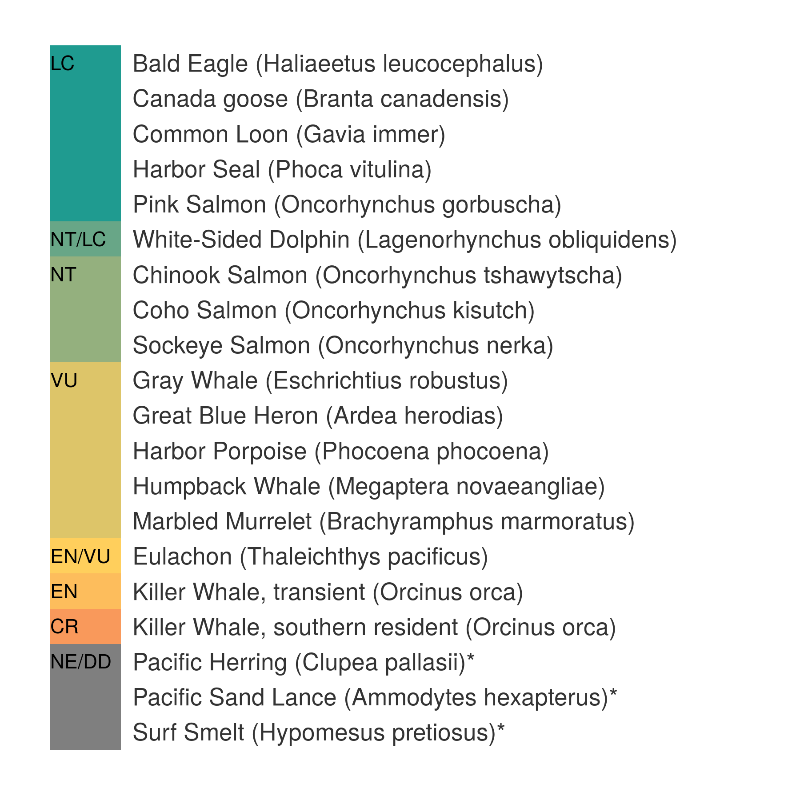

``` {r setup, echo = TRUE, message = FALSE, warning = FALSE}

knitr::opts_chunk$set(fig.width = 6, fig.height = 4, fig.path = 'Figs/',
                      echo = TRUE, message = FALSE, warning = FALSE)

library(rgdal)
library(raster)
source('~/github/ohibc/src/R/common.R')  ### an OHIBC specific version of common.R

scenario <- 'vHS'
goal     <- 'spp_ico'
dir_git <- '~/github/ohibc'
dir_goal <- file.path(dir_git, 'prep', goal, scenario)
dir_rgn  <- file.path(dir_git, 'prep/spatial')
dir_anx        <- file.path(dir_M, 'git-annex/bcprep') ### git-annex: goal-specific large files
dir_anx_global <- file.path(dir_M, 'git-annex/globalprep/spp_ico')

library(provRmd); prov_setup()

source(file.path(dir_goal, 'spp_fxn.R'))

### set up proj4string options: BC Albers and WGS84
p4s_bcalb <- c('bcalb' = '+init=epsg:3005')
p4s_wgs84 <- c('wgs84' = '+init=epsg:4326')

```

# Summary: OHIBC Howe Sound Species and Iconic Species

This script prepares scores (status and trend) for species richness in 
British Columbia's Howe Sound region.  Spatial data from IUCN and Aquamaps is
combined with extinction risk information from IUCN and conservation rank
info based on province-level NatureServe categories.

Because of the small scale of Howe Sound, neither Species nor Iconic Species goals use any area weighting.  Instead, ICO and SPP status is based upon a simple average of species
health for species found within the Howe Sound region.

From Halpern et al (2012):

> The target for the Species sub-goal is to have all species at a risk status of Least Concern. We scaled the lower end of the biodiversity goal to be 0 when 75% species are extinct, a level comparable to the five documented mass extinctions and would constitute a catastrophic loss of biodiversity. The Status of assessed species was calculated as the area- and threat status-weighted average of the number of threatened species within each 0.5 degree grid cell.

**Mean risk status for Howe Sound:**

$$\bar{R} = \frac{\displaystyle\sum_{species}(Risk)}{n_{spp}}$$

**Iconic Species goal model**

$$X_{SPP} = 1 - \bar{R}_{ICO} * 100%$$

where:

* $X_{ICO}$ is Species goal status
* $\bar{R}$ is mean extinction risk for identified species within Howe Sound (different subsets for ICO and SPP)
* *Risk* is scaled value for species extinction risk category, based on: 
    * 'LC' = 0.0, 'NT' = 0.2, 'VU' = 0.4, 'EN' = 0.6, 'CR' = 0.8, 'EX' = 1.0
* ICO trend is calculated as the linear trend of the average extinction risk categories over time.

-----

# Data sources

See goal_prep_spp_howesound.Rmd for data sources

-----

# Methods

## Define assessment region

Using OHIBC Howe Sound region polygon, determine 0.5° raster cells corresponding to the region.

``` {r setup_region-to-cell_lookup}

### Read in OHIBC Howe Sound polygons, and transform to WGS84 CRS
poly_howesound_rgn <- readOGR(dsn = path.expand(dir_rgn), layer = 'howe_sound_rgn',
                       verbose = FALSE, stringsAsFactors = FALSE) %>%
  spTransform(CRS(p4s_wgs84))

poly_howesound_rgn@data <- poly_howesound_rgn@data %>%
  rename(rgn_id = id) %>%
  mutate(rgn_id = as.integer(rgn_id),
         rgn_name = 'Howe Sound')

rgn2cell_list <- spp_rgn2cell(poly_howesound_rgn, 
                              rgn_tag = '_howesound',
                              reload = TRUE)

rgn2cell_df      <- rgn2cell_list[[1]]
loiczid_rast     <- rgn2cell_list[[2]]
```


## Identify Howe Sound-specific species and info

The goal_prep_spp_howesound.Rmd script creates a time series of species info for all species present within Howe Sound, as determined by AquaMaps and IUCN.

-----

## Identify Howe Sound iconic species

Combining global ICO list with CORI-supplied Howe Sound ICO list, we come up with a master list of all iconic species within the Howe Sound region.  The spp_info_timeseries file is generated within the SPP goal prep script.

``` {r generate_ico_list}

spp_info_timeseries <- read_csv(file.path(dir_goal, 'int/spp_info_timeseries.csv'))

# ico_list_gl <- read_csv(file.path(dir_goal, 'ico_list_howe_sound_from_global.csv')) %>%
#   select(sciname = `Specie Scientific Name`,
#          comname = `Specie Common Name`) %>%
#   mutate(comname = tools::toTitleCase(comname)) %>%
#   filter(sciname %in% spp_info_timeseries$sciname) %>%
#   distinct()
  
ico_list_hs <- read_csv(file.path(dir_goal, 'ico_list_howesound.csv')) %>%
  filter(!str_detect(comments, 'elimin')) %>%
  mutate(comname = tools::toTitleCase(comname)) %>%
  select(sciname, comname) %>%
  filter(!is.na(sciname)) %>%
  distinct()

# ico_list <- ico_list_gl %>%
#   bind_rows(ico_list_hs) %>%
#   filter(!is.na(sciname)) %>%
#   distinct() %>%
#   arrange(sciname)

ico_list <- ico_list_hs

write_csv(ico_list, file.path(dir_goal, 'int', 'ico_list_scinames.csv'))
```

### Howe Sound Iconic Species

The `r nrow(ico_list)` species considered Iconic for the Howe Sound assessment:

`r ico_list$sciname %>% paste(collapse = ', ')`

**NOTE**: Not all these species have IUCN red list assessments or NatureServe assessments.

### Howe Sound Iconic Species info

Most recent year only: 

`r DT::datatable(spp_info_timeseries %>% filter(year == 2016) %>% filter(sciname %in% ico_list$sciname) %>% select(-year))`


``` {r summarize_ico}

ico_list <- read_csv(file.path(dir_goal, 'int', 'ico_list_scinames.csv'))

ico_info_timeseries <- read_csv(file.path(dir_goal, 'int/spp_info_timeseries.csv')) %>%
  # select(am_sid, iucn_sid, sciname, cat_score, pr_score, trend_score, cat_ts, cat_txt, cat_ts_score, year, comname) %>%
  inner_join(ico_list, by = 'sciname') 

### I think there's an easier way to do this using fill() and complete()...
### but it's not coming to me right now.
### 1. set up a list of years to add
assess_years <- ico_info_timeseries$year %>% unique() %>% sort()
ico_info_local <- read_csv(file.path(dir_goal, 'raw/ico_info_hs_specific.csv'))
n_spp <- nrow(ico_info_local)

### repeat each line of the dataframe for the total number of years
ico_info_local <- ico_info_local[rep(seq_len(nrow(ico_info_local)), each = length(assess_years)), ]
ico_info_local$year <- rep(assess_years, times = n_spp)

### now stick it onto the bottom of ico_info_timeseries

ico_info_timeseries <- ico_info_timeseries %>%
  filter(!str_detect(sciname, 'Orcinus orca')) %>% ### ditch the old Orca lines
  bind_rows(ico_info_local) %>%
  filter(!is.na(year))

### ico_list %>% filter(!sciname %in% ico_info_timeseries$sciname)
write_csv(ico_info_timeseries,
          file.path(dir_goal, 'int/ico_info_timeseries.csv'))

ico_risk_ts <- ico_info_timeseries %>%
  select(pr_score, cat_ts_score, year) %>%
  mutate(cat_ts_score = ifelse(is.na(pr_score), cat_ts_score, pr_score)) %>%
  group_by(year) %>%
  summarize(mean_cat_ts = mean(cat_ts_score, na.rm = TRUE))

ico_status_ts <- ico_risk_ts %>%
  mutate(rgn_id = 1,
         status = 1 - mean_cat_ts) %>%
  filter(year >= max(year) - 10)
  
ico_status_ts$trend <- ico_status_ts %>%
  do(trend = lm(status ~ year, data = .)$coefficients[2] * 5) %>%
  unlist()

write_csv(ico_status_ts, 
          file.path(dir_goal, 'summary/ico_status_ts.csv'))

knitr::kable(ico_status_ts %>% arrange(desc(year)), 
             caption = 'Howe Sound iconic species status and trend')

```

``` {r plot_ico_by_cat}

ico_info_timeseries <- read_csv(file.path(dir_goal, 'int/ico_info_timeseries.csv'))

ico_table_info <- ico_info_timeseries %>%
  group_by(sciname) %>%
  # filter(sciname == last(sciname)) %>%
  arrange(year) %>%
  filter(year == last(year)) %>%
  ungroup() %>%
  select(am_sid, iucn_sid, year,
         sciname, comname,
         cat_score, pr_score) %>%
  distinct() %>%
  mutate(spp_health = round(1 - cat_score, 1)) %>%
  arrange(desc(cat_score), desc(comname))

### rearrange to get the NAs on top
ico_table_info <- ico_table_info %>%
  filter(is.na(spp_health)) %>%
  bind_rows(ico_table_info %>%
              filter(!is.na(spp_health))) %>%
  mutate(n_ico = 1:n())

### list status cats on the plot itself?
cat_list <- data.frame(spp_health = c(   0,      .1,    .2,      .3,    .4,      .5,    .6,      .7,    .8,      .9,   1.0),
                       cat_lab    = c('EX', 'CR/EX',  'CR', 'CR/EN',  'EN', 'EN/VU',  'VU', 'VU/NT',  'NT', 'NT/LC',  'LC'),
                       stringsAsFactors = FALSE)

ico_table_labeled <- ico_table_info %>%
  left_join(cat_list, by = 'spp_health') %>%
  group_by(spp_health) %>%
  mutate(cat_lab = ifelse(is.na(spp_health), 'NE/DD', cat_lab),
         cat_lab = ifelse(n_ico == last(n_ico), cat_lab, NA),
         ico_lab = paste0(comname, ' (', sciname, ')'),
         ico_lab = ifelse(!is.na(pr_score), ico_lab, paste0(ico_lab, '*')))

ico_plot <- ggplot(ico_table_labeled, aes(x = n_ico, y = 0.3, fill = spp_health)) +
  theme(axis.ticks = element_blank(),
        text = element_text(family = 'Helvetica', color = 'gray30', size = 8),
        plot.title = element_text(size = rel(1.25), hjust = 0, face = 'bold'),
        legend.key = element_rect(colour = NA, fill = NA),
        panel.border     = element_blank(),
        panel.background = element_blank(),
        panel.grid = element_blank(),
        axis.title = element_blank(),
        axis.text  = element_blank(),
        legend.position = 'none') +
  geom_bar(stat = 'identity', width = 1, color = 'grey80', size = .25) +
  geom_text(aes(label = ico_lab, y = .35), 
            size = 2.5 * 1.8,
            color = 'grey20',
           # angle = 90, 
            hjust = 0) +
  geom_text(aes(label = cat_lab, y = 0),
            nudge_y = .02, 
            size = 2.5 * 1.5,
            color = 'black',
            # angle = 90, 
            hjust = 0) +
  scale_fill_gradient2(low = '#F27259', mid = '#FFCF5C', high = '#1F9B90', 
                       midpoint = 0.5,
                       breaks = c(0, .2, .4, .6, .8, 1.0),
                       labels = c('EX', 'CR', 'EN', 'VU', 'NT', 'LC'))+
  scale_y_continuous(limits = c(0, 3)) +
  coord_flip() +
  labs(fill = 'Species health')

ggsave(file.path(dir_goal, 'ico_plot_w_lines.png'),
       width = 6, height = 6, units = 'in', dpi = 300)
```

``` {r plot_ico_cat_legend}

cat_list <- data.frame(label_y    = c(-.2, seq(0, 1, 0.1)),
                       spp_health = c(NA,  seq(0, 1, 0.1)),
                       label      = c('Data Deficient/Not Evaluated',
                                      'Extinct', '', 
                                      'Critically Endangered', '',
                                      'Endangered', '',
                                      'Vulnerable', '',
                                      'Near Threatened', '',
                                      'Least Concern'),
                       stringsAsFactors = FALSE)


ico_legend <- ggplot(cat_list, aes(x = 0, y = label_y, fill = spp_health)) +
  theme(axis.ticks = element_blank(),
        text = element_text(family = 'Helvetica', color = 'gray30', size = 8),
        plot.title = element_text(size = rel(1.25), hjust = 0, face = 'bold'),
        legend.key = element_rect(colour = NA, fill = NA),
        panel.border     = element_blank(),
        panel.background = element_blank(),
        panel.grid = element_blank(),
        axis.title = element_blank(),
        axis.text  = element_blank(),
        legend.position = 'none',
        title = element_text(size = 10)) +
  geom_point(size = 5, shape = 22, color = 'grey80') +
  geom_text(aes(label = label, x = .04), 
            size = 3.2,
            color = 'grey30',
            # angle = 90, 
            hjust = 0) +
  scale_fill_gradient2(low = '#F27259', mid = '#FFCF5C', high = '#1F9B90', 
                       midpoint = 0.5,
                       breaks = seq(0, 1, 0.1)) +
  scale_y_continuous(limits = c(-.2, 1)) +
  scale_x_continuous(limits = c(0, .5)) +
  labs(title = 'Species health')

ggsave(file.path(dir_goal, 'spp_ico_legend.png'),
       height = 2.3, width = 2.2, units = 'in', dpi = 300)
```




``` {r save_howe_sound_status_trend}

ico_df <- read_csv(file.path(dir_goal, 'summary/ico_status_ts.csv')) %>%
  filter(year == max(year)) %>%
  select(-year)
  
write_csv(ico_df %>%
            select(rgn_id, score = status),
          file.path(dir_goal, 'output/ico_status.csv'))
write_csv(ico_df %>%
            select(rgn_id, score = trend),
          file.path(dir_goal, 'output/ico_trend.csv'))

```

***

``` {r provenance, results = 'asis'}

prov_wrapup()

```
